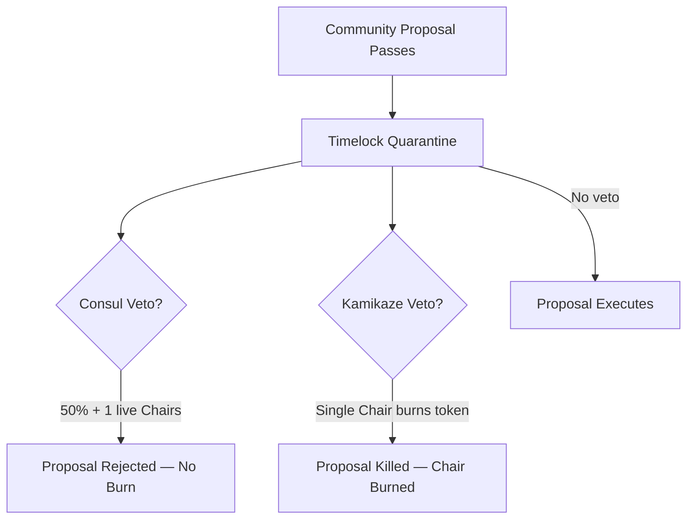

# The Iris Foundation — 15 Genesis Chairs

> *"The Foundation issues the credit lines; the network executes the reality of the ledger."*

**The Iris Foundation** is an ERC721 collection (`IRIS-FOUNDATION`) deployed at:

`0x00008c80D4cBD653B1D384566d9b23B37d100000`

It is the official sovereign ledger of the **15 Genesis Foundation Chairs** of Iris Protocol. These Chairs form the institutional credit-line layer and supreme financial council over the IrisX vault stack. On-chain, all Chairs are **functionally identical** — distinguished only by **token ID 0 through 14**. There are no per-Chair names, traits, or privilege tiers in the smart contract.

---

## Separation of Powers

| Layer | Authority | Mechanism |
|-------|-----------|-----------|
| **Protocol Governance** | IXToken holders via VotingEscrow | Proposals, quorum, timelock execution |
| **The Foundation** | 15 Chair holders | Fee capture, veto overlay, threshold bypass |
| **Keepers** | 5 Keeper NFT holders | Liquidation and force-close execution keys |

Token-weighted governance sets leverage caps, adapter listings, fee parameters, and upgrades. The Foundation does **not** replace community voting — it provides a **financial and tactical overlay** during the timelock quarantine window.

---

## Economic Rights — 5% Performance Fee

When traders close positions at a profit, the vault routes a **5% foundation fee** (`foundationFeeBps = 500`) of gross trade profit to the Foundation contract address. This fee scales with protocol volumetric growth and is **perpetual** for the lifetime of each live Chair.

Distribution to holders is executed via `ClaimRewards(token)`:

```solidity
uint256 amountPerCard = totalRewards / liveCards;
for (uint256 i = 0; i < MAX_SUPPLY; ++i) {
    if ((activeCardsRegistry & _cardBit(i)) != 0) {
        IERC20(token).safeTransfer(ownerOf(i), amountPerCard);
    }
}
```

- Rewards split **equally** among all **live** (non-burned) Chairs in `activeCardsRegistry`.
- Each live Chair receives `totalRewards / liveCards`.
- Burned Chairs permanently forfeit their fee stream; survivors absorb the redistributed share.

---

## Governance Overlay Powers

Every Chair holder possesses the following on-chain capabilities:

### 1. Threshold Bypass
Any Foundation holder may **submit a governance proposal without meeting the standard proposal threshold**.

### 2. Consul Veto (50% + 1 Consensus)
During the timelock window, **more than half** of live Chair holders (`floor(liveCards / 2) + 1`) may sign a unified veto to halt a passed proposal. **No Chair is burned** under this path. The proposal returns to the community for revision.

### 3. Kamikaze Veto (Emergency Sacrifice)
Any **single** Chair holder may invoke an emergency veto by **burning their own token**, instantly killing the proposal. This bypasses consensus requirements and timelock delay.

**Cost:** The invoking Chair is permanently erased from `activeCardsRegistry`. Their 1/15 fee share is redistributed equally among surviving Chairs.

> A Chair activates Kamikaze only when the existential threat to the protocol exceeds the lifetime value of their perpetual fee stream.

---

## Chair Index (Token IDs 0–14)

All Chairs share identical contract logic. Select a token ID for holder-facing documentation:

| Token ID | Documentation |
|----------|---------------|
| 0 | [Chair #0](/foundation-lore/chair-00) |
| 1 | [Chair #1](/foundation-lore/chair-01) |
| 2 | [Chair #2](/foundation-lore/chair-02) |
| 3 | [Chair #3](/foundation-lore/chair-03) |
| 4 | [Chair #4](/foundation-lore/chair-04) |
| 5 | [Chair #5](/foundation-lore/chair-05) |
| 6 | [Chair #6](/foundation-lore/chair-06) |
| 7 | [Chair #7](/foundation-lore/chair-07) |
| 8 | [Chair #8](/foundation-lore/chair-08) |
| 9 | [Chair #9](/foundation-lore/chair-09) |
| 10 | [Chair #10](/foundation-lore/chair-10) |
| 11 | [Chair #11](/foundation-lore/chair-11) |
| 12 | [Chair #12](/foundation-lore/chair-12) |
| 13 | [Chair #13](/foundation-lore/chair-13) |
| 14 | [Chair #14](/foundation-lore/chair-14) |

---

## Veto Flow



---

## NFT Art & Metadata

Generative art assets for Foundation Chairs are stored under `static/assets/nft-foundations/`. Token ID 7 currently has a published render; remaining token metadata stubs are maintained for integrators and marketplaces.
