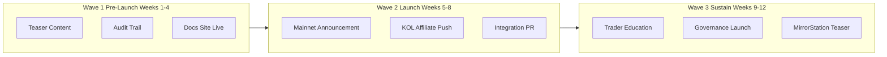

# Awareness Action Plan

**Objective:** Build **trust, recall, and technical credibility** for Iris Protocol before and during Phase 1 mainnet launch.  
**Horizon:** 90 days (pre-launch → launch + 60 days)  
**Parent strategy:** [Marketing Strategy](./marketing-strategy.md)

---

## 1. Awareness Goals

| Goal | Metric | 90-Day Target |
|------|--------|---------------|
| **Know** | Unique visitors to docs.iris.exchange | 25,000+ |
| **Understand** | Whitepaper / academic doc completions | 2,000+ |
| **Trust** | Audit report downloads / GitHub stars (iris-core) | 500+ stars |
| **Recall** | Branded search ("Iris Protocol DeFi") | Top 5 results |
| **Community** | Discord + Telegram combined members | 5,000+ |

---

## 2. Target Audiences & Messages

| Audience | Core Message | Primary Channel |
|----------|--------------|-----------------|
| **DeFi depositors** | "Earn rebasing yield on USDT — transparent, on-chain." | Twitter, YouTube, newsletters |
| **Traders** | "Leveraged spot long on ETH — self-custody, no funding rates." | Trading Twitter, alpha groups |
| **Developers** | "Dual-ledger vault + adapter API — integrate once." | GitHub, Dev.to, hackathons |
| **KOLs / affiliates** | "0.1% instant rebasing commission on every referred deposit." | Direct BD, affiliate brief |
| **Institutions** | "15-Chair Foundation veto layer + audited vault stack." | LinkedIn, direct outreach, academic whitepaper |

---

## 3. Campaign Architecture

---

## 4. Week-by-Week Action Plan

### Wave 1 — Pre-Launch (Weeks 1–4): *"Build the Ledger"*

| Week | Action | Owner | Deliverable | KPI |
|------|--------|-------|-------------|-----|
| **1** | Publish docs site + academic whitepaper | Content | docs.iris.exchange live | Site uptime |
| **1** | Launch Twitter/X + link in bio | Community | @irisprotocol handle | 500 followers |
| **1** | GitHub public README polish (iris-core) | DevRel | Architecture diagram in README | — |
| **2** | **Audit credibility thread** — 108 tests, C-1 disposition explained | Content | 10-tweet thread + blog | 50K impressions |
| **2** | Dual-ledger explainer video (3 min) | Content | YouTube + embed in docs | 1K views |
| **3** | Discord + Telegram launch | Community | Moderation playbook, FAQ bot | 1K members |
| **3** | Newsletter #1: "Why leveraged spot, not perps?" | Content | Mailchimp/Substack | 500 subs |
| **4** | KOL briefing deck (affiliate mechanics) | BD | PDF + `depositWithAffiliate` demo | 10 KOL meetings |
| **4** | Testnet walkthrough livestream | Community | Recorded demo deposit + mock trade | 200 live viewers |

### Wave 2 — Launch (Weeks 5–8): *"Execute the Reality"*

| Week | Action | Owner | Deliverable | KPI |
|------|--------|-------|-------------|-----|
| **5** | **Mainnet launch PR** — contracts, Etherscan links, Foundation address | BD + Content | Press release + blog | 5 media pickups |
| **5** | Launch day Twitter Space with founders | Community | 1hr AMA | 300 attendees |
| **6** | Affiliate program activation — top 10 KOLs | BD | Unique affiliate addresses tracked | $X affiliate TVL |
| **6** | "First deposit" tutorial series (3 parts) | Content | Docs + short videos | 2K tutorial views |
| **7** | Integration announcement #1 (wallet or tracker) | DevRel | Co-marketed tweet + blog | Partner audience reach |
| **7** | Comparison content: Iris vs perp DEX vs CEX margin | Content | SEO landing page | Organic traffic +20% |
| **8** | Trader campaign: "First leveraged ETH long" | Community | Badge/NFT commemorative (off-chain) | 100 first trades |
| **8** | Newsletter #2: Tokenomics + fee transparency | Content | Mailchimp | 1K subs |

### Wave 3 — Sustain (Weeks 9–12): *"Grow the Network"*

| Week | Action | Owner | Deliverable | KPI |
|------|--------|-------|-------------|-----|
| **9** | Governance launch awareness — VotingEscrow explainer | Content | Blog + diagram | 500 locks (stretch) |
| **9** | Keeper lore content series (5 knights, 1/week) | Content | Social + docs cross-links | Engagement rate |
| **10** | Regional community AMA (MENA / APAC / EU rotation) | Community | Localized summary threads | 1 region/week |
| **10** | Developer office hours (monthly cadence start) | DevRel | Calendly + GitHub Discussions | 20 dev attendees |
| **11** | **MirrorStation teaser** — Arbitrum latency benchmark | Content | Blog with metrics | 10K impressions |
| **11** | Podcast tour (3 appearances) | BD | DeFi podcasts | 3 bookings |
| **12** | Q1 retrospective report — TVL, trades, affiliate % | Content | Public transparency report | Trust signal |
| **12** | Plan Phase 2 awareness calendar | BD | Internal doc | — |

---

## 5. Content Calendar (Recurring)

| Cadence | Format | Topic Rotation |
|---------|--------|----------------|
| **Daily** | Twitter/X post | Tips, metrics, memes, retweets |
| **2× / week** | Thread or infographic | Technical education |
| **Weekly** | Blog or docs update | Deep dive (vault, adapter, governance) |
| **Bi-weekly** | Newsletter | Product updates + roadmap |
| **Monthly** | Transparency report | TVL, volume, governance votes |
| **Monthly** | AMA / Space | Community Q&A |

### Content Pillars (Rotate)

1. **Transparency** — Fee bps, on-chain parameters, audit links
2. **Education** — Dual ledger, position lifecycle, liquidation
3. **Social proof** — TVL milestones, integration logos, testimonials
4. **Affiliate** — KOL success stories (with permission)
5. **Roadmap** — MirrorStation, lending module teasers

---

## 6. Channel Playbook

### 6.1 Twitter / X

- Pin: Mainnet links + docs + audit
- Hashtags: `#DeFi` `#USDT` `#LeveragedTrading` `#Ethereum` (not spammy)
- Engage: Reply to USDT yield, ETH leverage, and DeFi safety conversations
- Avoid: Price speculation, guaranteed returns language

### 6.2 YouTube / Video

- Explainer: Dual ledger (animated)
- Tutorial: Wallet connect → deposit → trade → close
- Founder clip: "Why Foundation 15 Chairs" (institutional narrative)

### 6.3 GitHub / DevRel

- Pin iris-core with test count + coverage badge
- `good first issue` labels for docs contributions
- Hackathon bounty: "Best IrisX integrator demo"

### 6.4 KOL / Affiliate

- Provide: Affiliate brief, tracking dashboard, branded assets
- Require: Risk disclaimer in every sponsored post
- Track: `depositWithAffiliate` on-chain attribution per KOL address

### 6.5 PR & Media

- Targets: The Defiant, Bankless, regional crypto media
- Angle: "Dual-ledger vault funds leveraged spot — new DeFi primitive"
- Assets: Academic whitepaper PDF, founder quotes, Etherscan links

### 6.6 Events (Phase 1)

| Event Type | Goal |
|------------|------|
| Hackathon sponsor | Developer awareness |
| Side event at major conference | BD meetings |
| Regional meetup (Tehran, Dubai, Istanbul, Singapore) | Community building |

---

## 7. Brand & Compliance Guardrails

| Rule | Detail |
|------|--------|
| **No guaranteed yield** | Rebasing yield varies with protocol performance |
| **Risk disclaimers** | Leverage = liquidation risk; required on all trader content |
| **Sanctions awareness** | Gatekeeper / sanctions list is a feature, not hidden |
| **Consistent naming** | Iris Protocol, IrisX, USDI, The Iris Foundation |
| **Visual identity** | Cosmic void + holographic violet per brand guidelines |

---

## 8. Measurement & Reporting

### Weekly Dashboard

| Metric | Source |
|--------|--------|
| Social followers / engagement | Twitter analytics |
| Docs unique visitors | Plausible / GA |
| Discord/TG active users | Community tools |
| GitHub stars / forks | GitHub API |
| On-chain new depositors | Dune / custom indexer |
| Affiliate deposit % | `DepositWithAffiliate` events |

### Monthly Review

1. Which content pillar drove most deposits?
2. Which KOL cohort had best retention (D30)?
3. Adjust Week 9–12 plan based on data.

---

## 9. Budget Estimate (90 Days)

| Item | Est. Cost (USD) |
|------|-----------------|
| KOL / affiliate bounties (off-chain) | $15,000–30,000 |
| Video production | $3,000–5,000 |
| Design / infographics | $2,000–4,000 |
| Newsletter tool + ads test | $1,000–2,000 |
| Event sponsorship (1) | $5,000–15,000 |
| Hackathon prizes | $5,000–10,000 |
| **Total** | **$31,000–66,000** |

*On-chain affiliate CAC (0.1%) is additional and scales with referred TVL — not in this bucket.*

---

## Related Documents

- [Marketing Strategy](./marketing-strategy.md)
- [User Onboarding Action Plan](./user-onboarding-action-plan.md)
