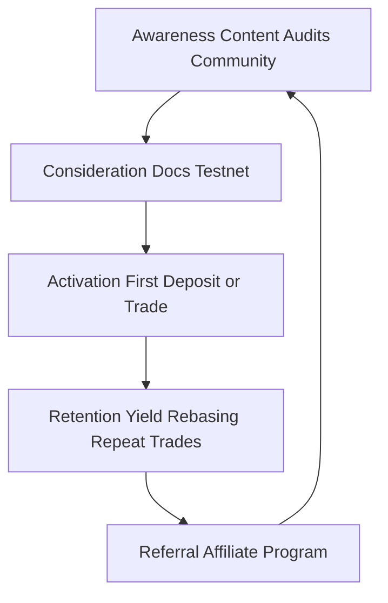

# Marketing Strategy & Go-to-Market

**Document owner:** Business Development  
**Horizon:** Phase 1 launch → Phase 2 MirrorStation (12–18 months)  
**Canonical product reference:** [Public Brief](/whitepaper/public-brief) · [Tokenomics](/whitepaper/tokenomics) · [Academic Whitepaper](/whitepaper/full-academic)

---

## Executive Summary — Strategic Questions (پاسخ به سوالات کلیدی)

| Question | Answer |
|----------|--------|
| **چگونه کاربر جذب می‌شود؟** (How are users acquired?) | Through **four on-chain acquisition rails**: (1) **rebasing vault deposits** for yield seekers, (2) **leveraged spot trading** for active traders, (3) **`depositWithAffiliate`** for KOL/community referrers, and (4) **integrator partnerships** (wallets, dashboards, trading frontends). Off-chain: content, audits, testnet campaigns, and Arbitrum MirrorStation latency narrative. |
| **CAC چقدر است؟** (What is CAC?) | **On-chain affiliate CAC = 0.1% of referred deposit** (`affiliateFeeBps = 10`), paid as rebasing shares at deposit time. Protocol books this as `protocolDebt` and **amortizes via 0.5% withdrawal fees** — effective payback when referred users withdraw or churn. **Blended off-chain CAC** (ads, events, content) is separate; target **&lt; 3 months payback** on affiliate-attributed TVL. |
| **چرا کاربر مهاجرت کند؟** (Why should users migrate?) | **Self-custody** leveraged spot on USDT, **transparent on-chain fees** (no hidden spread), **rebasing yield** on idle capital in one vault, **Ethereum security + Arbitrum speed** (Phase 2), and **affiliate/referral earnings** for community leaders. Migration trigger: "same leverage thesis, better custody and fee visibility." |
| **مزیت رقابتی چیست؟** (Competitive advantage?) | **Dual-ledger IXToken** (yield + DEX-safe fixed ledger), **unified vault + margin stack** (not siloed lending + perp DEX), **institutional Foundation overlay** (15-Chair veto layer), **keeper-automated solvency**, and **modular adapter roadmap** (spot today → lending tomorrow). |

---

## 1. Market Positioning

### 1.1 Category Definition

Iris Protocol occupies the intersection of three DeFi categories:

```
        Yield Vaults (Aave, Morpho)
                 ╲
                  ╲
                   ● Iris Protocol
                  ╱
                 ╱
    Leveraged Trading (GMX, dYdX) ──── Fund Management / Stable Liquidity
```

**Positioning statement:**

> *Iris is the USDT-native execution and fund-management layer for leveraged spot traders and yield depositors — one vault, dual ledgers, on-chain fee transparency, and institutional-grade governance safeguards.*

### 1.2 Target Segments (ICP)

| Segment | Profile | Primary Job-to-be-Done | Iris Product Hook |
|---------|---------|----------------------|-------------------|
| **Yield Depositors** | USDT holders, DeFi natives, treasuries | Earn on idle stablecoins without CEX risk | Rebasing IrisX (`USDI`); trader profit share accrues to vault NAV |
| **Leveraged Spot Traders** | ETH/alts long bias; avoid perp funding | Leveraged long spot with defined margin | Adapter v1 — 5x default, Chainlink-guarded swaps |
| **Affiliates / KOLs** | Crypto educators, alpha groups | Monetize audience without custodial product | `depositWithAffiliate` — instant rebasing commission |
| **Integrators** | Wallets, portfolio trackers, aggregators | Offer yield + trade in one API | IXToken ERC20 surface, permit deposits, fixed ledger for routing |
| **Institutional observers** | Funds, family offices, auditors | Trust-minimized infra with circuit breakers | Foundation veto layer, audit suite, transparent tokenomics |

### 1.3 Phase-Gated GTM Focus

| Phase | GTM Priority | North-Star Metric |
|-------|--------------|-------------------|
| **Phase 1 (Ethereum)** | Depositor TVL + first 500 traders | TVL + weekly active traders |
| **Phase 2 (Arbitrum)** | Trader migration from L1 + latency narrative | % volume on MirrorStation |
| **Phase 3 (Modules)** | Collateral lending cross-sell | Revenue per user (depositor + trader) |

---

## 2. Acquisition Model

### 2.1 How Users Enter the Funnel



### 2.2 On-Chain Acquisition Mechanics

| Mechanism | Function | Who Benefits |
|-----------|----------|--------------|
| **Organic deposit** | `deposit(assets, receiver)` | Depositor earns rebasing yield |
| **Affiliate deposit** | `depositWithAffiliate(..., affiliate)` | Affiliate earns 0.1% rebasing shares; depositor unchanged UX |
| **Trader open** | `openPosition` via adapter | Trader gets leverage; vault earns protocol share on profit |
| **Governance lock** | VotingEscrow lock | Voter gets proposal weight + long-term alignment |
| **LP farming (Phase 3)** | `lpFarming` locker rewards | UV4 LP lockers earn 5% profit slice |

### 2.3 Off-Chain Acquisition Channels

| Channel | Tactic | Segment |
|---------|--------|---------|
| **Technical credibility** | Audit reports, academic whitepaper, open-source repos | Traders, integrators, institutions |
| **Developer relations** | Adapter integration guides, SDK snippets | Integrators |
| **Community** | Discord/Telegram, governance forum | Depositors, voters |
| **Affiliate/KOL** | Referral links with on-chain attribution | Affiliates |
| **Content SEO** | "USDT yield", "leveraged spot DeFi", comparison pages | Organic search |
| **Events** | ETHDenver, Token2049, regional Web3 meetups | All segments |

**Rule:** Every campaign must map to a **measurable on-chain action** (deposit, trade, lock, affiliate deposit).

---

## 3. CAC Economics (On-Chain + Blended)

### 3.1 Protocol-Native CAC — Affiliate Program

From `IXToken` defaults:

| Parameter | Value | Role |
|-----------|-------|------|
| `affiliateFeeBps` | **10 (0.1%)** | Commission minted to affiliate on referred deposit |
| `protocolDebt` | Increases by affiliate amount | Virtual CAC booked in `totalAssets()` |
| `withdrawalFeeBps` | **50 (0.5%)** | Amortizes `protocolDebt` on each withdraw |

**Effective model:**

1. Affiliate receives **immediate rebasing exposure** on 0.1% of gross deposit — strong incentive to promote.
2. Protocol does **not** haircut the depositor upfront — lower friction than fee-split models.
3. CAC is **repaid** as referred users pay withdrawal fees over time (or as churn amortizes debt).

**Example (USDT 6 decimals):**

| Referred Deposit | Affiliate CAC (0.1%) | Withdrawals to Repay CAC (0.5% fee) |
|------------------|------------------------|-------------------------------------|
| $10,000 | $10 rebasing shares | ~$2,000 cumulative withdrawals |
| $100,000 | $100 rebasing shares | ~$20,000 cumulative withdrawals |

**Governance guard:** `withdrawalFeeBps × (10000 - maxOpenPositionsVolumeBps) ≥ affiliateFeeBps × 10000` ensures affiliate program remains solvent under stress.

### 3.2 Blended CAC Framework (Off-Chain)

Track separately from on-chain `protocolDebt`:

| Cost Bucket | Examples | Attribution |
|-------------|----------|-------------|
| **Paid media** | Twitter/X ads, newsletter sponsorships | UTM → wallet connect → deposit |
| **Content production** | Video, translations, design | Assisted conversions |
| **Events & BD** | Booth, travel, partnerships | Partner-referred TVL |
| **Grants / incentives** | Testnet rewards, trading competitions | First-trade cohort |

**Target benchmarks (Phase 1):**

| Segment | Target Blended CAC | LTV Proxy (12 mo) | Payback |
|---------|-------------------|---------------------|---------|
| Depositor | &lt; $15 per $1K TVL | Yield + retention | &lt; 6 months |
| Trader | &lt; $50 per activated trader | Protocol fee share on wins | &lt; 3 months |
| Affiliate-sourced depositor | **0.1% on-chain** + &lt; $5 off-chain | Same as depositor | &lt; 4 months |

### 3.3 CAC vs LTV — Protocol Revenue Share

On profitable trader close (defaults):

- Foundation: 5%
- Protocol (rebasing holders): 20%
- LP farming: 5%
- Trader: remainder

**Marketing implication:** Depositor LTV rises with **trading volume** (not just idle TVL). GTM must balance **liquidity marketing** and **trader activation**.

---

## 4. Migration Thesis — Why Users Switch

### 4.1 Migration Triggers by Segment

| From | Pain | Iris Migration Promise |
|------|------|------------------------|
| **CEX margin** | Custody risk, opaque fees, withdrawal freezes | Self-custody, on-chain fee bps, sanctions-aware gatekeeping |
| **Perp DEXs** | Funding rates, complexity, short-only bias | **Leveraged spot long** — no funding drag on long bias |
| **Lending-only (Aave)** | Capital idle unless manually looped | Single vault: deposit earns yield **and** funds trader leverage |
| **Yield vaults (Morpho, etc.)** | No native trading stack | IrisX is execution-funded — yield correlates with protocol activity |
| **Arbitrum traders (Phase 2)** | L1 gas/latency | MirrorStation sub-cent execution |

### 4.2 Migration Objections & Responses

| Objection | Response |
|-----------|----------|
| "Smart contract risk" | Audit suite (108+ tests), Foundation veto layer, keeper liquidation |
| "Liquidity depth" | Phase 1 seed liquidity program; LP farming Phase 3 |
| "Why not just hold USDT?" | Rebasing yield + optional governance participation |
| "Adapter trust" | Authorized adapters only; governance-controlled; same owner as vault |

### 4.3 Migration Journey (Macro)

```
Awareness → Education → Testnet trial → Mainnet small deposit →
First leveraged trade → Habit (rebasing balance growth) →
Governance lock / affiliate referral → Arbitrum migration (Phase 2)
```

---

## 5. Competitive Advantage

### 5.1 Differentiation Matrix

| Capability | Iris | Typical Perp DEX | Typical Yield Vault | CEX Margin |
|------------|------|------------------|---------------------|------------|
| Self-custody | Yes | Yes | Yes | No |
| Leveraged **spot** long | **Yes** | Perp swap | No | Yes |
| Rebasing USDT vault | **Yes** | No | Partial | No |
| Dual-ledger DEX safety | **Yes** | N/A | No | N/A |
| On-chain fee transparency | **Yes** | Partial | Yes | No |
| Institutional veto layer | **15 Chairs** | Rare | Rare | Centralized |
| Automated keeper solvency | **5 Keepers** | Partial | N/A | Internal |
| Modular adapter roadmap | **Yes** | Monolithic | No | Closed |

### 5.2 Defensible Moats (12–24 months)

1. **Accounting moat** — Dual-ledger + `protocolDebt` affiliate CAC is non-trivial to fork correctly.
2. **Liquidity moat** — IrisX as single liquidity pool for **both** yield and margin deployment.
3. **Governance moat** — Foundation overlay creates institutional trust narrative competitors lack.
4. **Execution moat** — MirrorStation + keeper network = latency + safety bundle.
5. **Integrator moat** — First wallet/aggregator with native IrisX deposit + trade UX.

### 5.3 Messaging Pillars

| Pillar | Message |
|--------|---------|
| **Transparency** | "Every fee is a bps parameter on-chain." |
| **Unified stack** | "Deposit, earn, trade — one vault." |
| **Safety** | "Keepers liquidate. Foundation vetoes. You custody." |
| **Growth** | "Refer with `depositWithAffiliate` — earn rebasing shares instantly." |

---

## 6. Go-to-Market Phases

### Phase 1 — Launch (Months 0–6)

**Goal:** Prove deposit → trade → close loop on mainnet.

| Workstream | Actions |
|------------|---------|
| **Liquidity bootstrap** | Seed depositor incentives (governance-approved); target $X TVL milestone |
| **Trader activation** | ETH leveraged spot launch campaign; first-trade fee waiver (off-chain promo) |
| **Affiliate program** | Onboard 10–20 KOLs with `depositWithAffiliate` tracking dashboards |
| **Credibility** | Publish audit summary, academic whitepaper PR, Etherscan verified contracts |
| **Integrations** | 1 wallet + 1 portfolio tracker listing |

**KPIs:** TVL, weekly active traders, affiliate-attributed deposits %, governance proposals live.

### Phase 2 — Scale (Months 6–12)

**Goal:** Arbitrum MirrorStation trader migration.

| Workstream | Actions |
|------------|---------|
| **Latency narrative** | "Trade on Arbitrum, settle on Ethereum" campaign |
| **Cross-chain UX** | Bridge guides, unified dashboard |
| **Volume incentives** | Trading competitions with keeper-visible leaderboard |
| **Institutional BD** | Foundation Chair narrative for family offices / funds |

### Phase 3 — Expand (Months 12–18)

**Goal:** Collateral lending + multi-adapter cross-sell.

| Workstream | Actions |
|------------|---------|
| **Product marketing** | Borrow against IrisX collateral — "stay in ecosystem" |
| **LP farming launch** | UV4 locker rewards — DeFi farmer segment |
| **Multi-asset vaults** | USDC instance, LST exploration |

---

## 7. Budget & Team (Indicative)

| Function | Phase 1 Allocation | Notes |
|----------|-------------------|-------|
| Content & community | 30% | Docs, social, forum moderation |
| Affiliate & KOL | 25% | On-chain 0.1% + off-chain bounties |
| Integrations & DevRel | 20% | Wallet listings, hackathon sponsorship |
| Events & BD | 15% | Conferences, regional meetups |
| Paid performance | 10% | Retargeting, newsletter tests |

**Minimum viable GTM team:** 1 BD lead, 1 community manager, 1 content/devrel (can be fractional).

---

## 8. Risk Register (GTM)

| Risk | Mitigation |
|------|------------|
| Low initial liquidity | Seeded TVL + conservative leverage caps at launch |
| Smart contract exploit narrative | Audits, bug bounty, Foundation veto communication |
| Trader losses → bad PR | Risk disclaimers, liquidation education, position size UX |
| Affiliate spam | Self-referral blocked on-chain; quality KOL vetting |
| Regulatory (sanctions) | Gatekeeper narrative — compliance-aware design |

---

## 9. Success Metrics Dashboard

| Metric | Definition | Phase 1 Target |
|--------|------------|----------------|
| **TVL** | `totalAssets()` USDT equivalent | TBD by governance |
| **Affiliate %** | Deposits via `depositWithAffiliate` / total deposits | &gt; 20% |
| **Trader WAU** | Unique addresses opening/closing positions weekly | 100+ |
| **CAC payback** | Months to recover affiliate `protocolDebt` per cohort | &lt; 4 months |
| **Retention D30** | Depositors with balance &gt; 0 at day 30 | &gt; 40% |
| **NPS / sentiment** | Community survey quarterly | Baseline → improve |

---

## Related Documents

- [Awareness Action Plan](./awareness-action-plan.md)
- [User Onboarding Action Plan](./user-onboarding-action-plan.md)
- [Tokenomics](/whitepaper/tokenomics)
- [Roadmap](/whitepaper/roadmap)
