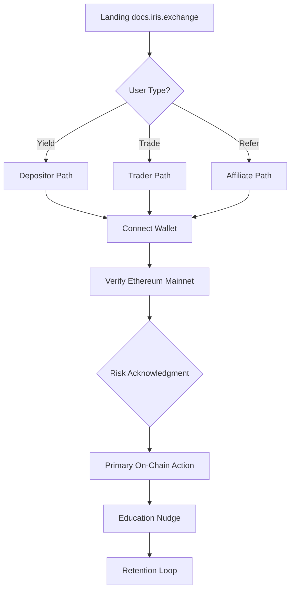

# User Onboarding Action Plan

**Objective:** Convert aware users into **activated, retained on-chain participants** with minimal friction and clear risk education.  
**Parent strategy:** [Marketing Strategy](./marketing-strategy.md)  
**Product reference:** [IXToken Vault](/technical/ix-token-vault) · [Leveraged Spot Adapter](/technical/leveraged-spot-adapter) · [Tokenomics](/whitepaper/tokenomics)

---

## 1. Onboarding Principles

| Principle | Implementation |
|-----------|----------------|
| **One primary action per session** | Depositor path ≠ trader path — separate UX flows |
| **Progressive disclosure** | Show leverage risks only when user enters trade flow |
| **On-chain verifiability** | Every step links to Etherscan / docs parameter |
| **Affiliate attribution preserved** | Referral param → `depositWithAffiliate` before any other action |
| **Fail gracefully** | Insufficient gas, wrong network, sanctions block — clear error copy |

---

## 2. User Segments & Activation Definitions

| Segment | Activated When | Retained When |
|---------|----------------|---------------|
| **Depositor** | First `deposit` ≥ minimum | Balance &gt; 0 at D30 |
| **Trader** | First `openPosition` closed (any PnL) | 2+ trades in 60 days |
| **Affiliate** | First referred `depositWithAffiliate` | 3+ referred deposits in 90 days |
| **Governance voter** | First VotingEscrow lock | Lock not withdrawn before unlock |
| **Integrator** | First API integration in staging | Production listing |

---

## 3. Master Onboarding Funnel



---

## 4. Depositor Onboarding Flow

### 4.1 Journey Steps

| Step | User Action | System / Protocol | Success Criteria |
|------|-------------|-------------------|------------------|
| **1. Discover** | Read [Public Brief](/whitepaper/public-brief) | Docs site | Clicks "Deposit" CTA |
| **2. Connect** | MetaMask / Rabby / WalletConnect | Web3 provider | Address connected |
| **3. Network** | Switch to Ethereum mainnet | Chain ID 1 | Correct network |
| **4. Acquire USDT** | Hold or swap to USDT | External DEX | USDT balance ≥ min deposit |
| **5. Approve** | `approve(IXToken, amount)` on USDT | ERC20 approve | Allowance set |
| **6. Deposit** | `deposit(assets, receiver)` or `depositWithPermit` | IXToken | Shares minted; rebasing balance visible |
| **7. Confirm** | View balance on Etherscan + app | `balanceOf` increases over time | User sees position |

### 4.2 Depositor UX Checklist (Product)

- [ ] Show `minimumDepositAssetAmount` before user signs
- [ ] Display rebasing vs fixed ledger toggle (advanced tab)
- [ ] Show `maxWithdraw` — not just `balanceOf` (physical cash limit)
- [ ] Link to [Phantom NAV C-1](/technical/phantom-nav-c1) in advanced FAQ
- [ ] Post-deposit email/TG: "Your yield accrues automatically"

### 4.3 Depositor Education Microcopy

| Screen | Copy |
|--------|------|
| Pre-deposit | "You deposit USDT. You receive IrisX (USDI). Your balance grows as the vault earns." |
| Rebasing explain | "No claim button — your balance increases as `totalAssets()` grows." |
| Withdraw warn | "Large withdrawals depend on available vault cash. Check max withdraw." |
| Affiliate note | "Referred by a friend? Use their link so they earn 0.1% — you pay nothing extra." |

### 4.4 Depositor Retention Triggers

| Trigger | Action |
|---------|--------|
| D3 no activity | Email: "How rebasing works" + current APY proxy |
| D7 | Notify: balance change since deposit |
| D30 | Prompt: governance lock or trader exploration |
| Withdraw attempt | Show fee (0.5%) and `protocolDebt` amortization tooltip |

---

## 5. Trader Onboarding Flow

### 5.1 Journey Steps

| Step | User Action | Protocol | Success Criteria |
|------|-------------|----------|------------------|
| **1. Prerequisites** | Hold USDT + IrisX margin understanding | — | Read risk disclaimer |
| **2. Fund margin** | Deposit USDT → IrisX OR hold IrisX | `deposit` | Margin balance available |
| **3. Approve margin** | `approve(adapter, margin)` | IXToken allowance | Adapter can pull margin |
| **4. Select market** | Choose ETH (Phase 1) | Adapter UI | Token config exists |
| **5. Set params** | Margin, leverage (≤ 5x default), slippage | Adapter `openPosition` | Valid position config |
| **6. Open** | Sign transaction | Vault `openPosition` + swap | Position ID minted |
| **7. Monitor** | Watch position MTM | Adapter views | User understands liquidation threshold |
| **8. Close** | Trader close or expiry/liquidation | `closePosition` / keeper path | Position settled |

### 5.2 Risk Gate (Mandatory Before First Trade)

Display and require acknowledgment:

```
⚠ Leveraged Trading Risk Disclosure
• You can lose your entire margin.
• Positions may be liquidated by Keepers if loss exceeds threshold (default 75% of margin).
• Leverage amplifies both gains and losses.
• Iris is self-custody — no recovery of lost funds.
[ ] I understand and accept these risks.
```

### 5.3 Trader Education Sequence

| Order | Topic | Doc Link |
|-------|-------|----------|
| 1 | What is leveraged spot (not perps) | [Adapter spec](/technical/leveraged-spot-adapter) |
| 2 | Margin vs allocation | [Position lifecycle](/technical/position-lifecycle) |
| 3 | Liquidation mechanics | [Iron Liquidator](/keepers-lore/iron-liquidator) |
| 4 | Fees on profit | [Tokenomics](/whitepaper/tokenomics) |
| 5 | Force-close on expiry | [Squall Keeper](/keepers-lore/squall-keeper) |

### 5.4 Trader Activation Incentives (Off-Chain)

| Incentive | Mechanism | Guardrail |
|-----------|-----------|-----------|
| First-trade gas rebate | Off-chain refund form | Cap per address |
| Fee discount week | Governance temp param (if approved) | Time-limited |
| Leaderboard | Public ranked by volume | No loss-leader promises |

### 5.5 Phase 2 — Arbitrum Trader Migration Onboarding

| Step | Action |
|------|--------|
| 1 | Announce MirrorStation with latency benchmarks |
| 2 | "Bridge USDT → Arbitrum IrisX" wizard |
| 3 | Side-by-side gas comparison (L1 vs L2) |
| 4 | Same risk gate + adapter UX on L2 |

---

## 6. Affiliate Onboarding Flow

### 6.1 Affiliate Activation

| Step | Action |
|------|--------|
| **1. Apply** | BD form: audience size, region, content type |
| **2. Brief** | Receive affiliate deck + risk disclaimer template |
| **3. Wallet** | Register affiliate address (receives rebasing commission) |
| **4. Link** | Unique URL: `app.iris.exchange?affiliate=0x...` |
| **5. Track** | Dashboard: referred deposits, `protocolDebt` attributed TVL |
| **6. Payout** | Automatic — rebasing shares minted on each `depositWithAffiliate` |

### 6.2 On-Chain Mechanics (Affiliate Must Understand)

```
depositor calls depositWithAffiliate(assets, receiver, affiliate)
  → affiliate receives rebasing shares = assets × 0.1%
  → protocolDebt += affiliate amount (virtual CAC)
  → depositor receives full deposit shares (no extra cost)
```

**Blocked:** Self-referral (same address as depositor and affiliate).

### 6.3 Affiliate Content Kit

| Asset | Purpose |
|-------|---------|
| 1-page PDF | Program rules + commission structure |
| Thread template | Pre-written Twitter thread |
| Video B-roll | Product demo clips |
| FAQ | CAC, withdrawal fee amortization, risk disclaimers |
| Logo pack | `static/assets/branding/` |

### 6.4 Affiliate Tier Model (Suggested)

| Tier | Requirement | Off-Chain Bonus |
|------|-------------|-----------------|
| **Bronze** | 1+ referred deposit | Swag |
| **Silver** | $100K referred TVL | Featured in newsletter |
| **Gold** | $1M referred TVL | Event invite + co-marketing |
| **Platinum** | $10M referred TVL | Governance advisory call |

*Tiers are off-chain recognition — on-chain commission is always 0.1% regardless of tier.*

---

## 7. Integrator Onboarding Flow

### 7.1 Integration Checklist

| Step | Task | Reference |
|------|------|-----------|
| 1 | Read [IXToken Vault](/technical/ix-token-vault) | Dual ledger, `maxWithdraw` |
| 2 | Read [Adapter spec](/technical/leveraged-spot-adapter) | If building trade UI |
| 3 | Test on fork/mainnet | `deposit`, `depositWithPermit`, `withdraw` |
| 4 | Handle fixed vs rebasing display | `isExcludedFromYield` |
| 5 | Submit listing PR | Logo + description |
| 6 | Co-marketing launch | Awareness plan Week 7 |

### 7.2 Integrator Support

- Monthly developer office hours
- Telegram dev channel
- Reference implementation repo (widget / SDK — roadmap)

---

## 8. Governance Voter Onboarding

| Step | Action |
|------|--------|
| 1 | Hold IrisX |
| 2 | Read [Governance](/technical/governance) |
| 3 | `createLock(amount, duration)` on VotingEscrow |
| 4 | Vote on first proposal |
| 5 | Optional: learn Foundation veto overlay (read-only for most users) |

**Message:** "Lock IXToken → voting weight = share count. One lock per address. Block-number clock."

---

## 9. Onboarding Metrics

| Metric | Formula | Phase 1 Target |
|--------|---------|----------------|
| **Connect → Deposit** | Deposits / wallet connects | &gt; 25% |
| **Deposit → D30 retain** | D30 balance &gt; 0 / depositors | &gt; 40% |
| **Connect → First trade** | Traders / connects (trader cohort) | &gt; 15% |
| **Trade → Second trade** | 2nd trade / 1st trade | &gt; 30% |
| **Affiliate conversion** | Affiliate deposits / affiliate link clicks | &gt; 5% |
| **Time to first deposit** | Median minutes from land to tx | &lt; 10 min |
| **Support ticket rate** | Tickets / new users | &lt; 5% |

---

## 10. Support & Failure Recovery

| Failure | User Message | Recovery Path |
|---------|--------------|---------------|
| Wrong network | "Switch to Ethereum mainnet" | Network switch button |
| Insufficient USDT | "You need USDT to deposit" | Link to swap widget |
| Below min deposit | Show `minimumDepositAssetAmount` | Adjust amount input |
| Sanctioned address | "Address not permitted" | Link to Gatekeeper docs |
| Insufficient gas | Gas estimate + buffer | Faucet link (testnet only) |
| Liquidated | "Position liquidated by Keeper" | Post-mortem education link |
| Withdraw &gt; max | "Limited by vault cash" | Show `maxWithdraw` |

### Support Channels

| Channel | SLA |
|---------|-----|
| Discord #support | &lt; 4h (community mods) |
| Email support@irislab.net | &lt; 24h |
| Docs FAQ | Self-serve 24/7 |

---

## 11. 30-Day Onboarding Sprint (Launch Month)

| Day | Focus | Deliverable |
|-----|-------|-------------|
| **1–3** | Depositor flow live + tutorial | Video + docs |
| **4–7** | Trader flow + risk gate | Trade UI + disclaimer |
| **8–10** | Affiliate links + dashboard MVP | 5 KOLs onboarded |
| **11–14** | First-trade campaign | 100 activated traders |
| **15–18** | Retention emails D3/D7 | Automation live |
| **19–21** | Governance lock campaign | VotingEscrow tutorial |
| **22–25** | Integrator #1 onboarding | Wallet listing |
| **26–30** | Retrospective + funnel metrics | Report + iterate |

---

## Related Documents

- [Marketing Strategy](./marketing-strategy.md)
- [Awareness Action Plan](./awareness-action-plan.md)
- [Public Brief](/whitepaper/public-brief)
