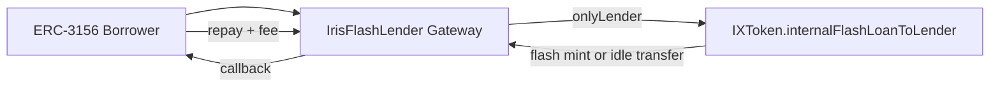

# Flash Lending

Iris Protocol implements flash liquidity through a governance-controlled gateway pattern. End borrowers never call IXToken flash entrypoints directly.

---

## Architecture

---

## Trust Model

| Rule | Detail |
|------|--------|
| `onlyLender` | Only governance-set `lender` address may call `internalFlashLoanToLender` |
| Gateway | `IrisFlashLender` implements public ERC-3156 |
| Assets | DAI and USDC (underlying ERC-3156 routing) |
| Callback | ERC-3156 success token `keccak256("ERC3156FlashBorrower.onFlashLoan")` required |

---

## IXToken Flash Paths

`internalFlashLoanToLender(token, amount, data)`:

1. **Vault-token path:** Flash-mint fixed-ledger vault tokens to gateway
2. **Underlying path:** Transfer idle underlying to gateway

Post-callback balance checks enforce repayment + `lendingFeeBps` fee.

### Guards (2026-06 audit)

- `onlyLender`
- `nonReentrant`
- `amount > 0`
- ERC-3156 callback success verification (`ERC3156CallbackFailed`)
- Post-callback solvency checks on both paths

---

## Fee

`lendingFeeBps` — governance-tunable, max 100 bps (1%). Default: 0.

Fee accrues to vault on successful flash repayment.

---

## Integration Notes

- Flash mint creates **uncollateralized fixed-ledger** vault tokens for gateway routing — not public ERC-3156 on IXToken itself
- Borrowers integrate with `IrisFlashLender`, not IXToken directly
- See `IIrisFlashLender.sol` for gateway API and error definitions

**Status:** Gateway in active development (WIP draft in iris-core).
