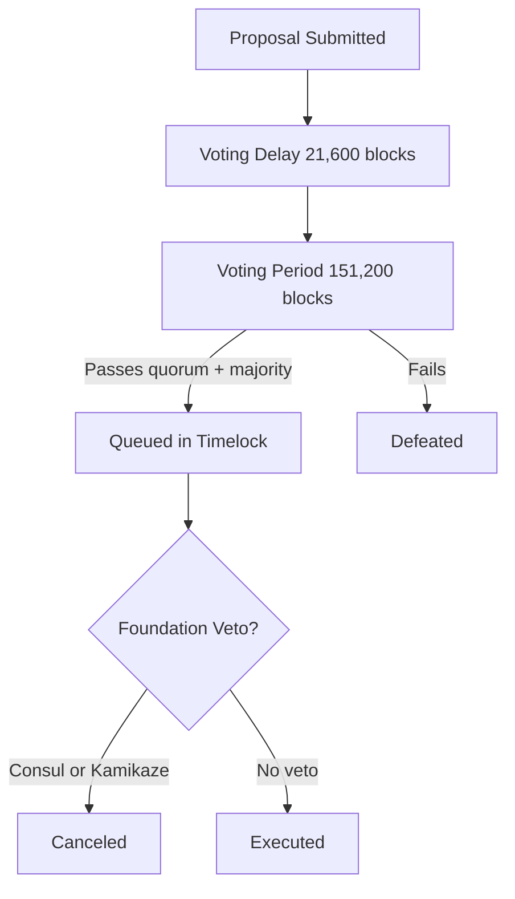

# Governance Architecture

Iris Protocol governance combines token-weighted voting through **VotingEscrow** and **IrisGovernor**, a **TimelockController** quarantine period, and a **Foundation overlay** for veto and threshold bypass.

**Source:** [`iris-governance`](https://github.com/irislab-net/iris-governance)

---

## VotingEscrow

Users lock IXToken for a duration between 1 week and 4 years.

| Property | Value |
|----------|-------|
| Weight basis | Locked rebasing **share count** (not time-decayed) |
| Locks per address | One (use `increaseLockAmount` / `extendLockDuration`) |
| Delegation | Disabled — `delegates(user) == user` |
| Clock | **Block number** (`IERC6372`, `mode=blocknumber`) |
| Withdraw | After lock duration, `convertToAssets(shares)` including yield |

### Block Duration Constants

| Parameter | Blocks | ~Duration (12s blocks) |
|-----------|--------|------------------------|
| MIN_LOCK_DURATION | 50,400 | 1 week |
| MAX_LOCK_DURATION | 10,512,000 | 4 years |

---

## IrisGovernor

OpenZeppelin Governor v5 stack with Iris-specific extensions via `IIrisGovernor`:

- `GovernorSettings`
- `GovernorCountingSimple`
- `GovernorVotes`
- `GovernorVotesQuorumFraction`
- `GovernorTimelockControl`
- Foundation NFT hooks (veto, council)

### Parameters

| Parameter | Value |
|-----------|-------|
| Voting delay | 21,600 blocks (~3 days) |
| Voting period | 151,200 blocks (~3 weeks) |
| Proposal threshold | 1,000 voting units |
| Quorum | 10% at snapshot block |

**Integration rule:** `proposalSnapshot` block numbers must match VotingEscrow `clock()` mode (block-number).

### Veto State Override

```solidity
ProposalState = isVetoed[proposalId] ? Canceled : super.state(proposalId)
```

---

## Timelock

All passed proposals route through `TimelockController` before execution. The timelock window is when Foundation veto powers are active.

---

## Foundation Overlay

Integrated via `IIrisGovernor`:

| Power | Mechanism |
|-------|-----------|
| Threshold bypass | Foundation holders submit without standard threshold |
| Consul veto | `floor(liveCards/2) + 1` Chairs during timelock |
| Kamikaze veto | Single Chair burns token → `isVetoed = true` |

Foundation Chairs do **not** hold voting weight in the standard Governor sense — they exercise overlay powers during the quarantine window.

---

## Proposal Lifecycle



---

## Deployment (CREATE2)

1. `DeployVotingEscrow.s.sol` — requires `IX_TOKEN_ADDRESS`
2. `DeployGovernorCluster.s.sol` — requires `VOTING_ESCROW_ADDRESS`, `FOUNDATION_NFT_ADDRESS`, timelock/governor salts

Vanity mining via `cast create2` when salts not provided.

---

## Known Tech Debt

| Item | Severity |
|------|----------|
| `VoitingEscrow.sol` filename typo | Low — rename pending |
| `IrisGovernor` incomplete mixins | WIP |
| Escrow CEI ordering on create/increase | Medium |
