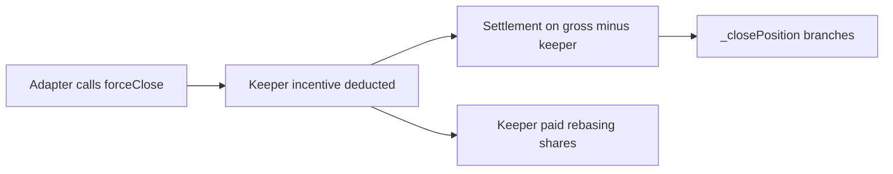

# Position Lifecycle

Positions are margin vault bookings executed by authorized adapters against `IXToken`. Each position is keyed by `positionId` and stores trader, adapter, margin, allocation, and timestamps.

---

## Position Struct

```solidity
struct Position {
    address trader;
    address adapter;
    uint256 marginAmount;
    uint256 allocatedAmount;
    uint256 openingTimestamp;
    uint256 closingTimestamp;
}
```

---

## Open (`openPosition`)

Adapter-only. Preconditions:

1. Unique `positionId`
2. `margin + allocated ≥ minimumPositionVolume`
3. Volume cap: deployed capital ≤ `maxOpenPositionsVolumeBps` of physical assets
4. Leverage: `allocated ≤ margin × maxLeverageBps`
5. Physical cash `I ≥ margin + allocated` (uses `totalAssets() - protocolDebt`)

Flow: pull margin to adapter fixed ledger → increment `assetsInStrategy` → transfer underlying to adapter.

---

## Close (`closePosition`)

Adapter reports `totalReturnAssets` (gross, includes `opFee`) and `opFee`.

```
debtToReturn = allocated + margin
netReturn = totalReturnAssets - opFee
```

### Branches

| Branch | Condition |
|--------|-----------|
| **Profit** | `netReturn > debtToReturn` — Foundation mint, protocol share, LP slice, trader profit |
| **Breakeven** | `netReturn == debtToReturn` |
| **Limited loss** | `loss ≤ margin × liquidationThresholdBps` |
| **Hard bad debt** | `totalReturn < allocated` — socialized loss |
| **Penalty** | Loss exceeds threshold — penalty to protocol |

Settlement ordering: ledger effects before underlying pull (atomic via `nonReentrant`).

---

## Force-Close (`forceClosePosition`)



- Keeper sizing: `min(margin × keeperIncentiveRewardBps, maxKeeperIncentiveReward, gross)`
- Settlement on `gross - keeperAsset`
- Expiry eligibility is adapter responsibility

---

## Liquidation (`liquidatePosition`)

- Keeper sizing: `min(netRecovery × bps, maxKeeperIncentiveReward)` on **net** recovery after `opFee`
- `opFee` waived if `opFee > totalReturnAssets`
- Bad debt vs limited-loss branches update `pnl`

**Design note:** Liquidation keeper incentives scale with net recovery (not margin), intentionally larger than force-close for underwater positions.

---

## PnL Accumulator

Signed `int256 pnl` — analytics only, not NAV:

| Event | Sign |
|-------|------|
| Profitable close protocol share | Positive |
| Bad debt close/liquidate | Negative |
| Penalty paths | Positive |
| Withdrawal fee (after debt amortization) | Positive |

Excluded: rebasing yield, affiliate debt amortization, rounding dust.

---

## Keeper Path Comparison

| Path | Vault Function | Keeper Base | Cap |
|------|----------------|-------------|-----|
| Force-close | `forceClosePosition` | Margin | `maxKeeperIncentiveReward`, gross |
| Liquidation | `liquidatePosition` | Net recovery | `maxKeeperIncentiveReward` |
| Expired (adapter) | `closeExpiredPosition` → force-close | Margin | Same as force-close |

After expiry, underwater positions may use either force-close or liquidation — both valid, economics differ.
