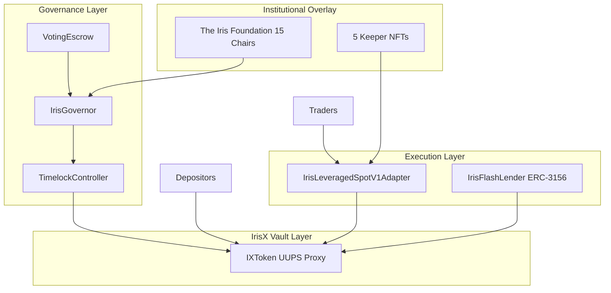
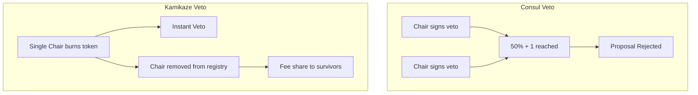

# Iris Protocol: A Dual-Ledger Margin Vault with Institutional Governance Overlay

**Version 1.0 — June 2026**  
**IrisLab, Inc.**

---

## 1. Introduction

Decentralized finance has matured along two parallel trajectories: **liquidity provision** (lending pools, yield vaults) and **leveraged execution** (perpetuals, margin trading). These trajectories rarely share a unified accounting layer, creating composability gaps, rounding hazards at integration boundaries, and governance structures ill-suited to institutional participation.

**Iris Protocol** addresses this fragmentation through a single vault token — **IrisX** (`IXToken`) — that simultaneously serves as a yield-bearing depositor instrument, a margin escrow for leveraged spot adapters, and the collateral base for on-chain governance. The protocol layers an institutional **Foundation** (15 ERC721 Chairs) and an execution **Keeper** corps (5 NFTs) atop community governance, creating separated incentive rails for long-horizon fee capture and short-horizon solvency maintenance.

This document specifies the architecture, accounting invariants, fee economics, governance mechanics, and security model sufficient for independent audit and integration.

---

## 2. System Architecture

### 2.1 Component Topology



### 2.2 Trust Model

| Trust Assumption | Implication |
|------------------|-------------|
| Authorized adapters report `totalReturnAssets` honestly on close/liquidate | Vault books PnL from adapter-reported values |
| Adapter owner == vault owner | `setAdapterStatus` governance control |
| Governance sets `lender` for flash gateway | Only gateway calls `internalFlashLoanToLender` |
| Oracle feeds at adapter level | Core vault has no embedded price oracle |

Adapters are **authorized**, not permissionless. This is a margin execution vault, not a classic over-collateralized lending pool.

---

## 3. IXToken — Dual-Ledger Vault Token

### 3.1 Ledger Modes

| Mode | Flag | Storage | Balance View | Yield |
|------|------|---------|--------------|-------|
| Rebasing | `isExcludedFromYield == false` | `_shares[user]` | `convertToAssets(shares)` Floor | Yes |
| Fixed | `isExcludedFromYield == true` | `_fixedBalances[user]` | Exact 1:1 assets | No |

User-facing denomination is always **underlying wei**. `transfer(amount)` moves asset units regardless of ledger mode.

Migration via `setExcludeFromYield(account, exclude)` snapshots `balanceOf` first, then moves between ledgers.

### 3.2 Global Accounting Equations

```
T = totalAssets() = I + D + S

I = _underlying.balanceOf(vault)      // idle cash
D = protocolDebt                        // virtual affiliate IOU
S = assetsInStrategy                    // deployed capital

F = _totalFixedBalances
σ = _totalShares
R = _rebasingAssets() = max(T - F, 0)

totalSupply() = convertToAssets(σ) + F
```

**Invariant:** `totalSupply()` must not add `S` again. Share conversion already incorporates `T` which includes `S`.

**Redemption constraint:** `maxWithdraw(user) ≤ idle I`. Book NAV `T` may exceed physically redeemable cash when capital is deployed to adapters.

### 3.3 Rounding Policy

Vault-favorable rounding minimizes extractable value from micro-operations:

- Deposit / mint shares: **Floor**
- Withdraw / burn shares: **Ceil**
- Rebasing `balanceOf`: **Floor**
- Dust bounded by `minimumDepositAssetAmount`

### 3.4 Optimistic Affiliate Accounting (C-1)

`depositWithAffiliate` increases `protocolDebt` by the affiliate commission while depositing full gross assets into idle cash. This creates a temporary phantom NAV component — **acknowledged by design** as customer acquisition cost amortized through withdrawal fees.

Physical deployment caps use `totalPhysicalAssets = totalAssets() - protocolDebt`, preventing phantom debt from being deployed to strategies.

Governance enforces steady-state solvency:

`withdrawalFeeBps × (10000 - maxOpenPositionsVolumeBps) ≥ affiliateFeeBps × 10000`

See [Phantom NAV C-1](/technical/phantom-nav-c1) for full disposition.

---

## 4. Position Lifecycle

### 4.1 Open

Authorized adapters call `openPosition(positionId, trader, marginAmount, allocatedAmount)`:

1. Unique `positionId`, volume cap, physical cash ≥ margin + allocated
2. Leverage check: `allocated ≤ margin × maxLeverageBps`
3. Margin transferred to adapter fixed ledger
4. `assetsInStrategy += margin + allocated`; underlying sent to adapter

### 4.2 Close Branches

`closePosition(positionId, totalReturnAssets, opFee)` computes profit/loss against `allocated + margin`:

| Branch | Condition | Outcome |
|--------|-----------|---------|
| Profit | net return > debt | Foundation mint, protocol share, LP slice, trader net |
| Breakeven | net return == debt | Principal returned |
| Limited loss | loss ≤ margin × threshold | Loss from margin escrow |
| Hard bad debt | totalReturn < allocated | Socialized shortfall, negative PnL |
| Penalty | loss > threshold | Penalty fee to protocol |

### 4.3 Force-Close & Liquidation

**Force-close** (`forceClosePosition`): keeper incentive = `min(margin × bps, maxReward, gross)`. Settlement on `gross - keeperAsset`.

**Liquidation** (`liquidatePosition`): keeper incentive = `min(netRecovery × bps, maxReward)`. `opFee` waived if excessive.

Keeper incentives are **intentionally sized differently** between paths to maintain execution motivation across administrative closes and underwater rescues.

### 4.4 PnL Accumulator

Signed `pnl` field tracks protocol-favorable and protocol-adverse events. It is an **analytics ledger**, not a substitute for `totalAssets()` or redeemable cash.

---

## 5. Governance Specification

### 5.1 VotingEscrow

- Lock IXToken for duration ∈ [1 week, 4 years] expressed in **blocks**
- Voting weight = locked rebasing share count (no time decay on weight)
- One lock per address; delegation disabled
- Clock: **block-number** (`IERC6372`, `mode=blocknumber`)

Block-time assumptions (~12s Ethereum):

| Parameter | Blocks | Approximate Duration |
|-----------|--------|---------------------|
| MIN_LOCK_DURATION | 50,400 | ~1 week |
| MAX_LOCK_DURATION | 10,512,000 | ~4 years |

### 5.2 IrisGovernor

OpenZeppelin Governor v5 stack: `GovernorSettings`, `GovernorCountingSimple`, `GovernorVotes`, `GovernorVotesQuorumFraction`, `GovernorTimelockControl`, plus `IIrisGovernor` Foundation hooks.

| Parameter | Value |
|-----------|-------|
| Voting delay | 21,600 blocks (~3 days) |
| Voting period | 151,200 blocks (~3 weeks) |
| Proposal threshold | 1,000 voting units |
| Quorum | 10% of supply at snapshot |

`proposalSnapshot` block numbers must align with VotingEscrow `clock()` mode.

### 5.3 Foundation Overlay

**Contract:** `ERC721("The Iris Foundation", "IRIS-FOUNDATION")`  
**Address:** `0x00008c80D4cBD653B1D384566d9b23B37d100000`  
**Supply:** 15 tokens, IDs 0–14, functionally identical

| Power | Mechanism |
|-------|-----------|
| Fee capture | 5% of trader profit minted to Foundation |
| Reward claim | `ClaimRewards(token)` — equal split among live cards |
| Threshold bypass | Submit proposals without standard threshold |
| Consul veto | `floor(liveCards/2) + 1` during timelock |
| Kamikaze veto | Single Chair burns token → instant veto |



---

## 6. Keeper Execution Layer

Five Keeper NFTs authorize premium access to `liquidatePosition` and `forceClosePosition`. Keeper bots compete on latency; successful executors receive rebasing vault share mints.

Keeper economics are **orthogonal** to Foundation fee capture. This separation prevents conflicts of interest between institutional stakeholders and execution agents.

| Knight | Primary Function |
|--------|-----------------|
| Iron Liquidator | Underwater liquidation |
| Squall Keeper | Force-close on expiry |
| Dust Sweeper | Full-exit dust purge |
| Amortizer | Protocol debt tracking |
| Gatekeeper | Sanctions enforcement |

---

## 7. Flash Lending

`internalFlashLoanToLender` is callable only by governance-set `lender` (`IrisFlashLender` gateway). The gateway implements public ERC-3156 for DAI and USDC, calling back into IXToken for vault-token flash mint or idle underlying transfer.

Guards: `onlyLender`, `nonReentrant`, ERC-3156 callback success verification, post-callback balance checks.

---

## 8. Security Considerations

| Area | Mitigation |
|------|------------|
| Reentrancy | `ReentrancyGuardTransient` on heavy paths (Cancun/EIP-1153) |
| Rounding extraction | Floor/Ceil policy, minimum deposit, dust sweep on full exit |
| Adapter trust | Owner-aligned authorization, position ID uniqueness |
| Governance attacks | Timelock + Foundation veto overlay |
| Sanctions | `ISanctionsList` integration on deposit/transfer |
| Upgradeability | UUPS with `onlyOwner` authorization |

### 8.1 Known Dispositions

| ID | Topic | Status |
|----|-------|--------|
| C-1 | `protocolDebt` phantom NAV | Acknowledged / By Design |
| VE-01 | Clock mismatch (governance) | Fixed via `IERC6372` block mode |
| M-1 | ERC-3156 callback check | Fixed |

---

## 9. Economic Equilibrium

The protocol's long-run sustainability depends on:

1. **Withdrawal fee ≥ affiliate amortization** under max-stress deployment model
2. **Keeper incentives sufficient** to guarantee liquidation liveness without socialized bad debt
3. **Foundation fee alignment** — 5% of profit creates institutional stake in volume growth without extractive governance capture
4. **Kamikaze cost discipline** — burning a Chair forfeits perpetual 1/15 fee stream, ensuring emergency veto is credibly scarce

---

## 10. Conclusion

Iris Protocol unifies yield vault accounting, leveraged spot execution, and layered governance into a single coherent stack. The dual-ledger IXToken design resolves the fundamental tension between rebasing depositor yield and fixed-ledger DEX integration. The 15-Chair Foundation overlay provides institutional fee participation and governance circuit breakers without replacing token-weighted sovereignty. The Keeper corps ensures solvency through competitive execution incentives.

The phased roadmap — Ethereum mainnet launch, Arbitrum MirrorStation, and collateral lending expansion — positions Iris to serve as foundational DeFi infrastructure at institutional scale.

---

## References

- Iris Core repository: `iris-core` (IXToken, adapters, Foundry test suite — 108+ tests)
- Iris Governance repository: `iris-governance` (VotingEscrow, IrisGovernor)
- OpenZeppelin Contracts v5 (Governor, UUPS, ERC-3156)
- Audit dispositions: C-1 protocol debt, VE-01 clock alignment

**Security contact:** security@irislab.net
