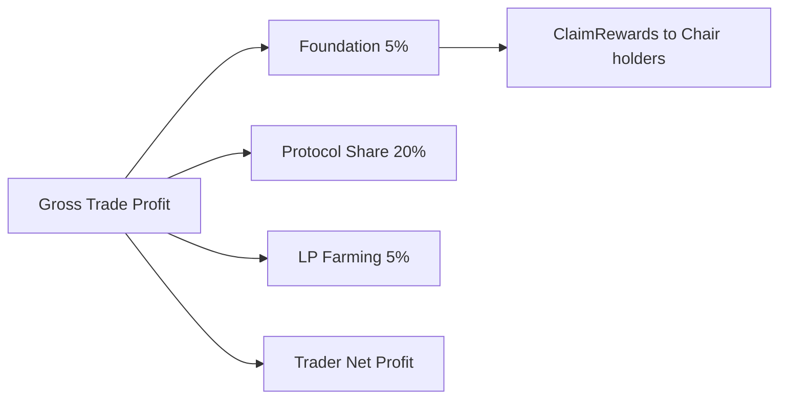

# Tokenomics & Fee Architecture

## IXToken — Rebasing Vault Dynamics

`IXToken` (IrisX, e.g. `USDI` over DAI) is an asset-denominated ERC-20 vault share. Depositors receive rebasing balances whose value grows as `totalAssets()` increases:

- **Deposit:** Pull underlying → mint rebasing shares (Floor rounding)
- **Withdraw:** Burn shares → payout assets including yield (Ceil rounding)
- **Fixed ledger:** Adapters and integrations hold exact 1:1 balances excluded from yield

### Global Accounting

```
T = totalAssets() = I + D + S

I = idle underlying cash
D = protocolDebt (virtual affiliate IOU)
S = assetsInStrategy (deployed margin + allocation)

totalSupply() = convertToAssets(totalShares) + totalFixedBalances
```

**Critical invariant:** Do not double-count `S` in `totalSupply()` — share conversion already flows through `T`.

Physical redemptions are capped by idle cash `I`, not book `T`. Use `maxWithdraw` for integrators.

---

## Profit Distribution on Position Close

When a trader closes a profitable position, gross profit is split across multiple rails:

| Recipient | Parameter | Default | Mechanism |
|-----------|-----------|---------|-----------|
| **Foundation** | `foundationFeeBps` | 500 (5%) | Minted vault tokens to Foundation contract |
| **Protocol (rebasing holders)** | `protocolShareOfProfitBps` | 2000 (20%) | Accrued to vault NAV |
| **LP Farming** | `lpFarmingFeeBps` | 500 (5%) | Minted to `lpFarming` locker (or Foundation if unset) |
| **Trader** | Remainder | — | Net profit after all slices |



---

## Foundation Reward Distribution

The Foundation contract (`0x00008c80D4cBD653B1D384566d9b23B37d100000`) accumulates fee tokens. Any holder may call:

```solidity
ClaimRewards(address token)
```

Rewards split **equally** among all live Chairs in `activeCardsRegistry`. If a Chair is burned via Kamikaze veto, `liveCards` decreases and each survivor's per-Chair share increases.

---

## Withdrawal & Affiliate Fees

| Fee | Default | Purpose |
|-----|---------|---------|
| `withdrawalFeeBps` | 50 (0.5%) | Protocol revenue; amortizes `protocolDebt` |
| `affiliateFeeBps` | 10 (0.1%) | Referral commission on `depositWithAffiliate` |

Affiliate deposits increase `protocolDebt` (optimistic accounting — see [Phantom NAV C-1](/technical/phantom-nav-c1)). Withdrawal fees repay `D` before accruing to protocol PnL.

---

## Keeper Incentives (Separate from Foundation)

| Path | Formula |
|------|---------|
| Force-close | `min(margin × keeperIncentiveRewardBps, maxKeeperIncentiveReward, gross)` |
| Liquidation | `min(netRecovery × keeperIncentiveRewardBps, maxKeeperIncentiveReward)` |

Paid as rebasing vault share mints to the executing keeper address. Default bps: 1000 (10%).

---

## VotingEscrow Governance Weight

Users lock IXToken for a duration between 1 week and 4 years (expressed in **blocks**). Voting weight equals locked rebasing share count — not time-decayed. One lock per address; manual delegation is disabled (`delegates(user) == user`).

---

## Veto Game Theory

| Mechanism | Cost to Chair | When Used |
|-----------|---------------|-----------|
| **Consul veto** | None (coordination required) | Non-security disputes, parameter disagreements |
| **Kamikaze veto** | Permanent token burn | Existential threats, governance attacks |

A rational Chair prefers Consul veto for recoverable disputes and reserves Kamikaze for threats exceeding the net present value of their perpetual 1/15 fee stream.
