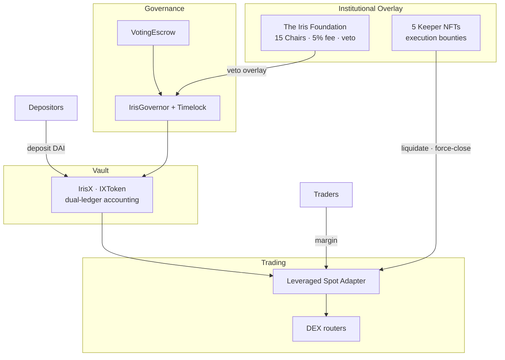

# Iris Protocol

**Iris Protocol** is a decentralized platform for **leveraged spot trading** and **on-chain fund management**, built on **DAI**.

Depositors earn yield on idle capital. Traders open leveraged long positions with transparent, on-chain fees. Governance, an institutional Foundation overlay, and Keeper operators keep the system accountable and solvent — all without handing custody to a centralized exchange.

> *"The Foundation issues the credit lines; the network executes the reality of the ledger."*

---

## Who Participates?

| Role | What they do |
|------|----------------|
| **Depositors** | Supply DAI to the vault and earn rebasing yield through **IrisX** |
| **Traders** | Post margin and open leveraged **long spot** positions |
| **Governance voters** | Lock IrisX to vote on protocol upgrades and parameters |
| **Foundation** | 15 Chair NFT holders share a 5% profit fee and hold tactical veto authority during governance timelocks |
| **Keepers** | Five execution operators liquidate unhealthy positions and earn bounded on-chain bounties |

---

## How It Fits Together

Iris separates **accounting** (who owns what on the ledger) from **execution** (how trades are swapped on-chain). One vault books all capital; authorized adapters handle the trading layer.

---

## Documentation Guide

This GitBook is organized in two layers:

### Whitepaper
Nine academic chapters covering the full protocol design — from the core vault invariant through governance game theory, execution adapters, and audit verification. Start with [Chapter 01 — Abstract](whitepaper/01-abstract.md) or jump to any topic below.

| | Chapter |
|---|---------|
| 01 | [Abstract & Executive Summary](whitepaper/01-abstract.md) |
| 02 | [Problem Space](whitepaper/02-problem.md) |
| 03 | [IXToken Vault](whitepaper/03-ixtoken_vault.md) |
| 04 | [Position Lifecycles](whitepaper/04-position_lifecycles.md) |
| 05 | [Systemic Risk Management](whitepaper/05-systemic_risk_manager.md) |
| 06 | [Governance](whitepaper/06-governance.md) |
| 07 | [Protocol Debt & Amortization](whitepaper/07-protocol_dept_and_captial_amortization.md) |
| 08 | [Execution Layers](whitepaper/08-execution_layers.md) |
| 09 | [System Verification](whitepaper/09-system_verification.md) |

### Technical Specifications
Engineering deep-dives for integrators and auditors:

| | Spec |
|---|------|
| — | [System Architecture](tech-specs/architecture.md) — includes Phantom NAV & economic solvency |
| — | [Smart Contract Protocol](tech-specs/smart-contracts.md) |
| — | [Go Backend & Infrastructure](tech-specs/backend-go.md) |
| — | [Security & Audit Dispositions](tech-specs/security-audit.md) |

---

## Security

Found a vulnerability? Report it responsibly to **security@irislab.net**.
