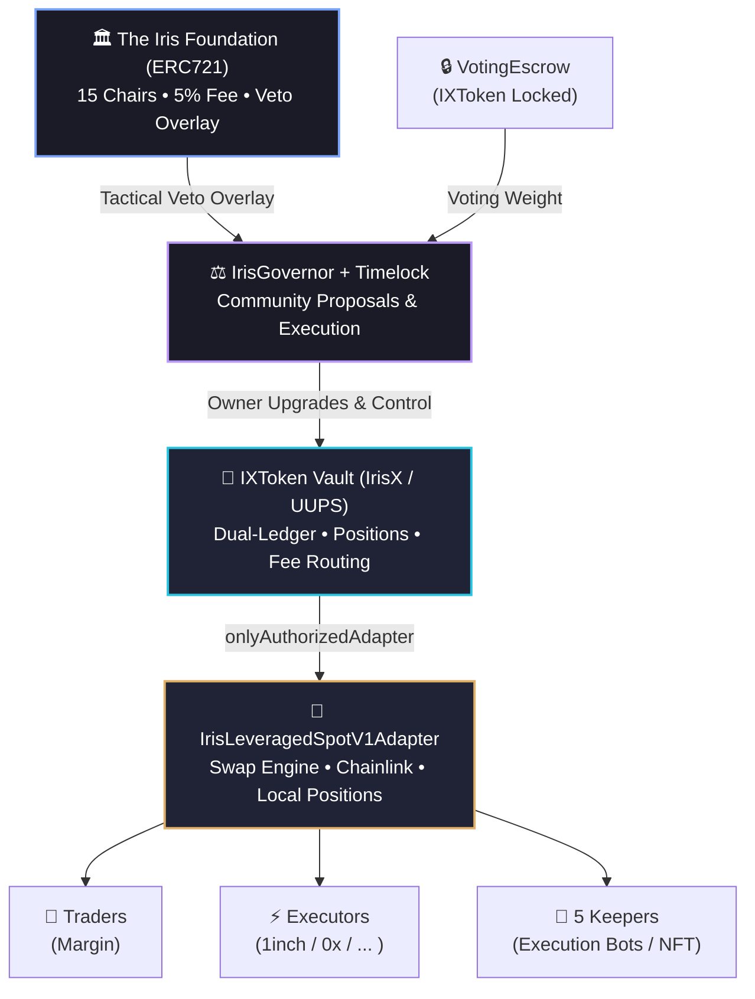

# Overview

Welcome to the official documentation hub for **Iris Protocol**. 

Iris Protocol is a modular, decentralized **leveraged spot trading** and **on-chain fund management** stack built for institutional-grade reliability on top of native stablecoin liquidity. 

> 🏷️ **The Iris Thesis:** > *"The Foundation issues the credit lines; the network executes the reality of the ledger."*

---

## What is Iris Protocol?

Iris operates as a highly specialized margin execution ecosystem rather than an over-collateralized lending pool. It introduces a powerful, dual-ledger infrastructure that maximizes capital efficiency for traders while protecting liquidity providers through mathematically rigorous risk management.

The ecosystem is sustained by five core participant profiles:
* **Depositors:** Supply liquidity to the vault in exchange for yield-bearing, rebasing asset tokens.
* **Traders:** Open optimized, decentralized leveraged long spot positions through authorized decentralized exchange (DEX) adapters.
* **Governance Voters:** Lock protocol tokens to dictate risk parameters, asset distributions, and code upgrades.
* **Foundation Chairs:** A governance overlay consisting of 15 unique cryptographic seats managing systemic security, strategic veto overrides, and capturing a percentage of volume profits.
* **Keeper Corps:** An automated network of 5 distinct execution profiles handling critical systemic actions like liquidations and expired position enforcement.

---

## Protocol Architecture

Iris Protocol decouples strategic capital routing from execution layers to ensure maximum composability and defense against on-chain vulnerabilities.

---

## Core System Components

To navigate through this documentation suite efficiently, the protocol is broken down into two main technical publications:

### 📖 1. The Whitepaper
The Whitepaper details the macroeconomics, target problem vectors, and systemic game theory governing Iris.
* [Executive Summary](whitepaper/abstract.md) — The high-level vision and abstract framework.
* [Core Mechanisms](whitepaper/core-mechanisms.md) — Under-the-hood look at yield routing, liquidations, and transaction processing.
* [Tokenomics & Profit Waterfalls](whitepaper/tokenomics.md) — Breakdown of the 5% Foundation fee architecture, protocol revenue accrual, and distribution rules.

### 🛠️ 2. Technical Specifications
The Tech Specs provide a comprehensive implementation guide for smart contract auditors, backend engineers, and web3 integrators.
* [System Architecture](tech-specs/architecture.md) — In-depth overview of global accounting invariants, balance conversion rules, and asset tracking formulas.
* [Smart Contract Layer](tech-specs/smart-contracts.md) — Specifications for the rebasing vs. fixed dual-ledger mechanism and position lifecycle states.
* [Go Backend Infrastructure](tech-specs/backend-go.md) — Guide to interacting with internal microservices, configuration layouts, and routing engines.

---

## Protocol Security & Dispositions

Iris is architected around absolute transparency and defensive smart contract engineering utilizing advanced patterns (`Cancun EVM`, transient reentrancy guards, and `UUPS` upgrade paths). 

* **Audit Vectors:** All historical audit logs and theoretical design specifications are publicly cataloged under [Security & Audits](tech-specs/security-audit.md).
* **Responsible Disclosure:** Found an edge case or a bug? Please refer to our vulnerability coordination guidelines or contact our security wing immediately at `security@irislab.net`.
