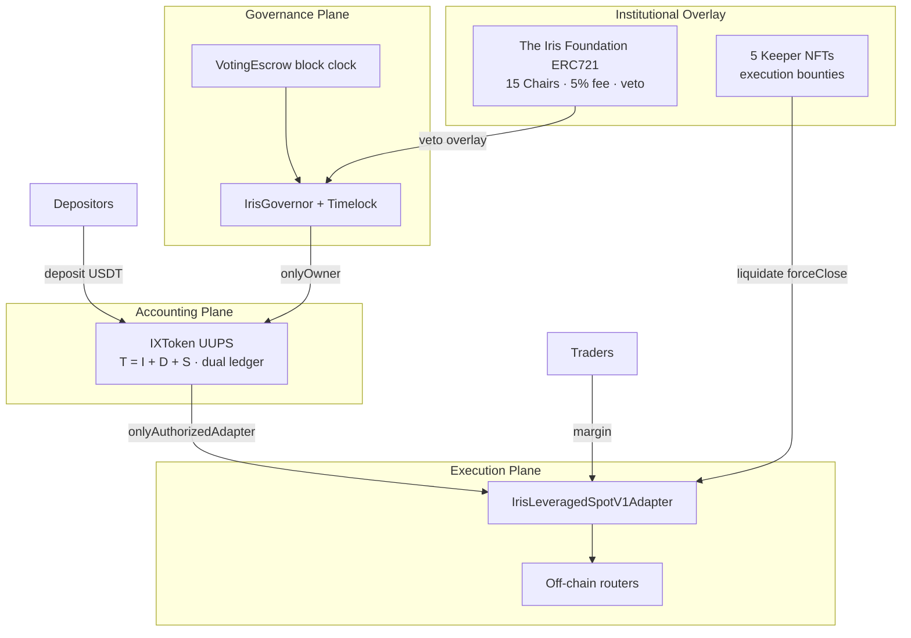

# Overview

Welcome to the official documentation hub for **Iris Protocol**.

Iris Protocol is a modular, decentralized **leveraged spot trading** and **on-chain fund management** stack built on **USDT** (6 decimals) with institutional-grade accounting invariants, block-number governance, and Cancun EVM defensive patterns.

> **The Iris Thesis:** *"The Foundation issues the credit lines; the network executes the reality of the ledger."*

---

## What is Iris Protocol?

Iris operates as a **margin execution vault** — not an over-collateralized lending pool. A single valuation book $T = I + D + S$ consolidates depositor liquidity and trader margin, while a **dual-ledger** `IXToken` separates rebasing yield balances from fixed 1:1 DEX integration slots.

Five participant classes sustain the ecosystem:

| Participant | Role |
|-------------|------|
| **Depositors** | Supply USDT; earn rebasing yield on IrisX (`USDI`) |
| **Traders** | Open leveraged **long spot** positions via authorized adapters |
| **Governance voters** | Lock IXToken in `VotingEscrow`; vote on parameters and upgrades |
| **Foundation Chair holders** | 15 ERC721 Chairs (IDs 0–14), functionally identical; 5% profit fee; timelock veto overlay |
| **Keeper operators** | 5 NFT execution keys; liquidate and force-close for rebasing share bounties (separate from Foundation fees) |

**Foundation contract:** `0x00008c80D4cBD653B1D384566d9b23B37d100000`  
**Governance clock:** `IERC6372` block number — not timestamp.

---

## Protocol Architecture

Iris decouples **accounting** (vault ledger) from **execution** (adapter swaps) to eliminate capital fragmentation and rebasing-margin incompatibility at DEX boundaries.

---

## Whitepaper

The academic whitepaper specifies architecture, invariants, game theory, and verification dispositions. Read sequentially or jump by topic:

| # | Chapter | Topics |
|---|---------|--------|
| 01 | [Abstract & Executive Summary](whitepaper/01-abstract.md) | Paradigm shift, dual-ledger innovation, capital efficiency vectors |
| 02 | [Problem Space](whitepaper/02-problem.md) | Lending pool fragmentation, MEV/slippage, governance fragility |
| 03 | [IXToken Vault](whitepaper/03-ixtoken_vault.md) | $T = I + D + S$, dual-ledger isolation, asymmetric rounding |
| 04 | [Position Lifecycles](whitepaper/04-position_lifecycles.md) | Origination, profit waterfall, signed `pnl` accumulator |
| 05 | [Systemic Risk](whitepaper/05-systemic_risk_manager.md) | Keeper rails, solvency guard, flash reentrancy |
| 06 | [Governance](whitepaper/06-governance.md) | Block-clock escrow, 15 Chairs, Consul vs Kamikaze veto |
| 07 | [Protocol Debt](whitepaper/07-protocol_dept_and_captial_amortization.md) | Affiliate CAC, `protocolDebt` amortization (C-1) |
| 08 | [Execution Layers](whitepaper/08-execution_layers.md) | Adapter V1, permissionless executor (C-03), oracle normalization |
| 09 | [System Verification](whitepaper/09-system_verification.md) | 108+ tests, audit dispositions, notation reference |

---

## Technical Specifications

Implementation guides for auditors and integrators. The whitepaper chapters above contain the canonical specifications; additional tech-spec pages will expand implementation detail.

* [System Architecture](tech-specs/architecture.md) — *(in progress)*

**Source repositories:**

* [`iris-core`](https://github.com/irislab-net/iris-core) — `IXToken`, position lifecycle, flash entry
* [`iris-governance`](https://github.com/irislab-net/iris-governance) — `VotingEscrow`, `IrisGovernor`
* Adapter repo — `IrisLeveragedSpotV1Adapter`

**Agent master reference:** `docs/aic/ai_context.md` (repository root)

---

## Protocol Security & Dispositions

Iris enforces defensive engineering on Cancun EVM: `ReentrancyGuardTransient` (EIP-1153), UUPS upgrade paths with `onlyOwner` authorization, and dispositioned audit findings (C-1 protocol debt by design; H-1/M-1/M-2 flash guards closed).

| Item | Status |
|------|--------|
| `IXToken.sol` test suite | 108+ tests; ~93% line coverage |
| C-1 `protocolDebt` phantom NAV | Acknowledged / by design |
| Flash reentrancy (H-1) | Fixed |
| ERC-3156 callback (M-1, M-2) | Fixed |
| Adapter permissionless executor (C-03) | By design |

**Responsible disclosure:** `security@irislab.net`
