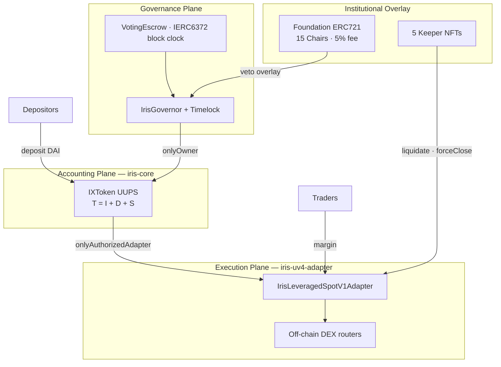
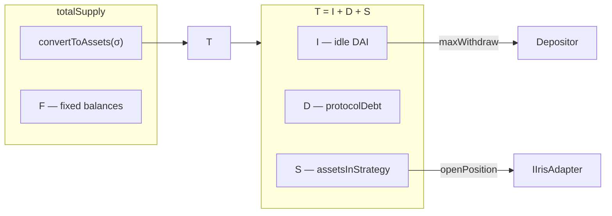
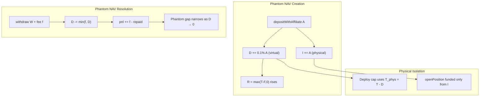
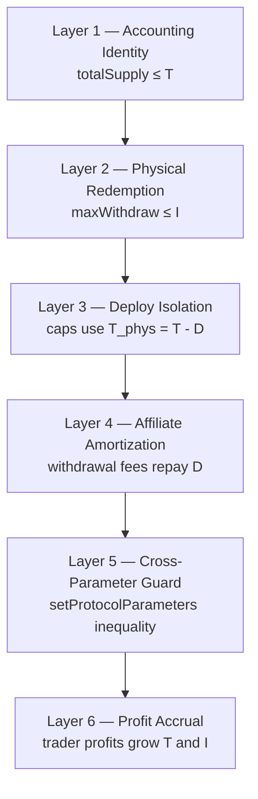
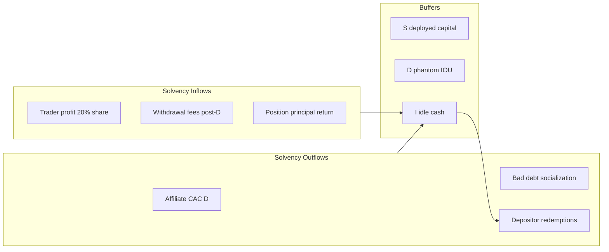

# System Architecture

This document specifies the **global accounting topology**, physical deployment constraints, and solvency guard mathematics for Iris Protocol. All numeric examples use **DAI** with **18 decimals** ($1\,\text{DAI} = 10^{18}$ wei).

**Related:** [Whitepaper Ch. 03](../whitepaper/03-ixtoken_vault.md) · [Ch. 05](../whitepaper/05-systemic_risk_manager.md) · [Ch. 07 — Protocol Debt](../whitepaper/07-protocol_dept_and_captial_amortization.md)

---

## 1. System Planes & Repository Boundaries

Iris Protocol decomposes into four operational planes, mapped to independent repositories:

| Plane | Responsibility | Repository |
|-------|----------------|------------|
| **Accounting** | Vault invariant $T = I + D + S$; dual-ledger; position registry | `iris-core` |
| **Execution** | DEX swaps; Chainlink normalization; local position state | `iris-uv4-adapter` |
| **Governance** | Block-clock escrow; proposals; timelock execution | `iris-governance` |
| **Institutional overlay** | Foundation fee mint; Chair veto; Keeper NFT authorization | `iris-core` + NFT contracts |



### Trust Model Summary

| Assumption | Implication |
|------------|-------------|
| Authorized adapters report honest `totalReturnAssets` | Vault books PnL from adapter values — no vault-level price oracle |
| Adapter owner == vault owner | `setAdapterStatus` under governance control |
| Swap `executor` + calldata supplied off-chain | On-chain safety = capped approvals, balance deltas, slippage floors (C-03 by design) |
| Governance sets `lender` address | Only `IrisFlashLender` gateway calls `internalFlashLoanToLender` |

---

## 2. Global Accounting Invariant

### 2.1 Asset Partition

Total book assets:

$$
T = \texttt{totalAssets()} = I + D + S
$$

| Symbol | Contract field | Definition |
|--------|----------------|------------|
| $I$ | `_underlying.balanceOf(vault)` | Idle DAI cash — **physical redemption ceiling** |
| $D$ | `protocolDebt` | Virtual affiliate IOU (optimistic CAC; disposition C-1) |
| $S$ | `assetsInStrategy` | $\sum_j (m_j + a_j)$ across open positions |

$I$, $D$, and $S$ are **mutually exclusive partitions** of $T$. Every state transition must attribute $\Delta T$ to exactly one or more of $\{\Delta I, \Delta D, \Delta S\}$.

### 2.2 Liability Identity

Gross token liabilities in DAI wei:

$$
\texttt{totalSupply()} = \texttt{convertToAssets}(\sigma) + F
$$

where $\sigma = \texttt{\_totalShares}$ and $F = \texttt{\_totalFixedBalances}$.

**Critical rule:** $S$ must **never** be added again to `totalSupply()`. Share conversion flows through $T$, which already includes $S$ exactly once. Violating this creates phantom redeemable assets.

### 2.3 Rebasing Pool Backing

$$
R = \texttt{\_rebasingAssets()} = \max(T - F,\, 0)
$$

Fixed ledger $F$ is reserved before rebasing pool sizing. Adapters hold fixed balances; depositors default to rebasing.



---

## 3. Physical Assets & Deployment Caps

### 3.1 Physical Asset Definition

**Physical assets** — capital that is deployable or redeemable without virtual components:

$$
T_{\text{phys}} = T - D = I + S
$$

Phantom debt $D$ cannot be transferred to adapters or redeemed as cash. All strategy deployment caps and open-position volume checks use $T_{\text{phys}}$, not $T$.

### 3.2 Maximum Strategy Deployment

$$
S_{\max} = \frac{\texttt{maxOpenPositionsVolumeBps}}{10\,000} \cdot T_{\text{phys}}
$$

Default $\texttt{maxOpenPositionsVolumeBps} = 5000$ (50%). At open:

$$
S + m + a \leq S_{\max}
$$

### 3.3 Open Position Preconditions

Authorized adapter calls `openPosition(id, trader, m, a)` only when:

$$
\begin{aligned}
\text{(i)} \quad & m + a \leq I \\
\text{(ii)} \quad & a \leq m \cdot \frac{\texttt{maxLeverageBps}}{10\,000} \\
\text{(iii)} \quad & S + m + a \leq \frac{\texttt{maxOpenPositionsVolumeBps}}{10\,000} \cdot T_{\text{phys}} \\
\text{(iv)} \quad & m + a \geq V_{\min}
\end{aligned}
$$

Defaults: $\texttt{maxLeverageBps} = 50{,}000$ (5×), $V_{\min} = 10^{18}$ wei (1 DAI).

**Book-neutral deploy:** On success, $S' = S + m + a$, $I' = I - (m + a)$, $T' = T$. Value shifts from $I$ to $S$ without changing $T$.

### 3.4 Physical Redemption Ceiling

Per-user redemption:

$$
\texttt{maxWithdraw}(u) \leq I
$$

Book NAV `balanceOf(u)` may exceed physically redeemable DAI when $S > 0$ or $D > 0$. Integrators **must** surface `maxWithdraw`, not raw `balanceOf`.

---

## 4. Phantom NAV (C-1)

**Status:** Acknowledged / by design (audit disposition C-1).

### 4.1 Definition

**Phantom NAV** is the gap between **book net asset value** (what rebasing shares price against) and **physically redeemable DAI** (what idle cash $I$ can actually pay out). Two independent sources create this gap:

| Source | Symbol | Mechanism |
|--------|--------|-----------|
| **Virtual affiliate IOU** | $D$ | `protocolDebt` booked in $T$ without matching cash inflow |
| **Strategy lock-up** | $S$ | Margin + allocation deployed to adapters; not in $I$ |

$$
\underbrace{T}_{\text{book NAV}} = I + D + S, \qquad \underbrace{I}_{\text{redeemable cash}} \leq T - S - D_{\text{non-amortizable}}
$$

The **phantom component from $D$** is the C-1 finding: optimistic CAC accounting that inflates rebasing pool $R$ before economic repayment.

### 4.2 How Phantom NAV Is Created — `depositWithAffiliate`

On `depositWithAffiliate(A, receiver, affiliate)` with gross deposit $A$ (DAI wei):

$$
\Delta D_{\text{aff}} = A \cdot \frac{\texttt{affiliateFeeBps}}{10\,000}, \quad \texttt{affiliateFeeBps} = 10 \text{ (0.1\%)}
$$

| Step | State change |
|------|--------------|
| 1. Pull $A$ from depositor | $I \mathrel{+}= A$ |
| 2. Mint affiliate rebasing shares on $\Delta D_{\text{aff}}$ | $\sigma_{\text{aff}} \uparrow$ |
| 3. Book virtual IOU | $D \mathrel{+}= \Delta D_{\text{aff}}$, $T \mathrel{+}= \Delta D_{\text{aff}}$ |
| 4. Mint depositor shares on full gross $A$ | $\sigma_{\text{dep}} \uparrow$ (no depositor haircut) |

**Cash vs. book mismatch:** Only $A$ physical DAI arrives, but $T$ increases by $A + \Delta D_{\text{aff}}$. The excess $\Delta D_{\text{aff}}$ is phantom — it raises share price $p = T / \sigma$ for all rebasing holders without a corresponding cash inflow.

$$
R = \max(T - F, 0) \uparrow \quad \text{while} \quad I \text{ increases by only } A
$$

**Self-referral block:** `affiliate == depositor` or `affiliate == address(0)` skips the affiliate branch — prevents trivial CAC loops.

### 4.3 Phantom NAV vs. Physical NAV

Define two integrator-facing NAV surfaces:

$$
\text{NAV}_{\text{book}} = T = I + D + S
$$

$$
\text{NAV}_{\text{phys}} = T_{\text{phys}} = T - D = I + S
$$

$$
\text{NAV}_{\text{redeemable}} = I
$$

| Surface | Contract view | Use case |
|---------|---------------|----------|
| Book NAV | `totalAssets()` | Share price; yield accrual |
| Physical NAV | `totalAssets() - protocolDebt` | Deploy caps; strategy limits |
| Redeemable NAV | `_underlying.balanceOf(vault)` | `maxWithdraw`; withdrawal UX |

**Per-user phantom exposure:**

$$
\text{PhantomGap}(u) = \texttt{balanceOf}(u) - \texttt{maxWithdraw}(u)
$$

This gap is **not a bug** — it reflects strategy deployment ($S$) and virtual debt ($D$). UIs must never present `balanceOf` as instantly withdrawable cash.

### 4.4 What C-1 Claims — and Does Not Claim

**Claims (by design):**

- Affiliate CAC is booked optimistically as $D$ and recovered through withdrawal fee amortization.
- Phantom $D$ cannot fund `openPosition` — deploy caps use $T_{\text{phys}}$.
- Rebasing NAV may exceed aggregate idle cash while $D > 0$ or $S > 0$.

**Does not claim:**

- All holders can simultaneously redeem full `balanceOf` from $I$.
- `previewDeposit(A)` fair-mint independence when affiliate mint is concurrent (separate audit item).
- $D$ amortization is instantaneous — it requires cumulative withdrawal volume.

### 4.5 Amortization — How Phantom NAV Resolves

Withdrawal fees repay $D$ first:

$$
f = W \cdot \frac{\texttt{withdrawalFeeBps}}{10\,000}, \quad D' = D - \min(f, D)
$$

Cumulative amortization for initial phantom liability $D_0$:

$$
D_0 \leq F_{\text{cum}} = \frac{\texttt{withdrawalFeeBps}}{10\,000} \cdot W_{\text{cum}} \implies W_{\text{cum}} \geq \frac{10\,000 \cdot D_0}{\texttt{withdrawalFeeBps}}
$$

**Example (DAI, 18 decimals):** $D_0 = 100 \times 10^{18}$ wei (from $100{,}000$ DAI referred at 0.1%) requires $W_{\text{cum}} \geq 20{,}000$ DAI in cumulative withdrawals to fully extinguish phantom debt.

Residual fee after $D$ exhaustion accrues to `pnl` and benefits rebasing holders via $T$ growth.



### 4.6 Monitoring Metrics

| Metric | Formula | Healthy range |
|--------|---------|---------------|
| Phantom debt ratio | $D / T$ | Declining over time; spikes with affiliate campaigns |
| Liquidity coverage | $I / \texttt{totalSupply()}$ | $> 0$ always; higher = more redemption headroom |
| Strategy utilization | $S / T_{\text{phys}}$ | $\leq 50\%$ at default cap |
| Amortization velocity | $\Delta D / \Delta t$ vs. withdrawal fee inflow | $|\Delta D_{\text{net}}|$ should not grow unbounded |

**Full auditor brief:** `iris-core/docs/audit_reports/dispositions/C-1-protocol-debt-phantom-nav.md`

---

## 5. Economic Solvency Framework

Economic solvency is the protocol's ability to **honor liabilities over time** — through physical redemption, strategy recovery, fee amortization, and profit accrual — without insolvency events or governance intervention. Iris enforces solvency through layered constraints, not a single ratio.

### 5.1 Solvency Layers



| Layer | Constraint | Failure mode if violated |
|-------|------------|------------------------|
| **Accounting** | $\texttt{totalSupply()} \leq T$ | Phantom redeemable shares; exploitable |
| **Redemption** | $\texttt{maxWithdraw}(u) \leq I$ | Over-promising withdrawable cash |
| **Deploy isolation** | $\Delta S$ capped on $T_{\text{phys}}$ | Phantom $D$ funds trading |
| **Amortization** | $D$ reduced by withdrawal fees first | Unbounded phantom NAV growth |
| **Parameter guard** | $\omega \geq \alpha$ (see §5.3) | Governance-blocked at setter |
| **Profit accrual** | Profitable closes increase $T$ and $I$ | Long-run backing improvement |

### 5.2 Liquidity Coverage Ratios

**Immediate redemption coverage** — fraction of book liabilities backed by idle cash:

$$
\Lambda_{\text{redeem}} = \frac{I}{\texttt{totalSupply()}}
$$

When $S > 0$: $\Lambda_{\text{redeem}} < 1$ is **expected** — deployed capital is not instantly redeemable. Integrators should display this explicitly.

**Physical asset coverage** — book assets excluding virtual debt:

$$
\Lambda_{\text{phys}} = \frac{T_{\text{phys}}}{T} = \frac{I + S}{I + D + S}
$$

As $D \to 0$ through amortization, $\Lambda_{\text{phys}} \to 1$. Persistent $D / T > 5\%$ with declining withdrawal volume signals affiliate program stress.

**Strategy recovery coverage** — deployed capital relative to physical base:

$$
\Lambda_{\text{strat}} = \frac{S}{T_{\text{phys}}} \leq \frac{\texttt{maxOpenPositionsVolumeBps}}{10\,000}
$$

Default cap: $\Lambda_{\text{strat}} \leq 0.5$.

### 5.3 Affiliate CAC Solvency Guard

Let $\phi = \texttt{maxOpenPositionsVolumeBps} / 10\,000$ be the maximum strategy lock fraction. At most fraction $(1 - \phi)$ of the book can withdraw at steady state. Fee recovery capacity must dominate affiliate issuance:

$$
\underbrace{(1 - \phi) \cdot \texttt{withdrawalFeeBps}}_{\omega \text{ — effective recovery bps}} \geq \underbrace{\texttt{affiliateFeeBps}}_{\alpha \text{ — issuance bps}}
$$

Governance enforces the equivalent cross-parameter form:

$$
\texttt{withdrawalFeeBps} \cdot (10\,000 - \texttt{maxOpenPositionsVolumeBps}) \geq \texttt{affiliateFeeBps} \cdot 10\,000
$$

**Default verification:**

$$
(1 - 0.5) \times 50 = 25 \geq 10 \quad \checkmark, \qquad 50 \times 5000 = 250{,}000 \geq 100{,}000 \quad \checkmark
$$

### 5.4 Bad Debt & Limited-Loss Solvency

Position settlement can erode $T$ through adverse branches:

| Branch | Effect on $T$ | Effect on $I$ | Solvency impact |
|--------|---------------|---------------|-----------------|
| **Profit** | $T \uparrow$ (protocol share + fees) | $I \uparrow$ on close | Strengthens solvency |
| **Breakeven** | Neutral | $I \uparrow$ (principal return) | Neutral |
| **Limited loss** | Loss absorbed from margin | Partial $I$ recovery | Bounded; within $m$ |
| **Penalty** | Penalty fee → `pnl` | Partial recovery | Protocol-favorable |
| **Hard bad debt** | $T \downarrow$; `pnl < 0` | Shortfall socialized | Weakens solvency |

Bad debt socialization reduces $T$ without a matching reduction in $\texttt{totalSupply()}$ — rebasing share price falls. This is **distinct from phantom NAV** (which inflates $T$ without cash). Both reduce $\Lambda_{\text{redeem}}$ but through opposite mechanisms.

$$
\Delta T_{\text{bad debt}} < 0 \implies p = \frac{T}{\sigma} \downarrow \implies \text{rebasing holders absorb loss}
$$

Keeper rails (Chapter 5) bound tail-loss frequency; liquidation incentives convert underwater positions into bounded recoveries before hard bad debt.

### 5.5 Long-Run Economic Equilibrium

Steady-state solvency requires **inflows $\geq$ outflows** across all rails:

$$
\underbrace{\Pi_P + f_{\text{net}} + \Delta D_{\text{repay}}}_{\text{protocol inflows}} \geq \underbrace{\Delta D_{\text{aff}} + L_{\text{bad}}}_{\text{protocol outflows / obligations}}
$$

where $\Pi_P$ is the 20% protocol profit share on profitable closes, $f_{\text{net}}$ is withdrawal fees after $D$ amortization, and $L_{\text{bad}}$ is cumulative bad debt.

**Profit waterfall as solvency engine:** Trader profits generate $\Pi_P$ accrual to $T$, Foundation fees (5%), and trader net — all of which increase book backing. Sustained trading volume is the primary long-run solvency driver beyond fee amortization.

### 5.6 Stress Scenario Matrix

| Scenario | $S / T_{\text{phys}}$ | $D / T$ | $\Lambda_{\text{redeem}}$ | Outcome |
|----------|----------------------|---------|--------------------------|---------|
| Normal operations | 25% | $< 1\%$ | $\approx 0.74$ | Healthy |
| Max strategy deploy | 50% | $< 1\%$ | $\approx 0.49$ | Expected; use `maxWithdraw` |
| Affiliate campaign spike | 25% | 3–5% | $\approx 0.71$ | Monitor amortization velocity |
| Max deploy + high $D$ | 50% | 5% | $\approx 0.44$ | At guard boundary; elevated phantom NAV |
| Bad debt event | 50% | 1% | Drops sharply | Share price haircut; keeper post-mortem |
| Misconfigured fees | Any | Growing | Declining | **Blocked at `setProtocolParameters`** |

### 5.7 Governance Parameter Sensitivity

| Parameter | $\uparrow$ effect | Solvency risk |
|-----------|-----------------|---------------|
| `affiliateFeeBps` | Faster $D$ accumulation | Phantom NAV grows faster |
| `withdrawalFeeBps` | Slower $D$ amortization | Phantom NAV persists longer |
| `maxOpenPositionsVolumeBps` | Smaller $(1-\phi)$ | Weaker amortization margin |
| `maxLeverageBps` | Larger per-position $S$ | Higher tail-loss exposure |
| `liquidationThresholdBps` | Later liquidations | Larger potential bad debt |

All parameter changes must satisfy the cross-parameter inequality or `setProtocolParameters` reverts.



---

## 6. DAI 18-Decimal Scaling Reference

All user-facing amounts are denominated in **DAI wei** ($10^{18}$ per 1 DAI).

| Constant | Formula | Default (18 decimals) |
|----------|---------|----------------------|
| `minimumDepositAssetAmount` | $10^{\text{decimals} - 4}$ | $10^{14}$ wei (0.0001 DAI) |
| `minimumPositionVolume` | $10^{\text{decimals}}$ | $10^{18}$ wei (1 DAI) |
| `maxKeeperIncentiveReward` | $500 \times 10^{\text{decimals}}$ | $500 \times 10^{18}$ wei |
| `MAX_KEEPER_INCENTIVE_REWARD_NO_DECIMALS` | 500 | Cap scalar × $10^{18}$ |

Integrators must validate input amounts against these floors before submitting transactions. Off-chain services should use `bigint` / `uint256` arithmetic — never floating-point — for all DAI wei calculations.

---

## 7. End-to-End Capital Flow

```mermaid
sequenceDiagram
  participant D as Depositor
  participant V as IXToken
  participant A as Adapter
  participant X as DEX Executor
  participant K as Keeper

  D->>V: deposit(A) — Floor mint σ
  Note over V: T = I + D + S; I += A

  D->>A: openPosition + swap calldata
  A->>V: openPosition(id, trader, m, a)
  V->>V: validate cap on T_phys; I ≥ m+a
  V->>A: transfer DAI (m+a); S += m+a
  A->>X: swap DAI → target
  X-->>A: target tokens

  K->>A: liquidatePosition / forceClose
  A->>X: swap target → DAI
  A->>V: closePosition / liquidatePosition
  V->>K: _mint rebasing shares (keeper bounty)
  V->>V: settle branches; S -= m+a; I += return
```

---

**Implementation reference:** `iris-core/src/IXToken.sol`  
**Security contact:** `security@irislab.net`
