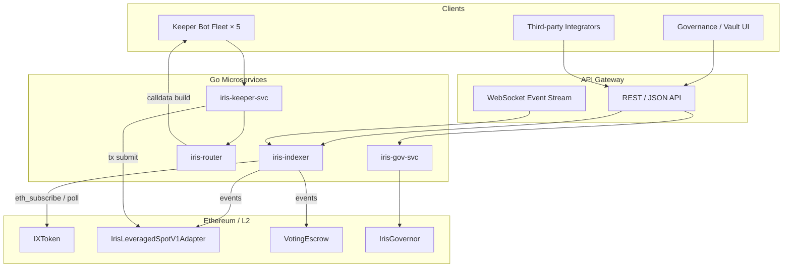
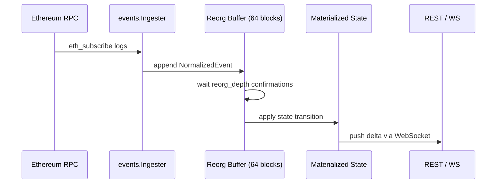
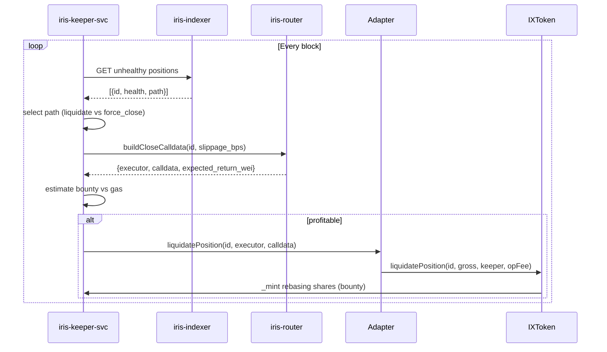

# Go Backend & Core Infrastructure

This document outlines the **off-chain service architecture** for Iris Protocol: microservice boundaries, Go package layout, configuration schema, event ingestion, and API contracts. The backend layer bridges on-chain vault state (DAI, 18 decimals) to integrator UIs, keeper bot fleets, and governance dashboards.

**Related:** [Architecture](architecture.md) · [Smart Contracts](smart-contracts.md) · [Whitepaper Ch. 08](../whitepaper/08-execution_layers.md)

---

## 1. Service Topology



| Service | Responsibility |
|---------|----------------|
| **iris-indexer** | Chain event ingestion; materialized vault/position state; reorg handling |
| **iris-keeper-svc** | Health monitoring; liquidation/force-close trigger; bounty accounting |
| **iris-router** | Off-chain DEX quote aggregation; executor + calldata construction (C-03 boundary) |
| **iris-gov-svc** | Proposal indexing; VotingEscrow weight snapshots; Foundation veto state |
| **API gateway** | Rate-limited REST + WebSocket fan-out to clients |

---

## 2. Go Package Layout

Proposed monorepo structure (`iris-backend`):

```
iris-backend/
├── cmd/
│   ├── indexer/main.go
│   ├── keeper/main.go
│   ├── router/main.go
│   └── api/main.go
├── pkg/
│   ├── vault/          # IXToken state, T=I+D+S, maxWithdraw
│   ├── adapter/        # Position health, eligibility checks
│   ├── governance/     # Escrow locks, proposals, veto overlay
│   ├── keeper/         # Liquidation/force-close orchestration
│   ├── router/         # Quote + calldata builders (1inch, 0x, etc.)
│   ├── events/         # ABI decode, log normalization, reorg buffer
│   ├── config/         # Typed config loading
│   └── eth/            # RPC client, tx submission, nonce management
├── api/
│   ├── openapi.yaml    # REST contract
│   └── proto/          # Optional gRPC for internal services
└── deployments/
    └── config/
        ├── mainnet.yaml
        └── arbitrum.yaml
```

### Package Responsibilities

| Package | Key types | On-chain coupling |
|---------|-----------|-------------------|
| `pkg/vault` | `VaultState`, `UserBalance`, `WithdrawQuote` | `IXToken` view calls |
| `pkg/adapter` | `Position`, `HealthScore`, `LiquidationEligibility` | `IrisLeveragedSpotV1Adapter` |
| `pkg/governance` | `Lock`, `Proposal`, `VetoState` | `VotingEscrow`, `IrisGovernor` |
| `pkg/keeper` | `KeeperJob`, `BountyEstimate` | Keeper NFT ownership + adapter calls |
| `pkg/events` | `NormalizedEvent`, `BlockCursor` | All subscribed ABIs |

---

## 3. Configuration Schema

```yaml
# deployments/config/mainnet.yaml
chain:
  chain_id: 1
  rpc_url: "${ETH_RPC_URL}"
  ws_url: "${ETH_WS_URL}"
  block_time_seconds: 12

contracts:
  ix_token: "0x..."
  adapter: "0x..."
  voting_escrow: "0x..."
  iris_governor: "0x..."
  timelock: "0x..."
  foundation: "0x00008c80D4cBD653B1D384566d9b23B37d100000"
  keeper_nft: "0x..."
  dai: "0x6B175474E89094C44Da98b954EedeAC495271d0F"

assets:
  underlying_symbol: "DAI"
  underlying_decimals: 18          # CRITICAL — all amounts in DAI wei
  ix_token_decimals: 18

indexer:
  start_block: 0
  reorg_depth: 64
  poll_interval_ms: 12000

keeper:
  enabled_paths: ["liquidate", "force_close"]
  min_profit_wei: "100000000000000000"   # 0.1 DAI
  gas_price_cap_gwei: 50
  keeper_token_ids: [0, 1, 2, 3, 4]

router:
  providers: ["1inch", "0x"]
  default_slippage_bps: 100
  max_slippage_bps: 300

governance:
  clock_mode: "blocknumber"        # IERC6372 — must match on-chain
  voting_delay_blocks: 21600
  voting_period_blocks: 151200
```

All monetary fields in config and API payloads use **string-encoded uint256** (DAI wei) to avoid floating-point precision loss.

---

## 4. Event Ingestion Boundaries

### 4.1 Subscribed Events

| Contract | Event | Indexer action |
|----------|-------|----------------|
| `IXToken` | `Deposit(receiver, assets, shares)` | Update $I$; user rebasing balance |
| `IXToken` | `Withdraw(caller, receiver, owner, assets, shares)` | Update $I$; fee + $D$ amortization |
| `IXToken` | `PositionOpened(id, trader, adapter, margin, allocated)` | $S \mathrel{+}= m + a$; register position |
| `IXToken` | `PositionClosed(id, ...)` | $S \mathrel{-}= m + a$; branch classification |
| `IXToken` | `Transfer(from, to, value)` | Dual-ledger balance sync |
| `IXToken` | `ProtocolDebtUpdated(debt)` | $D$ snapshot |
| `Adapter` | `PositionOpened` (local) | Cross-validate vault id |
| `Adapter` | `PositionClosed` / `Liquidated` | Health state terminal |
| `VotingEscrow` | `Deposit` / `Withdraw` | Lock weight update |
| `IrisGovernor` | `ProposalCreated` / `VoteCast` | Proposal index |
| `Foundation` | `RewardsClaimed` | Fee distribution audit trail |

### 4.2 Ingestion Pipeline



### 4.3 Reorg Handling

1. Buffer events for `reorg_depth` blocks (default 64).
2. On reorg detection: roll back state to `fork_block - 1`.
3. Re-process buffered events from canonical chain.
4. Emit `state_resync` WebSocket signal to clients.

### 4.4 Ingestion Exclusions

| Data | Source | Not ingested |
|------|--------|--------------|
| Off-chain swap routes | `iris-router` | Routes are ephemeral; only tx hash + calldata hash logged |
| Chainlink prices | Direct RPC | Fetched on-demand by keeper/router; not event-sourced |
| `pnl` accumulator | On-chain view | Snapshotted on close events; not independently computed |

---

## 5. API Payloads

### 5.1 Vault State — `GET /v1/vault`

```json
{
  "total_assets_wei": "1000000000000000000000",
  "idle_cash_wei": "400000000000000000000",
  "protocol_debt_wei": "5000000000000000000",
  "assets_in_strategy_wei": "595000000000000000000",
  "physical_assets_wei": "995000000000000000000",
  "total_supply_wei": "1000000000000000000000",
  "share_price_wei": "1000000000000000000",
  "underlying": "DAI",
  "decimals": 18,
  "block_number": 21234567,
  "solvency": {
    "phantom_debt_ratio": "0.005",
    "liquidity_coverage": "0.40",
    "physical_coverage": "0.995",
    "strategy_utilization": "0.50"
  }
}
```

Invariant check (server-side): `total_assets_wei == idle_cash_wei + protocol_debt_wei + assets_in_strategy_wei`.

**Solvency fields:**

| Field | Formula | Notes |
|-------|---------|-------|
| `phantom_debt_ratio` | $D / T$ | C-1 phantom NAV indicator; monitor during affiliate campaigns |
| `liquidity_coverage` | $I / \texttt{totalSupply()}$ | Immediate redemption headroom; $< 1$ expected when $S > 0$ |
| `physical_coverage` | $(T - D) / T$ | Approaches 1 as $D$ amortizes |
| `strategy_utilization` | $S / (T - D)$ | Must be $\leq$ `maxOpenPositionsVolumeBps / 10000` |

### 5.2 User Balance — `GET /v1/vault/users/{address}`

```json
{
  "address": "0x...",
  "balance_wei": "50000000000000000000",
  "max_withdraw_wei": "35000000000000000000",
  "ledger_mode": "rebasing",
  "shares": "49500000000000000000",
  "is_excluded_from_yield": false
}
```

**Critical:** `max_withdraw_wei ≤ idle_cash_wei` globally. Never expose `balance_wei` as redeemable capacity.

### 5.3 Position Health — `GET /v1/positions/{id}`

```json
{
  "position_id": "0x...",
  "trader": "0x...",
  "adapter": "0x...",
  "margin_wei": "10000000000000000000",
  "allocated_wei": "40000000000000000000",
  "debt_wei": "50000000000000000000",
  "health_factor": 0.82,
  "liquidation_eligible": true,
  "force_close_eligible": false,
  "opened_at_block": 21200000,
  "expires_at_timestamp": 1740000000
}
```

### 5.4 Withdraw Quote — `POST /v1/vault/withdraw/quote`

```json
// Request
{ "owner": "0x...", "assets_wei": "10000000000000000000" }

// Response
{
  "assets_wei": "10000000000000000000",
  "fee_wei": "50000000000000000",
  "total_required_wei": "10050000000000000000",
  "shares_to_burn": "10050000000000000001",
  "protocol_debt_amortized_wei": "50000000000000000",
  "is_full_exit": false
}
```

### 5.5 Governance Proposal — `GET /v1/governance/proposals/{id}`

```json
{
  "proposal_id": 42,
  "proposer": "0x...",
  "snapshot_block": 21200000,
  "voting_start_block": 21221600,
  "voting_end_block": 21372800,
  "state": "Active",
  "for_votes": "500000000000000000000",
  "against_votes": "100000000000000000000",
  "quorum_reached": true,
  "foundation_veto": {
    "is_vetoed": false,
    "consul_votes_needed": 8,
    "consul_votes_cast": 0
  }
}
```

---

## 6. Keeper Execution Loop



### Keeper Decision Matrix

| Condition | Path | Bounty formula |
|-----------|------|----------------|
| Expired position | `forceClosePosition` | $\min(m \cdot \text{bps}/10{,}000,\, K_{\max},\, G)$ |
| Underwater (loss ≥ 75% margin) | `liquidatePosition` | $\min(r_{\text{net}} \cdot \text{bps}/10{,}000,\, K_{\max})$ |
| Expired + underwater | Either (C-02) | Economics differ; keeper selects higher bounty |

Default $K_{\max} = 500 \times 10^{18}$ DAI wei.

---

## 7. Oracle & Routing Boundary

| Responsibility | Layer | Trust |
|----------------|-------|-------|
| DEX route selection | `iris-router` (off-chain) | Operator trust |
| Swap execution | `executor` (on-chain `call`) | Balance delta + slippage floor |
| Price validation | Adapter `_getSafePrice` | Chainlink staleness guards |
| PnL booking | `IXToken` settlement | Adapter-reported `grossReturn` |

The backend **must not** recompute vault PnL independently. Settlement values come from adapter-reported `totalReturnAssets` at the vault boundary.

---

## 8. Deployment & Observability

| Concern | Tooling |
|---------|---------|
| Metrics | Prometheus: `vault_idle_cash_wei`, `positions_open_count`, `keeper_bounty_wei` |
| Alerts | $I / T < 0.1$ (liquidity stress); reorg > 2 in 1h; RPC lag > 30s |
| Logging | Structured JSON; tx hash + position id on every keeper action |
| Secrets | Keeper private keys in HSM / Vault; never in config files |

---

**Status:** Backend services are architectural specification — implementation repos (`iris-indexer`, `iris-keeper-svc`) are WIP.  
**Security contact:** `security@irislab.net`
