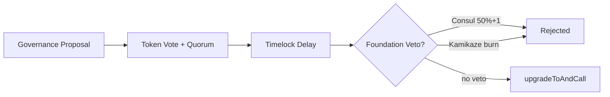
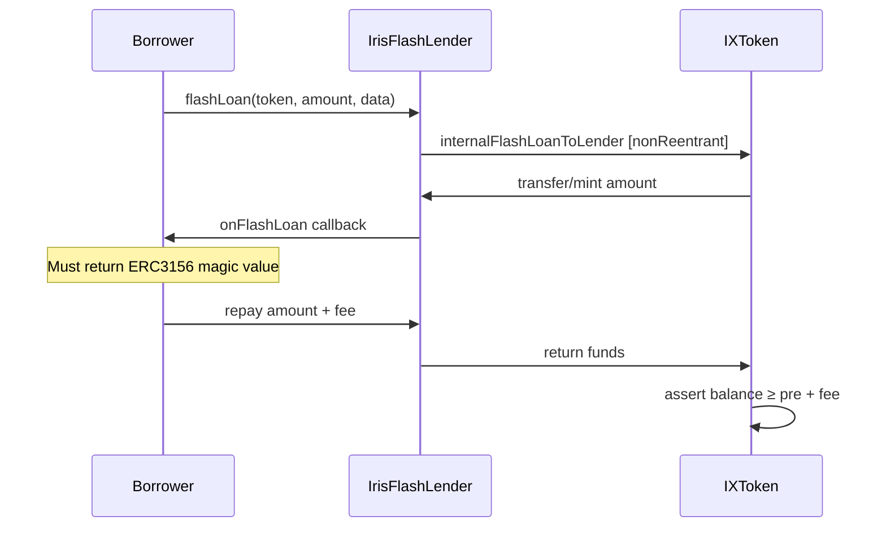
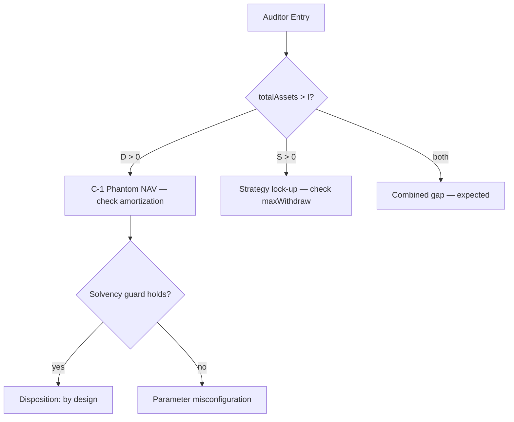

# Security & Audit Dispositions

This document details the **defensive architecture** of Iris Protocol on Cancun EVM: transient reentrancy guards, ERC-3156 flash loan mitigations, audit finding dispositions, and integrator security checklists. All monetary references use **DAI** (18 decimals).

**Related:** [Whitepaper Ch. 05](../whitepaper/05-systemic_risk_manager.md) · [Ch. 09](../whitepaper/09-system_verification.md) · [Architecture](architecture.md)

---

## 1. Cancun EVM Defensive Stack

### 1.1 Transient Reentrancy — EIP-1153

`IXToken` uses OpenZeppelin `ReentrancyGuardTransient` on all state-mutating heavy paths:

| Function | Guard |
|----------|-------|
| `deposit` / `depositWithAffiliate` | `nonReentrant` |
| `withdraw` | `nonReentrant` |
| `openPosition` / `closePosition` | `nonReentrant` |
| `forceClosePosition` / `liquidatePosition` | `nonReentrant` |
| `internalFlashLoanToLender` | `nonReentrant` |
| `setExcludeFromYield` | `nonReentrant` |

**Not guarded:** `transfer` / `transferFrom` — by design. ERC-20 transfer paths do not mutate vault accounting partitions ($I$, $D$, $S$) and must remain composable with DEX integrations.

Transient storage (EIP-1153) provides reentrancy protection without permanent storage gas cost — appropriate for Cancun-tier deployment.

### 1.2 UUPS Upgrade Authorization

```
upgradeToAndCall(newImplementation, data):
  onlyOwner                    // governance timelock
  _authorizeUpgrade(impl)      // owner check in IXToken
  ERC1967Utils.upgradeToAndCall
```

Implementation upgrades require timelock-queued governance proposal execution. No user-facing upgrade path exists outside `onlyOwner`.



---

## 2. Flash Loan Mitigations

### 2.1 Gateway Trust Model

End borrowers **never** call `IXToken` flash entrypoints directly:

```
ERC-3156 Borrower
  → IrisFlashLender (public gateway)
    → IXToken.internalFlashLoanToLender (onlyLender)
      → callback to borrower
        → repay + fee
```

| Rule | Enforcement |
|------|-------------|
| `onlyLender` | `msg.sender == lender` (governance-set gateway address) |
| `nonReentrant` | Transient guard on flash entry (H-1 fix) |
| Callback validation | `keccak256("ERC3156FlashBorrower.onFlashLoan")` return value required (M-1 fix) |
| Post-callback balance | Vault balance ≥ pre-loan balance + fee (M-2 fix) |

### 2.2 Flash Paths

`internalFlashLoanToLender(token, amount, data)`:

| Path | Mechanism |
|------|-----------|
| Vault-token flash | Temporary rebasing share mint to gateway; burned on repayment |
| Idle underlying flash | Transfer DAI from $I$; returned on repayment |

Default `lendingFeeBps = 0` (max configurable: 100 bps).

### 2.3 H-1 Fix — Flash Reentrancy

**Finding:** `internalFlashLoanToLender` lacked `nonReentrant`, allowing callback re-entry into `deposit`/`withdraw`.

**Fix:** `nonReentrant` modifier applied. Verified in `IXTokenFlashLoanTest` (17 cases).

### 2.4 M-1 / M-2 Fixes — ERC-3156 Callback

| ID | Finding | Fix |
|----|---------|-----|
| **M-1** | Callback success token not validated | Revert `ERC3156CallbackFailed` on wrong return value |
| **M-2** | Insufficient balance check used wrong account | Post-callback balance verified on vault, not borrower |



---

## 3. Audit Disposition History

### 3.1 iris-core Findings

| ID | Severity | Topic | Status | Detail |
|----|----------|-------|--------|--------|
| **C-1** | Critical | `protocolDebt` phantom NAV | **Acknowledged / by design** | Affiliate CAC booked as virtual $D$ in $T$; amortized via withdrawal fees; deploy caps use $T_{\text{phys}} = T - D$ |
| **H-1** | High | Flash loan missing `nonReentrant` | **Fixed** | Transient guard on `internalFlashLoanToLender` |
| **M-1** | Medium | ERC-3156 callback not checked | **Fixed** | `ERC3156CallbackFailed` revert |
| **M-2** | Medium | Wrong account in balance check | **Fixed** | Post-callback vault balance assertion |

**C-1 rationale — Phantom NAV:** `depositWithAffiliate` increases $D$ while full deposit sits in $I$. Book NAV $T$ rises by $\Delta D_{\text{aff}}$ without matching cash — inflating rebasing pool $R$ optimistically. This is **phantom NAV**, not an exploitable mint bug.

| Phantom NAV property | Detail |
|---------------------|--------|
| Creation | $T \mathrel{+}= \Delta D_{\text{aff}}$; $I \mathrel{+}= A$ only (cash < book increase) |
| Isolation | `openPosition` caps use $T_{\text{phys}} = T - D$ — phantom cannot fund trading |
| Resolution | Withdrawal fees repay $D$ first: $D \mathrel{-}= \min(f, D)$ |
| Redemption UX | `maxWithdraw` caps at $I$; `balanceOf` may exceed redeemable cash |
| Recovery proof | Solvency guard: $\texttt{withdrawalFeeBps} \cdot (10\,000 - \texttt{maxOpenPositionsVolumeBps}) \geq \texttt{affiliateFeeBps} \cdot 10\,000$ |

**Economic solvency under C-1:** Phantom NAV is sustainable when withdrawal fee inflow amortizes $D$ faster than affiliate issuance accumulates it. Monitor $D / T$ (phantom debt ratio) and $\Lambda_{\text{redeem}} = I / \texttt{totalSupply()}$ (liquidity coverage). Persistent $D / T > 5\%$ with low withdrawal volume warrants governance review.

Full disposition: `iris-core/docs/audit_reports/dispositions/C-1-protocol-debt-phantom-nav.md`

### 3.2 iris-uv4-adapter Findings

| ID | Severity | Topic | Status | Detail |
|----|----------|-------|--------|--------|
| **C-02** | Critical | Expired + underwater dual keeper paths | **By design** | Both `forceClose` and `liquidate` valid; economics differ |
| **C-03** | Critical | Permissionless `executor` | **By design** | Off-chain route + on-chain balance/slippage validation |
| **C-05** | Critical | Liquidation slippage uses pre-swap MTM | **Accepted game** | Keeper bears execution risk |

### 3.3 iris-governance Findings

| ID | Severity | Topic | Status | Detail |
|----|----------|-------|--------|--------|
| **VE-01** | High | Clock mismatch (timestamp vs block) | **Fixed** | `IERC6372` block-number mode on `VotingEscrow` |

---

## 4. Test Coverage & Verification

### 4.1 Foundry Suite (iris-core)

| Suite | Focus | Cases |
|-------|-------|-------|
| `IXTokenAdvancedFuzzTest` | Accounting closure, share math, affiliate NAV | Fuzz + 6 invariants |
| `IXTokenPositionLifecycleTest` | All close/liquidate/force-close branches | 25+ |
| `IXTokenPermitAndWithdrawTest` | EIP-2612, fixed withdraw, $D$ amortization | 11 |
| `IXTokenGovernanceTest` | Owner setters, adapter auth, UUPS | — |
| `IXTokenSecurityTest` | Access control, sanctions, reentrancy probe | 24 |
| `IXTokenFlashLoanTest` | Flash entry, callback guards | 17 |

**Aggregate:** 108+ tests; 0 failures on release candidate 2026-05-22.

### 4.2 Coverage Metrics (`IXToken.sol`)

| Metric | Value |
|--------|-------|
| Lines | ≈ 93.7% |
| Statements | ≈ 90.5% |
| Branches | ≈ 56.9% |
| Functions | 100% |

Moderate branch coverage reflects unreachable defensive branches (`InsufficientPhysicalLiquidity`), dust frontiers ($\leq 1$ wei at 18-decimal scale), permit catch-alls, and trusted-adapter fast paths.

### 4.3 Fuzz Invariants

`IXTokenAdvancedInvariantTest` enforces over 12,800 calls:

1. $\texttt{totalSupply()} \leq \texttt{totalAssets()}$
2. $\texttt{totalAssets()} = I + D + S$ decomposition coherence
3. Physical debt isolation under random deposit/withdraw/parameter toggles
4. Strategy booked once per position id

### 4.4 Production Sign-Off Checklist

| # | Target | Verification |
|---|--------|--------------|
| 1 | Flash mint reentrancy | `nonReentrant` + callback token + post-balance |
| 2 | Ledger sync deltas | $\Delta S \leftrightarrow \Delta I$ on lifecycle; no double-count $S$ in `totalSupply` |
| 3 | Asymmetric rounding | Floor deposit mint; Ceil withdraw burn; dust sweep on full exit |
| 4 | Oracle cross-feed skew | Decimal normalization; $\delta_s \in [100, 300]$ bps; staleness guards |

```bash
forge build
forge test
forge coverage --ir-minimum --report summary
```

---

## 5. Phantom NAV & Economic Solvency — Auditor Guide

### 5.1 Distinguishing Phantom NAV from Exploits

Auditors must classify phantom NAV symptoms correctly:

| Observation | Classification | Action |
|-------------|----------------|--------|
| `totalAssets() > I` when $S > 0$ | Expected strategy lock-up | Verify `maxWithdraw` UX |
| `totalAssets() > I` when $D > 0$ | Expected phantom NAV (C-1) | Verify amortization + guard |
| `totalSupply() > totalAssets()` | **Invariant violation** | Critical — halt and investigate |
| `openPosition` funded from $D$ | **Guard failure** | Critical — cap should use $T_{\text{phys}}$ |
| Affiliate self-referral minting $D$ | **Blocked** | Verify `affiliate != receiver` |

### 5.2 Economic Solvency Audit Checklist

- [ ] Trace `depositWithAffiliate` → confirm $\Delta T = \Delta D_{\text{aff}}$ beyond physical $A$
- [ ] Verify `openPosition` reads `totalAssets() - protocolDebt` for volume cap
- [ ] Confirm `withdraw` applies $\min(f, D)$ to `protocolDebt` before `pnl`
- [ ] Fuzz `setProtocolParameters` — confirm revert when $\omega < \alpha$
- [ ] Simulate max-deploy + max-affiliate: compute $\Lambda_{\text{redeem}}$ at boundary
- [ ] Trace bad debt close — confirm $T$ decreases and share price adjusts
- [ ] Verify profitable close — confirm $\Pi_P$ accrues to $T$ and DAI returns to $I$
- [ ] Confirm integrator docs specify `maxWithdraw`, not `balanceOf`

### 5.3 Solvency Ratio Reference

$$
\Lambda_{\text{redeem}} = \frac{I}{\texttt{totalSupply()}}, \quad
\Lambda_{\text{phys}} = \frac{T - D}{T}, \quad
\Lambda_{\text{strat}} = \frac{S}{T - D}
$$

Under default parameters at max strategy deploy ($\Lambda_{\text{strat}} = 0.5$) with zero phantom debt: $\Lambda_{\text{redeem}} \approx 0.5$. With $D / T = 5\%$: $\Lambda_{\text{redeem}} \approx 0.45$. These are **design-expected**, not insolvency signals, provided `maxWithdraw` is enforced.



---

## 6. Access Control Matrix

| Function | Modifier | Authorized caller |
|----------|----------|-------------------|
| `openPosition` | `onlyAuthorizedAdapter` | Approved adapter contracts |
| `closePosition` | `onlyAuthorizedAdapter` | Approved adapter contracts |
| `forceClosePosition` | `onlyAuthorizedAdapter` | Approved adapter contracts |
| `liquidatePosition` | `onlyAuthorizedAdapter` | Approved adapter contracts |
| `internalFlashLoanToLender` | `onlyLender` | Governance-set gateway |
| `setProtocolParameters` | `onlyOwner` | Timelock |
| `setAdapterStatus` | `onlyOwner` | Timelock |
| `upgradeToAndCall` | `onlyOwner` | Timelock |
| `deposit` / `withdraw` | `nonReentrant` | Any (subject to sanctions) |

### Sanctions Gate

`ISanctionsList` integration blocks sanctioned addresses on:

- `deposit` / `depositWithAffiliate`
- `transfer` / `transferFrom`
- Keeper reward mint paths

Enforced by Gatekeeper rail monitoring.

---

## 7. Integrator Security Checklist

Before mainnet integration sign-off:

- [ ] Use `maxWithdraw(user)` — **never** `balanceOf` as redeemable capacity
- [ ] Validate `IERC6372` block-number clock on both `VotingEscrow` and `IrisGovernor`
- [ ] Parse all amounts as `uint256` DAI wei (18 decimals) — no float arithmetic
- [ ] Enforce `minimumDepositAssetAmount` ($10^{14}$ wei) client-side before tx submission
- [ ] Display $T_{\text{phys}} = T - D$ separately from book NAV when $D > 0$
- [ ] Do not recompute vault PnL off-chain — use on-chain `pnl` view for analytics only
- [ ] Separate Foundation 5% fee display from Keeper bounty display (orthogonal rails)
- [ ] Verify adapter is in `authorizedAdapters` mapping before routing user margin
- [ ] Read C-1 disposition before flagging `protocolDebt` as a vulnerability
- [ ] Confirm `totalSupply() ≤ totalAssets()` invariant holds after any custom integration

---

## 8. Open Items & Known Tech Debt

| Item | Repo | Status |
|------|------|--------|
| `lpFarming` distribution wiring | `iris-core` | Not wired in core |
| `IrisFlashLender` gateway | `iris-core` | WIP |
| `VoitingEscrow.sol` filename typo | `iris-governance` | Rename pending |
| `IrisGovernor` OZ mixin boilerplate | `iris-governance` | WIP |
| Escrow CEI ordering on create/increase | `iris-governance` | Medium — open |

---

## 9. Responsible Disclosure

Report vulnerabilities to **security@irislab.net**.

Include: affected contract, function, reproduction steps, estimated impact on $T = I + D + S$ invariant or physical redemption ceiling $I$.

---

**Audit reports:** `iris-core/docs/audit_reports/report1.md`, `report2.md`  
**Coverage matrix:** `iris-core/docs/audit_reports/test-coverage.md`  
**Governance audit:** `iris-governance/docs/audits/voting-escrow-01.md`
