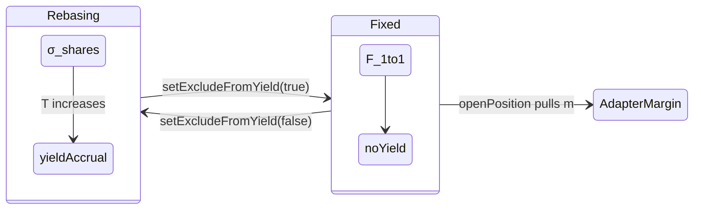
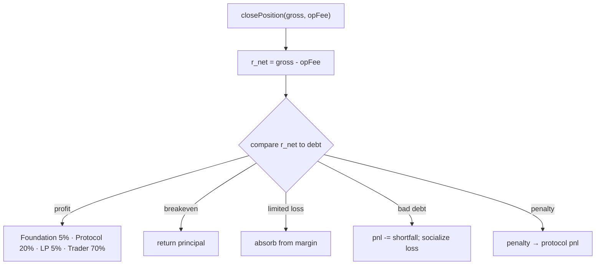
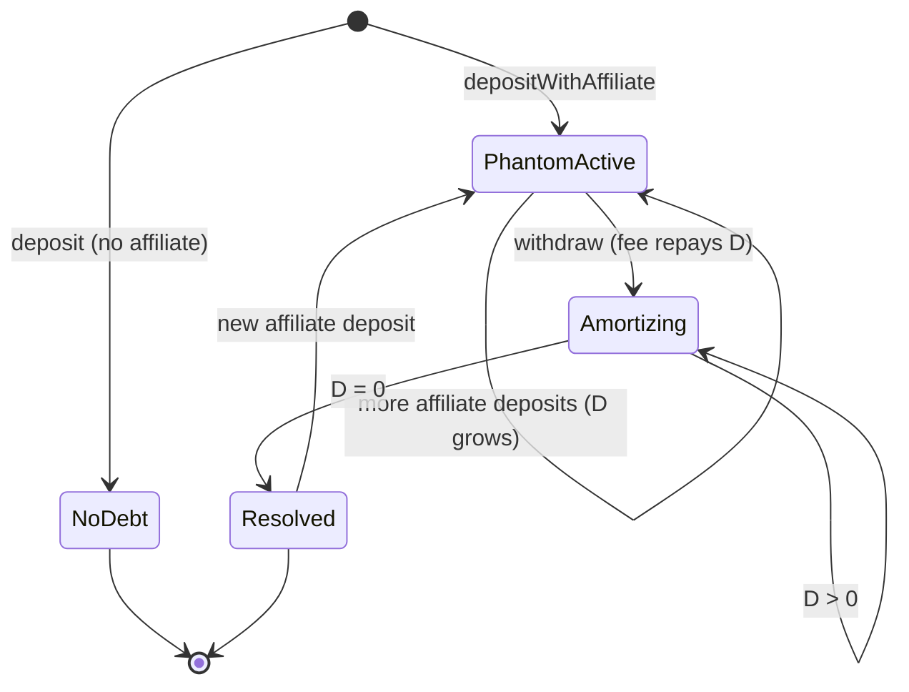

# Smart Contract Protocol

This document specifies the **IXToken** contract architecture, dual-ledger isolation, rounding policy, and the complete position lifecycle branch tree. All amounts are in **DAI wei** (18 decimals).

**Related:** [Whitepaper Ch. 03](../whitepaper/03-ixtoken_vault.md) · [Ch. 04](../whitepaper/04-position_lifecycles.md) · [Ch. 08](../whitepaper/08-execution_layers.md)

---

## 1. Contract Map

| Contract | Repo | Role |
|----------|------|------|
| `IXToken` | `iris-core` | UUPS vault; dual-ledger; position registry; fee routing |
| `IrisXProxy` | `iris-core` | ERC1967 proxy for `IXToken` |
| `IIrisAdapter` | `iris-core` | Adapter interface (`openPosition`, `closePosition`, etc.) |
| `IrisLeveragedSpotV1Adapter` | `iris-uv4-adapter` | Leveraged long spot; swap engine; Chainlink feeds |
| `VotingEscrow` | `iris-governance` | Block-clock IXToken lock |
| `IrisGovernor` | `iris-governance` | OZ Governor v5 + Foundation veto hooks |
| `TimelockController` | `iris-governance` | Execution delay |
| `The Iris Foundation` | deployed | ERC721; 15 Chairs (IDs 0–14); `ClaimRewards` |

**Solidity:** `^0.8.26` · Cancun EVM · `via_ir` · optimizer 10,000 runs · OpenZeppelin v5.

---

## 2. IXToken Core Architecture

### 2.1 Storage Model

```
IXToken
├── _underlying          ERC20 DAI (18 decimals)
├── _totalShares σ       Rebasing share supply
├── _shares[user]        Per-address rebasing shares
├── _totalFixedBalances F
├── _fixedBalances[user] Per-address fixed 1:1 balances
├── isExcludedFromYield  Dual-ledger mode flag
├── assetsInStrategy S   Booked deployed capital
├── protocolDebt D       Virtual affiliate IOU
├── positions[id]        Position registry
├── pnl                  Signed analytics accumulator
└── authorizedAdapters   Adapter allowlist
```

### 2.2 Dual-Ledger Isolation

Each address $a$ has `isExcludedFromYield[a] ∈ {false, true}`:

| Mode | Flag | Storage | `balanceOf(a)` | Yield |
|------|------|---------|----------------|-------|
| **Rebasing** | `false` | `_shares[a]` | $\lfloor \texttt{convertToAssets}(\sigma_a) \rfloor$ | Accrues as $T \uparrow$ |
| **Fixed** | `true` | `_fixedBalances[a]` | $F_a$ exactly (1:1 DAI wei) | None |

User-facing `transfer(to, amount)` and `withdraw` denominate **amount** in underlying DAI wei regardless of ledger mode.

### 2.3 Ledger Migration — `setExcludeFromYield`

```
setExcludeFromYield(account, exclude):
  1. b ← balanceOf(account)           // snapshot current balance
  2. if exclude == true:              // rebasing → fixed
       burn rebasing shares for b
       _fixedBalances[account] ← b
       isExcludedFromYield[account] ← true
  3. if exclude == false:             // fixed → rebasing
       clear _fixedBalances[account]
       σ_new ← Floor(convertToShares(b))
       revert ZeroSharesMinted if σ_new == 0
       mint σ_new shares
       isExcludedFromYield[account] ← false
```

**Adapter invariant:** `setAdapterStatus(adapter, true)` forces the adapter onto the **fixed** ledger. On `openPosition`, margin $m$ is pulled via `_executeTransfer(trader, adapter, m)` — margin remains constant in DAI wei for the position lifetime.



---

## 3. Rounding Policy

### 3.1 Vault-Favorable Asymmetry

| Operation | Direction | Implementation |
|-----------|-----------|----------------|
| Deposit / mint shares | **Floor** | $\sigma_{\text{mint}} = \lfloor \texttt{convertToShares}(A) \rfloor$ |
| Withdraw / burn shares | **Ceil** | $\sigma_{\text{burn}} = \lceil \texttt{convertToShares}(W) \rceil$ |
| Rebasing `balanceOf` | **Floor** | $b_a = \lfloor \texttt{convertToAssets}(\sigma_a) \rfloor$ |
| Fixed ledger transfer | **Exact** | $\Delta F_a \in \mathbb{Z}_{\geq 0}$ |

### 3.2 Share Conversion Formulas

Deposit amount $A$:

$$
\sigma_{\text{received}} = \left\lfloor \frac{A \cdot (\sigma + \sigma_{\text{offset}})}{T} \right\rfloor
$$

Withdraw amount $W$:

$$
\sigma_{\text{burned}} = \left\lceil \frac{W \cdot (\sigma + \sigma_{\text{offset}})}{T} \right\rceil
$$

$\sigma_{\text{offset}}$ is the virtual-share inflation defense exponent (ERC-4626-style offset in `_convertToShares`).

### 3.3 Dust Guards

| Guard | Condition | Revert |
|-------|-----------|--------|
| Minimum deposit | $A < \texttt{minimumDepositAssetAmount}$ | `InvalidDepositAmount` |
| Zero-share migration | Fixed→rebasing yields $\sigma_a = 0$ | `ZeroSharesMinted` |
| Full-exit dust sweep | Remaining $\sigma_a$ or $F_a \leq 1$ wei | Burn residual to zero account |

Default $\texttt{minimumDepositAssetAmount} = 10^{14}$ wei (0.0001 DAI at 18 decimals).

**Economic interpretation:** Rounding residue accrues to rebasing $\sigma$ holders via $T$. Over adversarial deposit/withdraw cycles:

$$
\sum_{\text{roundings}} \epsilon_i \geq 0 \quad \text{for the vault}
$$

---

## 4. Deposit & Withdraw Paths

### 4.1 `deposit(assets, receiver)`

```
nonReentrant
1. require assets ≥ minimumDepositAssetAmount
2. σ ← Floor(convertToShares(assets))
3. revert ZeroSharesMinted if σ == 0
4. _mint(receiver, σ)          // rebasing ledger
5. I += assets; transfer DAI from caller
6. emit Deposit
```

### 4.2 `depositWithAffiliate(assets, receiver, affiliate)`

```
Same as deposit, plus:
1. ΔD_aff ← assets × affiliateFeeBps / 10_000
2. protocolDebt += ΔD_aff; T += ΔD_aff
3. Mint rebasing shares to affiliate on ΔD_aff
```

**Phantom NAV effect (C-1):** Physical cash increases by `assets` ($I \mathrel{+}= A$), but $T$ increases by $A + \Delta D_{\text{aff}}$. The virtual component $\Delta D_{\text{aff}}$ inflates rebasing pool $R = \max(T - F, 0)$ without additional DAI — this is optimistic affiliate CAC, not an accounting error. Self-referral (`affiliate == receiver`) skips steps 1–3.

| Field | After affiliate deposit of $A = 10^{20}$ wei (100 DAI) |
|-------|--------------------------------------------------------|
| $\Delta I$ | $+10^{20}$ wei |
| $\Delta D$ | $+10^{17}$ wei (0.1% of $A$) |
| $\Delta T$ | $+10^{20} + 10^{17}$ wei |
| Phantom gap | $10^{17}$ wei booked without cash |

### 4.3 `withdraw(assets, receiver, owner)`

```
nonReentrant
1. f ← assets × withdrawalFeeBps / 10_000
2. totalRequired ← assets + f
3. Burn shares (Ceil) or fixed balance (exact 1:1)
4. ΔD ← min(f, protocolDebt); protocolDebt -= ΔD
5. pnl += f - ΔD
6. Transfer assets to receiver; transfer f to protocol
7. Full-exit dust sweep if remaining balance ≤ 1 wei
```

### 4.4 Disabled ERC4626 Surfaces

`maxMint`, `maxRedeem`, `previewMint`, `previewRedeem` return `0`. Integrators must use asset-denominated `deposit` / `withdraw`.

---

## 5. Position Lifecycle

### 5.1 Position Record

```solidity
struct Position {
    address trader;
    address adapter;
    uint256 marginAmount;      // m
    uint256 allocatedAmount;   // a
    uint256 openingTimestamp;
    uint256 closingTimestamp;
}
```

### 5.2 Open — `openPosition` (adapter only)

```mermaid
sequenceDiagram
  participant T as Trader
  participant A as Adapter
  participant V as IXToken

  T->>A: openPosition + executor calldata
  A->>A: swap DAI → target (off-chain route)
  A->>V: openPosition(id, trader, m, a)
  V->>V: unique id; m+a ≥ V_min; leverage cap
  V->>V: S+m+a ≤ cap(T_phys); I ≥ m+a
  V->>A: _executeTransfer(trader, adapter, m) — fixed ledger
  V->>A: transfer DAI (m+a)
  V->>V: S += m+a; store Position
```

### 5.3 Close — Branch Classification

On `closePosition(id, totalReturnAssets, opFee)`:

$$
\texttt{debt} = a + m, \quad r_{\text{net}} = \texttt{totalReturnAssets} - \texttt{opFee}
$$

Require `opFee ≤ totalReturnAssets` or revert `InvalidOperatorFee`.

| Branch | Condition | Protocol action |
|--------|-----------|-----------------|
| **Profit** | $r_{\text{net}} > \texttt{debt}$ | Profit waterfall (§5.4) |
| **Breakeven** | $r_{\text{net}} = \texttt{debt}$ | Principal restoration |
| **Limited loss** | $\texttt{loss} \leq m \cdot \texttt{liquidationThresholdBps}/10\,000$ | Loss absorbed from margin escrow |
| **Hard bad debt** | $\texttt{totalReturnAssets} < a$ | Socialized shortfall; `pnl < 0` |
| **Penalty** | Loss exceeds threshold | Penalty fee to protocol; `pnl > 0` |

where $\texttt{loss} = \max(0, \texttt{debt} - r_{\text{net}})$. Default `liquidationThresholdBps = 7500` (75% of margin).



### 5.4 Profit Waterfall

Gross trade profit $\Pi = r_{\text{net}} - \texttt{debt}$:

$$
\begin{aligned}
\Pi_F &= \Pi \cdot 500 / 10\,000 && \text{(Foundation 5\%)} \\
\Pi_P &= \Pi \cdot 2000 / 10\,000 && \text{(Protocol 20\%)} \\
\Pi_L &= \Pi \cdot 500 / 10\,000 && \text{(LP farming 5\%)} \\
\Pi_T &= \Pi - \Pi_F - \Pi_P - \Pi_L && \text{(Trader 70\%)}
\end{aligned}
$$

- $\Pi_F$ minted to Foundation `0x00008c80D4cBD653B1D384566d9b23B37d100000`
- $\Pi_L$ minted to `lpFarming` or redirected to Foundation if unset
- $\Pi_P$ accrues to $T$ via rebasing pool
- $\Pi_T$ credited to trader

### 5.5 Force-Close — `forceClosePosition`

Administrative/expiry path (Squall Keeper rail):

$$
K_{\text{force}} = \min\left( m \cdot \frac{\texttt{keeperIncentiveRewardBps}}{10\,000},\, K_{\max},\, G \right)
$$

where $G = \texttt{totalReturnAssets}$. Settlement on $G - K_{\text{force}}$; keeper paid via rebasing `_mint`.

### 5.6 Liquidation — `liquidatePosition`

Underwater rescue path (Iron Liquidator rail):

$$
K_{\text{liq}} = \min\left( r_{\text{net}} \cdot \frac{\texttt{keeperIncentiveRewardBps}}{10\,000},\, K_{\max} \right)
$$

`opFee` waived if `opFee > totalReturnAssets`. Default `keeperIncentiveRewardBps = 1000`, $K_{\max} = 500 \times 10^{18}$ DAI wei.

| Path | Keeper base | Also capped by |
|------|-------------|----------------|
| Force-close | Margin $m$ | $K_{\max}$, gross $G$ |
| Liquidation | Net recovery $r_{\text{net}}$ | $K_{\max}$ |

---

## 6. Adapter V1 Interface

### 6.1 `IrisLeveragedSpotV1Adapter`

| Function | Caller | Vault callback |
|----------|--------|----------------|
| `openPosition` | Trader | `IXToken.openPosition` |
| `closePosition` | Trader / operator | `IXToken.closePosition` |
| `closeExpiredPosition` | Anyone (keeper) | `IXToken.forceClosePosition` |
| `liquidatePosition` | Keeper NFT holder | `IXToken.liquidatePosition` |

**Direction:** `LONG` only — `SHORT` reverts.

### 6.2 On-Chain Swap Validation

Per swap leg, adapter verifies:

1. **Balance delta:** $\Delta \texttt{bal}(\text{target})$ and $\Delta \texttt{bal}(\text{DAI})$ post-call;
2. **Slippage floor:** cross-price via Chainlink target/USD + DAI/USD feeds;
3. **Capped approval:** exact spend amount approved to `executor`.

`executor` address and calldata are **caller-supplied** (C-03 by design). On-chain safety does not depend on a router allowlist.

### 6.3 Oracle Cross-Price (Open Leg)

Given base amount $b$ (DAI wei), target decimals $d_\tau$, underlying feed decimals $d_\upsilon$, target feed decimals $d_f$:

$$
\mathbb{E}[\text{tokens}] = \frac{b \cdot P_\upsilon \cdot 10^{d_\tau} \cdot 10^{d_f}}{P_\tau \cdot 10^{d_\upsilon} \cdot 10^{18}}
$$

Default slippage tolerance $\delta_s \in [100, 300]$ bps (1–3%).

---

## 7. Governance Hooks

| Function | Access | Effect |
|----------|--------|--------|
| `setProtocolParameters` | `onlyOwner` | Fee bps, caps; enforces solvency guard |
| `setAdapterStatus` | `onlyOwner` | Authorize/revoke adapter; forces fixed ledger |
| `setExcludeFromYield` | User or owner | Dual-ledger migration |
| `upgradeToAndCall` | `onlyOwner` | UUPS implementation upgrade |
| `setMaxKeeperIncentiveReward` | `onlyOwner` | Cap ≤ $500 \times 10^{\text{decimals}}$ |

`onlyOwner` is the governance timelock address post-deployment.

---

## 8. Phantom NAV & Economic Solvency (Contract View)

### 8.1 Three NAV Surfaces

| Surface | Solidity accessor | Formula |
|---------|-------------------|---------|
| Book NAV | `totalAssets()` | $T = I + D + S$ |
| Physical NAV | `totalAssets() - protocolDebt` | $T_{\text{phys}} = I + S$ |
| Redeemable cash | `_underlying.balanceOf(address(this))` | $I$ |

`balanceOf(user)` prices against book NAV $T$. `maxWithdraw(user)` caps at redeemable cash $I$ (and user balance). The difference is phantom exposure from $D$ and $S$.

### 8.2 Contract-Level Solvency Enforcement

| Hook | Enforcement |
|------|-------------|
| `openPosition` | Requires $m + a \leq I$; cap on $T_{\text{phys}}$, not $T$ |
| `setProtocolParameters` | Reverts unless $\texttt{withdrawalFeeBps} \cdot (10\,000 - \texttt{maxOpenPositionsVolumeBps}) \geq \texttt{affiliateFeeBps} \cdot 10\,000$ |
| `withdraw` | Fee $f$ repays `protocolDebt` before `pnl` accrual: $D \mathrel{-}= \min(f, D)$ |
| `_closePosition` | Bad debt branch reduces $T$; profitable branch increases $T$ and returns DAI to $I$ |
| Fuzz invariants | `totalSupply() ≤ totalAssets()` maintained over 12,800+ calls |

### 8.3 Phantom NAV Lifecycle (State Machine)



### 8.4 Integrator Contract Calls

```solidity
// Correct redemption capacity
uint256 redeemable = vault.maxWithdraw(user);

// Phantom debt health
uint256 phantomRatio = vault.protocolDebt() * 1e18 / vault.totalAssets();

// Physical deploy headroom
uint256 physical = vault.totalAssets() - vault.protocolDebt();
uint256 deployed = vault.assetsInStrategy();
uint256 headroom = (physical * vault.maxOpenPositionsVolumeBps() / 10_000) - deployed;
```

Never use `balanceOf(user)` or `totalAssets()` alone as withdrawal capacity when `protocolDebt() > 0` or `assetsInStrategy() > 0`.

---

## 9. Default Parameter Table

| Parameter | Default (bps) | DAI wei example |
|-----------|---------------|-----------------|
| `withdrawalFeeBps` | 50 | 0.5% of withdraw |
| `affiliateFeeBps` | 10 | 0.1% of referred deposit |
| `foundationFeeBps` | 500 | 5% of trade profit |
| `protocolShareOfProfitBps` | 2000 | 20% of trade profit |
| `lpFarmingFeeBps` | 500 | 5% of trade profit |
| `maxLeverageBps` | 50,000 | 5× allocation/margin |
| `maxOpenPositionsVolumeBps` | 5000 | 50% of $T_{\text{phys}}$ |
| `liquidationThresholdBps` | 7500 | 75% of margin |
| `keeperIncentiveRewardBps` | 1000 | 10% keeper rate |
| `minimumPositionVolume` | — | $10^{18}$ wei (1 DAI) |
| `minimumDepositAssetAmount` | — | $10^{14}$ wei (0.0001 DAI) |
| `maxKeeperIncentiveReward` | — | $500 \times 10^{18}$ wei |

---

**Implementation reference:** `iris-core/src/IXToken.sol` · `iris-uv4-adapter/src/IrisLeveragedSpotV1Adapter.sol`  
**Security contact:** `security@irislab.net`
