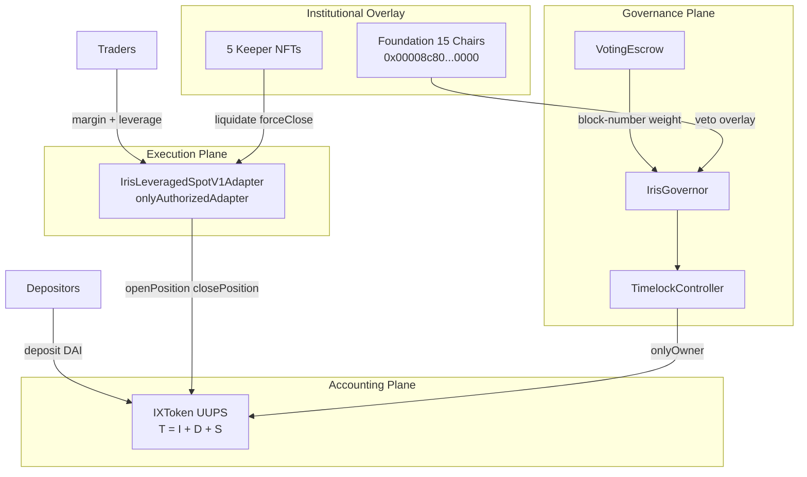
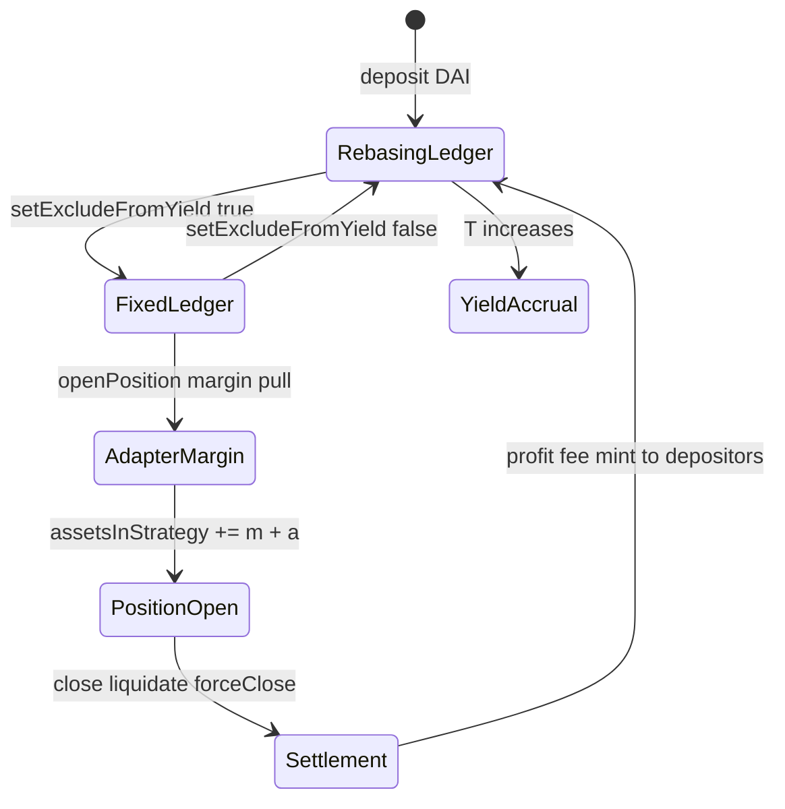
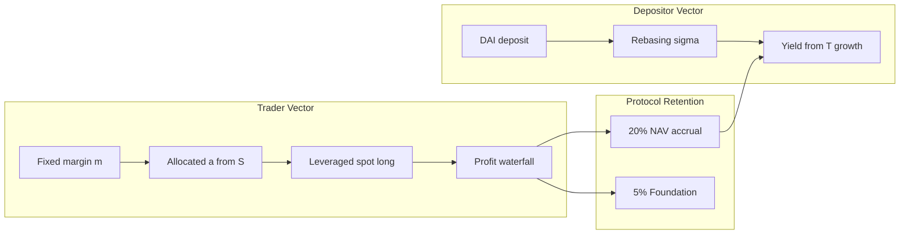

# Abstract & Executive Summary

## Structural Overview

Iris Protocol is a **modular margin execution suite** deployed on Ethereum-class networks (Cancun EVM tier). It is architecturally distinct from over-collateralized lending pools (e.g., Aave-style borrow/lend markets): capital is not allocated through discrete loan books with independent liquidation engines. Instead, a single vault token — **IrisX** (`IXToken`) — denominates all liabilities in **DAI** (18 decimals), books deployed strategy capital in a unified ledger, and authorizes external **execution adapters** to open, close, and liquidate leveraged **long spot** positions against that book.

The protocol decomposes into four structurally coupled planes:

| Plane | Component | Function |
|-------|-----------|----------|
| **Accounting** | `IXToken` (UUPS) | Global asset valuation, dual-ledger balances, position registry, fee routing |
| **Execution** | `IrisLeveragedSpotV1Adapter` | Swap-engine leveraged spot; Chainlink cross-price guards; local position state |
| **Governance** | `VotingEscrow` → `IrisGovernor` → `TimelockController` | Parameter control, upgrades, adapter authorization |
| **Institutional overlay** | The Iris Foundation (15 ERC721 Chairs) + 5 Keeper NFTs | Fee capture, veto circuit breakers, solvency execution |

Five participant classes interact with these planes: **depositors** (rebasing yield on DAI liquidity), **traders** (margin-posted leveraged spot), **governance voters** (IXToken locked in `VotingEscrow`), **Foundation Chair holders** (token IDs 0–14, functionally identical on-chain), and **Keeper operators** (competitive liquidation and force-close execution).

The global valuation invariant that binds the accounting plane is:

$$
T = I + D + S
$$

where $T = \texttt{totalAssets()}$, $I$ is idle underlying DAI held by the vault, $D$ is $\texttt{protocolDebt}$ (virtual affiliate obligation), and $S$ is $\texttt{assetsInStrategy}$ (aggregate margin plus allocation booked across open positions). Gross liabilities to token holders satisfy:

$$
\texttt{totalSupply()} = \texttt{convertToAssets}(\sigma) + F
$$

with $\sigma = \texttt{\_totalShares}$ (rebasing ledger) and $F = \texttt{\_totalFixedBalances}$ (fixed 1:1 ledger). The term $S$ must **not** be added to $\texttt{totalSupply()}$ a second time; it is already embedded in $T$ through which share conversion is computed.

Physical redemptions are bounded by idle cash: $\texttt{maxWithdraw}(u) \leq I$, not by book NAV $T$. Strategy deployment caps reference **physical** assets $T - D$, ensuring virtual affiliate debt cannot be routed into adapter margin. These constraints define Iris as a **margin vault with authorized execution adapters**, not a rehypothecation lending market.

---

## Core Innovation

The central architectural contribution of Iris Protocol is the **asynchronous dual-ledger mechanism** inside `IXToken`, coupled to a **decoupled tactical execution layer** (`IIrisAdapter` implementations). These two mechanisms jointly resolve a structural failure mode in combined yield-and-execution vaults: rebasing share price dynamics are incompatible with fixed-amount DEX margin transfers unless ledger mode is explicitly partitioned.

### Dual-Ledger Partition

Each address $a$ carries a flag $\texttt{isExcludedFromYield}[a]$:

| Mode | Condition | Storage | Balance view | Yield accrual |
|------|-----------|---------|--------------|---------------|
| **Rebasing** | $\texttt{isExcludedFromYield}[a] = \texttt{false}$ | $\texttt{\_shares}[a]$ | $\lfloor \texttt{convertToAssets}(\sigma_a) \rfloor$ (Floor) | Yes — via rising $T$ |
| **Fixed** | $\texttt{isExcludedFromYield}[a] = \texttt{true}$ | $\texttt{\_fixedBalances}[a]$ | Exact 1:1 DAI wei | No |

Migration between modes is affected by $\texttt{setExcludeFromYield(account, exclude)}$, which snapshots $\texttt{balanceOf}(a)$ before atomic ledger transfer. Adapter margin posts exclusively to the **fixed** ledger, eliminating rebasing drift at the swap boundary. Depositors default to the **rebasing** ledger and accrue yield as trading activity and fee retention increase $T$.

Vault-favorable asymmetric rounding is enforced at conversion boundaries:

$$
\text{deposit mint: } \lfloor \cdot \rfloor \quad (\text{Floor}), \qquad \text{withdraw burn: } \lceil \cdot \rceil \quad (\text{Ceil})
$$

### Decoupled Execution

The vault never executes DEX swaps. Authorized adapters:

1. Call $\texttt{openPosition}$ to book $(\texttt{margin}, \texttt{allocated})$ into $S$ and transfer underlying DAI to the adapter.
2. Route swaps through off-chain-selected **executors** (aggregators, routers) with on-chain balance-delta and slippage verification — not an on-chain router allowlist (disposition C-03: by design).
3. Report $\texttt{totalReturnAssets}$ on close, force-close, or liquidation; the vault applies PnL branches and fee waterfalls without an embedded price oracle.

### Institutional and Execution Overlays

Two NFT-gated layers sit **orthogonal** to community governance:

**The Iris Foundation** — $\texttt{ERC721("The Iris Foundation", "IRIS-FOUNDATION")}$ at $\texttt{0x00008c80D4cBD653B1D384566d9b23B37d100000}$. Fifteen Chairs (IDs 0–14), functionally identical. On profitable position close, $\texttt{foundationFeeBps} = 500$ (5%) of gross trade profit is minted to the Foundation contract; holders claim via $\texttt{ClaimRewards(token)}$ with equal split among live cards in $\texttt{activeCardsRegistry}$. Veto mechanics: **Consul** ($\lfloor \texttt{liveCards}/2 \rfloor + 1$ signatures during timelock, no burn) versus **Kamikaze** (single Chair burns token, instant veto, permanent fee-stream forfeiture).

**Keeper Corps** — five NFT execution keys. Incentives are paid via rebasing vault share $\texttt{\_mint}$ on $\texttt{forceClosePosition}$ and $\texttt{liquidatePosition}$, sized by $\texttt{keeperIncentiveRewardBps}$ (default 1000 bps) — a rail **separate** from the Foundation 5% profit cut.

Governance weight is keyed to **block number** via $\texttt{IERC6372}$ ($\texttt{clock()} = \texttt{block.number}$), not $\texttt{block.timestamp}$, eliminating snapshot ambiguity in high-frequency DeFi governance contexts.

---

## Target Capital Efficiency Vectors

Iris Protocol targets measurable improvements in capital utilization for DeFi integrators along four formal vectors. Each vector is tied to an on-chain parameter or invariant — not a marketing claim.

### Vector 1 — Unified Liquidity Pool Efficiency

In fragmented designs, depositor liquidity and trader margin draw from separate pools, duplicating idle capital. Iris consolidates both flows through a single $T$:

$$
\eta_{\text{pool}} = \frac{S}{T - D} \leq \frac{\texttt{maxOpenPositionsVolumeBps}}{10\,000}
$$

With default $\texttt{maxOpenPositionsVolumeBps} = 5000$, at most 50% of physical assets $T - D$ may be booked in $S$. The remainder stays in $I$ for redemptions and flash liquidity. Depositors earn rebasing exposure on the **entire** $T$ while traders deploy from the same book — capital efficiency without siloed TVL.

### Vector 2 — Execution–Accounting Decoupling Efficiency

By isolating swap execution in adapters and restricting vault mutation to authorized $\texttt{IIrisAdapter}$ calls, Iris avoids coupling rebasing $\sigma$ to swap slippage events. Margin $m$ is fixed-ledger throughout position lifetime:

$$
\Delta F_{\text{adapter}} = m \quad \text{at open}; \qquad \Delta S = m + a
$$

This decoupling reduces integrator rounding leakage at DEX approval boundaries — a quantifiable source of value extraction in single-ledger rebasing vaults used for margin.

### Vector 3 — Profit Waterfall Retention Efficiency

On profitable close, gross trade profit $\Pi$ is partitioned by basis-point governance parameters:

$$
\Pi_{\text{foundation}} = \Pi \cdot \frac{500}{10\,000}, \quad
\Pi_{\text{protocol}} = \Pi \cdot \frac{2000}{10\,000}, \quad
\Pi_{\text{lp}} = \Pi \cdot \frac{500}{10\,000}, \quad
\Pi_{\text{trader}} = \Pi - \Pi_{\text{foundation}} - \Pi_{\text{protocol}} - \Pi_{\text{lp}}
$$

Default allocation: 5% Foundation, 20% protocol NAV accrual (rebasing depositors), 5% LP farming locker, 70% trader. $\Pi_{\text{protocol}}$ increases $T$ and therefore rebase rate for all $\sigma$ holders — depositors benefit from trader success without separate staking loops.

### Vector 4 — Affiliate CAC Amortization Efficiency

Growth capital efficiency is encoded in the solvency guard enforced at $\texttt{setProtocolParameters}$:

$$
\texttt{withdrawalFeeBps} \cdot (10\,000 - \texttt{maxOpenPositionsVolumeBps}) \geq \texttt{affiliateFeeBps} \cdot 10\,000
$$

Under defaults ($\texttt{withdrawalFeeBps} = 50$, $\texttt{affiliateFeeBps} = 10$, $\texttt{maxOpenPositionsVolumeBps} = 5000$): $50 \times 5000 = 250{,}000 \geq 100{,}000$. Affiliate commission ($\texttt{depositWithAffiliate}$, 0.1% rebasing mint) is booked as $D$ and amortized through withdrawal fees — customer acquisition cost is recoverable without depositor upfront haircut.

### Summary

Iris Protocol advances a formal thesis: **leveraged spot infrastructure at scale requires ledger–execution separation, dual-mode balance accounting, and orthogonal incentive rails** (Foundation fee capture vs. Keeper solvency mints vs. governance block-clock voting). Subsequent chapters in this whitepaper derive each subsystem — vault invariants, position lifecycle branches, systemic risk controls, governance chronology, protocol debt amortization, execution layer trust assumptions, and verification dispositions — from the constraints introduced here.

**Security contact:** $\texttt{security@irislab.net}$
