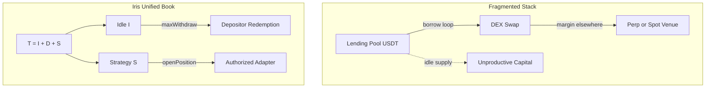
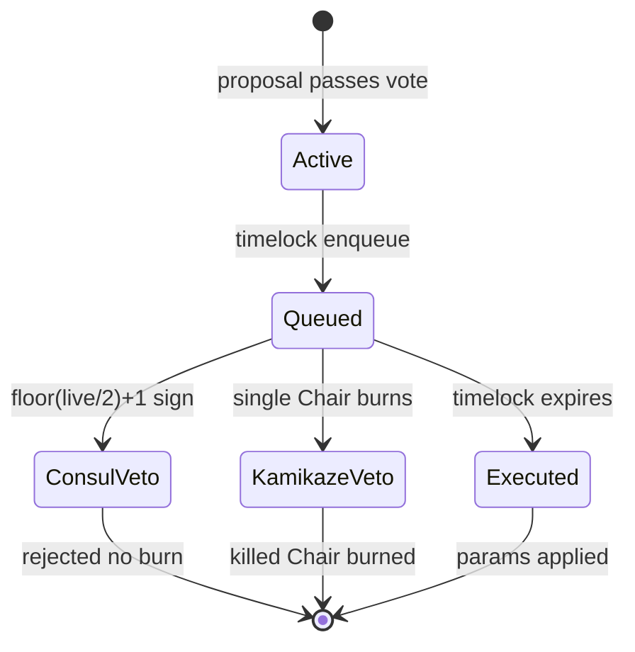

# Problem Space & Market Inefficiencies

Contemporary decentralized finance has bifurcated into **liquidity provision markets** (lending pools, yield vaults) and **leveraged execution venues** (perpetual swaps, margin interfaces). These stacks evolved independently. Their conflation in product design — without formal accounting separation — produces measurable capital inefficiency, extractable rounding leakage, execution adversarialism, and governance fragility. This chapter formalizes the failure modes Iris Protocol is engineered to eliminate.

---

## Capital Fragmentation in Lending Pools

### The Utilization Bottleneck

Over-collateralized lending pools (Aave-style markets) allocate liquidity through discrete borrow books. A supply asset $A_s$ and borrow demand $B_d$ interact through a utilization ratio:

$$
U = \frac{B_d}{A_s}
$$

Interest rate curves $r(U)$ incentivize equilibrium, but **leveraged spot exposure** is not native to this abstraction. A trader seeking long spot ETH with USDT collateral must typically:

1. Supply USDT to pool $P_1$;
2. Borrow USDT or WETH from pool $P_2$;
3. Swap on an external DEX;
4. Manage health factor $HF = \frac{\sum_i C_i \cdot p_i}{\sum_j D_j \cdot p_j}$ across independent oracle surfaces.

Each hop introduces **siloed idle capital**. Liquidity supplied to $P_1$ that is not borrowed remains economically inert relative to trading volume. Liquidity deployed to trading on a DEX is not simultaneously earning the supply-side yield of the lending pool without manual looping — a gas-expensive, rebalancing-intensive process.

### Fragmentation Cost Function

Define **effective capital efficiency** for a leveraged long spot strategy across $n$ siloed venues:

$$
\eta_{\text{frag}} = \frac{V_{\text{deployed}}}{\sum_{i=1}^{n} C_i}
$$

where $V_{\text{deployed}}$ is notional trading exposure and $C_i$ is capital parked in venue $i$ (supply buffers, borrow collateral, DEX LP, wallet dust). Empirically, $\eta_{\text{frag}} \ll 1$ for retail and integrator flows: a material fraction of USDT remains unproductive in supply pools while margin sits in separate contract namespaces.

### The Rebasing–Margin Incompatibility

Yield vaults that rebase depositor shares (ERC4626-style or share-price accrual) face a second fragmentation failure when used as margin collateral. Let $\sigma_u$ be rebasing shares and $F_u$ fixed balances. If margin $m$ is debited from a rebasing ledger:

$$
m_{\text{effective}}(t) = \texttt{convertToAssets}(\sigma_u, t)
$$

changes as $T(t)$ evolves during the position lifetime. DEX integrations require **fixed-amount approvals**:

$$
\texttt{approve}(\text{adapter}, m) \quad \text{with } m \in \mathbb{Z}_{\geq 0} \text{ constant}
$$

Rebasing drift between approval and execution creates rounding exploits and failed settlements at the adapter boundary. Single-ledger vaults therefore either (a) exclude yield on margin accounts, forfeiting depositor efficiency, or (b) accept integration risk.

### Iris Structural Response

Iris consolidates depositor liquidity and trader margin into one valuation book $T = I + D + S$, with **ledger mode separation** via $\texttt{isExcludedFromYield}$. Deployed strategy capital $S$ and idle cash $I$ coexist under unified governance caps:

$$
\frac{S}{T - D} \leq \frac{\texttt{maxOpenPositionsVolumeBps}}{10\,000}
$$

Default $\texttt{maxOpenPositionsVolumeBps} = 5000$ permits at most 50% of **physical** assets to be booked in open positions. The protocol is a **margin execution vault**, not a rehypothecation lending market — capital fragmentation across $n$ pools is replaced by a single-pool efficiency target $\eta_{\text{pool}}$.



---

## MEV Exposure and Slippage Inefficiencies

### Adversarial Execution in Leveraged On-Chain Markets

Standard on-chain leveraged implementations route swaps through public mempools. A trader opening long spot exposure submits:

$$
\texttt{swap}(\text{USDT} \rightarrow \text{target}, \Delta)
$$

An adversary observing this intent can construct a sandwich:

$$
\texttt{frontRun: push price up}, \quad \texttt{victim swap at inflated price}, \quad \texttt{backRun: arb revert}
$$

Extracted value scales with slippage tolerance $\delta$:

$$
\mathcal{L}_{\text{MEV}} \approx \Delta \cdot p \cdot \delta_{\text{effective}}
$$

Perpetual DEXs internalize matching but impose **funding rate** carry costs $f(t)$ on long bias:

$$
\text{PnL}_{\text{perp long}} = \Delta p \cdot q - \int_0^T f(t)\,dt
$$

Leveraged spot via external DEX routing avoids funding drag but exposes the open/close legs to MEV unless slippage and execution paths are formally bounded.

### Oracle Path Rigidity

Many implementations rely on a single oracle tick at execution time without cross-feed normalization. For target token $\tau$ and underlying $\upsilon$ (USDT), a naive price ratio:

$$
\hat{p}_{\tau/\upsilon} = \frac{P_\tau}{P_\upsilon}
$$

fails when feeds carry mismatched staleness, decimal precision, or heartbeat drift. Unbounded oracle error propagates into position health:

$$
\text{loss} = \max(0, \, a + m - \texttt{grossReturn})
$$

where $a$ is allocated principal and $m$ is margin — potentially triggering spurious liquidations or delayed recognition of genuine insolvency.

### Iris Adapter Mitigation Model

`IrisLeveragedSpotV1Adapter` enforces **cross-price slippage floors** using separate Chainlink USD feeds for target and underlying (USDT/USDC stable underlying accepted at deployment). Expected token amount on open:

$$
\mathbb{E}[\text{tokens}] = \frac{b \cdot P_\upsilon \cdot 10^{d_\tau}}{P_\tau \cdot 10^{d_\upsilon}} \cdot \frac{1}{10^{d_{\text{base}}}}
$$

with slippage tolerance $\delta_s$ in basis points: realized tokens must satisfy:

$$
\text{tokens}_{\text{received}} \geq \mathbb{E}[\text{tokens}] \cdot \left(1 - \frac{\delta_s}{10\,000}\right)
$$

Defaults: $\delta_s = 100$ bps (1%) when caller passes zero; hard cap $\delta_{s,\max} = 300$ bps (3%). Violations revert $\texttt{OpenSlippageExceeded}$ / $\texttt{LiquidationSlippageExceeded}$.

**Executor model (disposition C-03):** Swap routers are **caller-supplied off-chain** (1inch, 0x, etc.). The adapter does not maintain an on-chain router allowlist. Safety derives from:

1. **Capped ERC20 approvals** to executor;
2. **Balance-delta verification** post-$\texttt{call(data)}$;
3. **Slippage floor** vs Chainlink cross-price.

This trades router permissioning for execution flexibility — a deliberate architectural disposition, not an oversight.

```mermaid
sequenceDiagram
  participant Trader
  participant Adapter as IrisLeveragedSpotV1Adapter
  participant Vault as IXToken
  participant Executor as OffChain Router
  participant Chainlink

  Trader->>Adapter: openPosition(m, a, calldata)
  Adapter->>Vault: openPosition(id, trader, m, a)
  Vault->>Vault: S += m + a; transfer USDT
  Adapter->>Executor: approve + call(swapData)
  Executor-->>Adapter: target tokens
  Adapter->>Chainlink: _getSafePrice feeds
  Adapter->>Adapter: assert slippage floor
```

### Keeper Competition and Liquidation MEV

Underwater positions invoke $\texttt{liquidatePosition}$ with keeper incentive:

$$
K_{\text{liq}} = \min\left( r_{\text{net}} \cdot \frac{\texttt{keeperIncentiveRewardBps}}{10\,000}, \, K_{\max} \right)
$$

Default $\texttt{keeperIncentiveRewardBps} = 1000$, $K_{\max} = 500 \times 10^6$ USDT wei. Five Keeper NFTs compete on latency — premium keepers receive stricter liquidation thresholds and shorter max position durations at the adapter layer. Competitive execution converts MEV on liquidation from **extractable by arbitrary searchers** into **bounded protocol-sanctioned bounties** — solvency maintenance is incentivized, not adversarially exploited without bound.

---

## Governance Vulnerabilities & Centralization Risks

### Timestamp-Clock Governance Fragility

Governance systems keyed to $\texttt{block.timestamp}$ for $\texttt{proposalSnapshot}$ and voting weight introduce measurable ambiguity:

$$
\text{weight}(u, t_s) = f(\texttt{getPastVotes}(u, t_s)), \quad t_s = \texttt{block.timestamp}
$$

Validator/miner timestamp manipulation within protocol-permitted skew, L2 sequencer clock behavior, and cross-chain bridge latency create **snapshot desync** between the votes token and the Governor. In high-frequency DeFi, a proposal affecting $\texttt{maxLeverageBps}$, $\texttt{liquidationThresholdBps}$, or adapter authorization can be voted under stale weight while $S$ and $I$ reflect post-crash reality.

Iris $\texttt{VotingEscrow}$ implements $\texttt{IERC6372}$ with:

$$
\texttt{clock}() = \texttt{block.number}
$$

Governor $\texttt{proposalSnapshot}$ must align to block height. Voting delay $B_d = 21\,600$ blocks (~3 days at 12s/block); voting period $B_p = 151\,200$ blocks (~21 days). Weight equals locked rebasing share count — **no time decay** — with delegation disabled ($\texttt{delegates}(u) = u$; $\texttt{ManualDelegationNotAllowed}$ on $\texttt{delegate}$).

### Single-Layer Governance and Parameter Lag

Pure token-weighted governance without tactical overlay exhibits **parameter lag**: community votes on $\Delta \texttt{maxOpenPositionsVolumeBps}$ while $S$ approaches cap under black-swan volatility. Timelock quarantine delays execution further. A malicious or erroneous passed proposal (e.g., unauthorized adapter listing, fee parameter destabilization) cannot be halted without a secondary circuit breaker.

Iris introduces **The Iris Foundation** — $\texttt{ERC721}$ with 15 Chairs (IDs 0–14), functionally identical — exercising overlay authority during timelock:

| Mechanism | Threshold | Cost |
|-----------|-----------|------|
| **Consul veto** | $\lfloor \texttt{liveCards}/2 \rfloor + 1$ | Coordination only; no burn |
| **Kamikaze veto** | Single Chair | Permanent token burn; fee stream forfeited |
| **Threshold bypass** | Any Chair | Proposal submission without standard 1,000-unit threshold |

Foundation captures $\texttt{foundationFeeBps} = 500$ (5%) of gross trade profit — creating long-horizon stake in protocol survival that rationalizes veto against existential governance attacks.

### Centralization Misconception vs. Mechanism Design

Foundation overlay is **not** a replacement for token-weighted sovereignty. Community $\texttt{IrisGovernor}$ retains proposal passage and quorum ($10\%$ at snapshot block). Foundation acts as **timelock quarantine circuit breaker** — analogous to institutional risk committees in TradFi, encoded on-chain.

The Nash structure of Kamikaze veto ensures credible scarcity: a Chair burns only if

$$
\text{NPV}\left(\frac{1}{15} \cdot 0.05 \cdot \mathbb{E}[\Pi_{\text{future}}]\right) < \mathcal{D}_{\text{existential}}
$$

where $\Pi_{\text{future}}$ is expected future profit fee stream and $\mathcal{D}_{\text{existential}}$ is discounted protocol loss under the vetoed proposal. Cheap overlays get spammed; costly overlays get used once.



### Keeper Separation as Governance Risk Control

Conflating Foundation profit share (5% of $\Pi$) with Keeper execution mints ($K_{\text{force}}$, $K_{\text{liq}}$) would create perverse incentives to liquidate profitable positions. Iris enforces **orthogonal rails**:

- **Foundation:** passive fee royalty via $\texttt{ClaimRewards}$
- **Keepers:** active $\texttt{\_mint}$ on $\texttt{forceClosePosition}$ / $\texttt{liquidatePosition}$

Governance cannot silently redirect Keeper bps into Foundation bps without separate parameter votes on $\texttt{keeperIncentiveRewardBps}$ and $\texttt{foundationFeeBps}$ — reducing hidden centralization of execution incentives.

---

The inefficiencies above — capital siloing, rebasing-margin incompatibility, MEV-exposed swap paths, oracle rigidity, timestamp governance skew, and single-layer parameter lag — constitute the **problem space** Iris Protocol addresses. Chapter 3 derives the vault invariants ($T = I + D + S$, dual-ledger isolation, asymmetric rounding) that formally close these gaps at the accounting layer.
