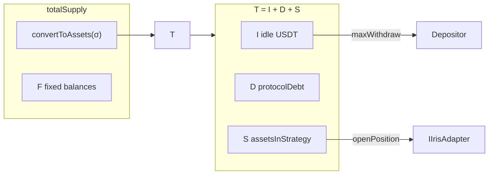
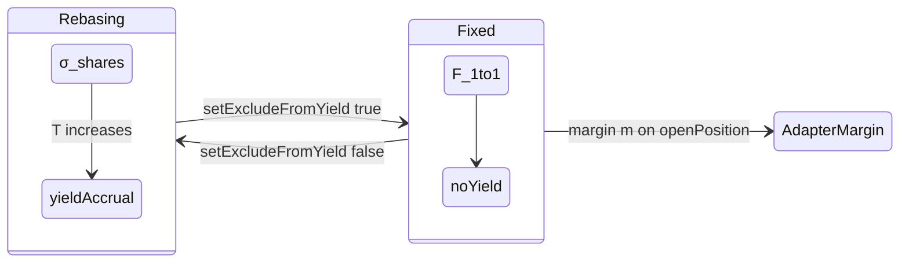
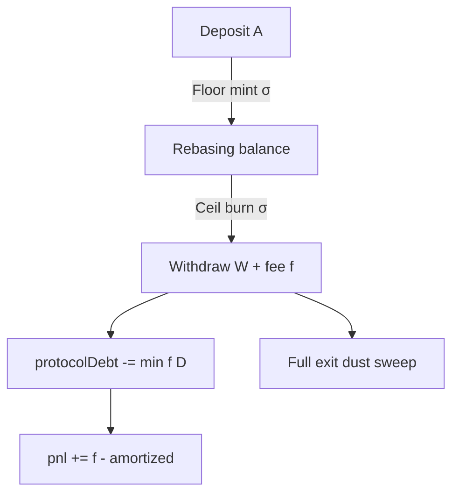

# The IXToken (IrisX) Vault Invariant & Global Accounting

`IXToken` (branded **IrisX**, e.g. `USDI` over USDT) is the accounting kernel of Iris Protocol. Implemented as a UUPS-upgradeable contract on Cancun EVM with `ReentrancyGuardTransient` (EIP-1153) on heavy paths, it exposes an ERC20 surface denominated in **USDT wei** (6 decimals) while internally maintaining rebasing shares $\sigma$, fixed liabilities $F$, and a position registry driving $S$. This chapter specifies the valuation framework, dual-ledger isolation, and rounding policy that all downstream subsystems must preserve.

---

## Comprehensive Valuation Framework

### Canonical Asset Identity

Total book assets are defined as:

$$
T = \texttt{totalAssets()} = I + D + S
$$

| Symbol | Contract field | Definition |
|--------|----------------|------------|
| $I$ | `_underlying.balanceOf(vault)` | Idle USDT cash — **physical redemption ceiling** |
| $D$ | `protocolDebt` | Virtual affiliate IOU (optimistic CAC; disposition C-1) |
| $S$ | `assetsInStrategy` | Aggregate $\sum_j (m_j + a_j)$ booked across open positions |

$I$, $D$, and $S$ are mutually exclusive partitions of $T$. Any state transition that modifies $T$ must attribute $\Delta T$ to exactly one or more of $\{\Delta I, \Delta D, \Delta S\}$.

### Liability Identity

Gross token liabilities in asset units:

$$
\texttt{totalSupply()} = \texttt{convertToAssets}(\sigma) + F
$$

where $\sigma = \texttt{\_totalShares}$ and $F = \texttt{\_totalFixedBalances}$. **Critical invariant:** $S$ must never be added again to $\texttt{totalSupply()}$. Share conversion $\texttt{convertToAssets}(\sigma)$ flows through $T$, which already includes $S$ exactly once. Violation creates phantom redeemable assets — an instantly exploitable integration bug.

### Rebasing Pool Backing

Rebasing assets available to $\sigma$ holders:

$$
R = \texttt{\_rebasingAssets()} = \max(T - F, \, 0)
$$

Fixed ledger $F$ is reserved before rebasing pool sizing. Adapters and DEX-facing accounts hold fixed balances; depositors default to rebasing.

### Physical vs. Book Assets

**Physical assets** (deployable and redeemable without virtual components):

$$
T_{\text{phys}} = T - D = I + S
$$

Open position volume caps and strategy deployment checks use $T_{\text{phys}}$, not $T$. Phantom $D$ cannot be transferred to adapters:

$$
\Delta S_{\max} \leq \frac{\texttt{maxOpenPositionsVolumeBps}}{10\,000} \cdot T_{\text{phys}}
$$

Default $\texttt{maxOpenPositionsVolumeBps} = 5000$.

Physical redemption per user $u$:

$$
\texttt{maxWithdraw}(u) \leq I
$$

Book NAV $\texttt{balanceOf}(u)$ may exceed physically redeemable USDT when $S > 0$ or $D > 0$. Integrators must surface $\texttt{maxWithdraw}$, not raw balance.

### Position Booking at Open

Authorized adapter calls $\texttt{openPosition}$ with margin $m$ and allocation $a$. Preconditions include:

$$
m + a \leq I, \quad a \leq m \cdot \frac{\texttt{maxLeverageBps}}{10\,000}, \quad S + m + a \leq \frac{\texttt{maxOpenPositionsVolumeBps}}{10\,000} \cdot T_{\text{phys}}
$$

Default $\texttt{maxLeverageBps} = 50\,000$ (5×). State update:

$$
S' = S + m + a, \quad I' = I - (m + a), \quad T' = T
$$

Deploy is book-neutral at $\Delta T = 0$: strategy booking shifts value from $I$ to $S$.

---

## Dual-Ledger Isolation Invariant

### Mode Flag and Storage Partition

Each address $a$ has $\texttt{isExcludedFromYield}[a] \in \{\texttt{false}, \texttt{true}\}$:

| Mode | Flag | Storage | Balance function | Yield |
|------|------|---------|------------------|-------|
| Rebasing | `false` | `_shares[a]` | $\lfloor \texttt{convertToAssets}(\sigma_a) \rfloor$ | Accrues as $T \uparrow$ |
| Fixed | `true` | `_fixedBalances[a]` | $F_a$ exactly (1:1 USDT wei) | None |

User-facing transfers $\texttt{transfer(to, amount)}$ and $\texttt{withdraw}$ denominate **amount** in underlying USDT wei regardless of mode.

### State Transition: Ledger Migration

$\texttt{setExcludeFromYield}(a, \texttt{exclude})$ executes:

1. Snapshot $b = \texttt{balanceOf}(a)$;
2. If migrating to fixed: burn rebasing shares for $b$, set $F_a \leftarrow b$;
3. If migrating to rebasing: clear $F_a$, mint $\sigma_a$ via $\lfloor \texttt{convertToShares}(b) \rfloor$;
4. Revert $\texttt{ZeroSharesMinted}$ if fixed→rebasing yields zero shares (dust guard).

**Adapter invariant:** On $\texttt{openPosition}$, margin $m$ is pulled via $\texttt{\_executeTransfer(trader, adapter, } m)$ into the adapter's **fixed** ledger ($\texttt{setAdapterStatus}$ forces adapter onto fixed mode). Margin amount remains constant in USDT wei for the position lifetime.

### Global Ledger Consistency

At all times:

$$
\sum_a \texttt{balanceOf}(a) \leq \texttt{totalSupply()} \leq T
$$

with equality under normal operation absent rounding dust. Full-exit paths invoke dust sweep: remaining ghost shares or $\leq 1$ wei residuals are burned to preserve:

$$
\texttt{totalSupply()} \leq T
$$

### Disabled ERC4626 Surfaces

$\texttt{maxMint}$, $\texttt{maxRedeem}$, $\texttt{previewMint}$, $\texttt{previewRedeem}$ return $0$ by design. Integration must use $\texttt{deposit}$ / $\texttt{withdraw}$ asset-denominated paths.

---

## Strategic Asymmetrical Rounding

### Vault-Favorable Rounding Policy

Iris enforces asymmetric rounding at all share–asset conversion boundaries to prevent micro-arbitrage extraction:

| Operation | Direction | Function |
|-----------|-----------|----------|
| Deposit / mint shares | Floor | $\sigma_{\text{mint}} = \lfloor \texttt{convertToShares}(assets) \rfloor$ |
| Withdraw / burn shares | Ceil | $\sigma_{\text{burn}} = \lceil \texttt{convertToShares}(assets) \rceil$ |
| Rebasing `balanceOf` | Floor | $b_a = \lfloor \texttt{convertToAssets}(\sigma_a) \rfloor$ |
| Fixed ledger transfer | Exact | $\Delta F_a \in \mathbb{Z}_{\geq 0}$ |

Formally, for deposit amount $A$:

$$
\sigma_{\text{received}} = \left\lfloor \frac{A \cdot (\sigma + \sigma_{\text{offset}})}{T} \right\rfloor
$$

For withdraw amount $W$:

$$
\sigma_{\text{burned}} = \left\lceil \frac{W \cdot (\sigma + \sigma_{\text{offset}})}{T} \right\rceil
$$

where $\sigma_{\text{offset}}$ is the virtual-share inflation defense exponent (ERC4626-style offset in $\texttt{\_convertToShares}$). The protocol retains rounding residue; over many operations, residue accrues to rebasing $\sigma$ holders via $T$.

### Dust and Minimum Deposit Guards

$\texttt{minimumDepositAssetAmount}$ blocks zero-share mints:

$$
A < A_{\min} \Rightarrow \texttt{revert}
$$

preventing dust inflation attacks on rebasing ledger. Fixed→rebasing migration that would mint $\sigma_a = 0$ reverts $\texttt{ZeroSharesMinted}$.

On **full exit**, withdraw path executes dust sweep: if remaining $\sigma_a$ or $F_a$ is $\leq 1$ wei equivalent, burn residual to zero the account — enforced by Dust Sweeper keeper monitoring and tested in $\texttt{test\_FixedWithdraw\_FullExitDustSweep}$.

### Economic Interpretation

Asymmetric rounding is not an implementation detail — it is a **value retention mechanism**. Depositors accept Floor `balanceOf` (slightly conservative display) in exchange for protocol Ceil on burn (slightly conservative share destruction). Net effect:

$$
\sum_{\text{roundings}} \epsilon_i \geq 0 \quad \text{for the vault over adversarial deposit/withdraw cycles}
$$

### Withdrawal Fee and Protocol Debt Amortization

Withdrawal charges fee $f_W$ in bps ($\texttt{withdrawalFeeBps}$, default 50):

$$
f = W \cdot \frac{\texttt{withdrawalFeeBps}}{10\,000}
$$

Amortization of $D$ on each withdraw:

$$
\Delta D = \min(f, \, D), \quad \Delta \texttt{pnl} = f - \Delta D
$$

Affiliate CAC booked at $\texttt{depositWithAffiliate}$ as $\Delta D_{\text{aff}} = A \cdot \texttt{affiliateFeeBps}/10\,000$ (default 10 bps = 0.1%) is recovered through this fee stream. Solvency guard at $\texttt{setProtocolParameters}$:

$$
\texttt{withdrawalFeeBps} \cdot (10\,000 - \texttt{maxOpenPositionsVolumeBps}) \geq \texttt{affiliateFeeBps} \cdot 10\,000
$$

Under defaults: $50 \times 5000 = 250{,}000 \geq 100{,}000$.

---

## Default Parameter Reference

Established in $\texttt{IXToken.initialize}$:

| Parameter | Default (bps) | Role |
|-----------|---------------|------|
| `withdrawalFeeBps` | 50 | Withdrawal fee; $D$ amortization |
| `affiliateFeeBps` | 10 | Affiliate commission on referred deposit |
| `foundationFeeBps` | 500 | Foundation profit share (5%) |
| `protocolShareOfProfitBps` | 2000 | Protocol NAV accrual (20%) |
| `lpFarmingFeeBps` | 500 | LP locker slice (5%) |
| `maxLeverageBps` | 50,000 | Max allocation/margin ratio (5×) |
| `maxOpenPositionsVolumeBps` | 5000 | Max $S / T_{\text{phys}}$ (50%) |
| `liquidationThresholdBps` | 7500 | Limited-loss boundary (75% of margin) |
| `keeperIncentiveRewardBps` | 1000 | Keeper reward rate (10%) |

---

The IXToken vault invariants above are necessary and sufficient preconditions for correct position lifecycle settlement (Chapter 4), systemic risk rails (Chapter 5), and governance parameter control (Chapter 6). Any implementation fork that alters $T = I + D + S$, dual-ledger semantics, or rounding asymmetry without re-deriving these identities is non-compliant with the Iris Protocol specification.

**Implementation reference:** `iris-core/src/IXToken.sol`  
**Security contact:** $\texttt{security@irislab.net}$
