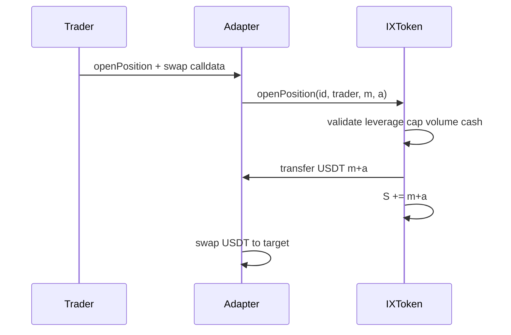
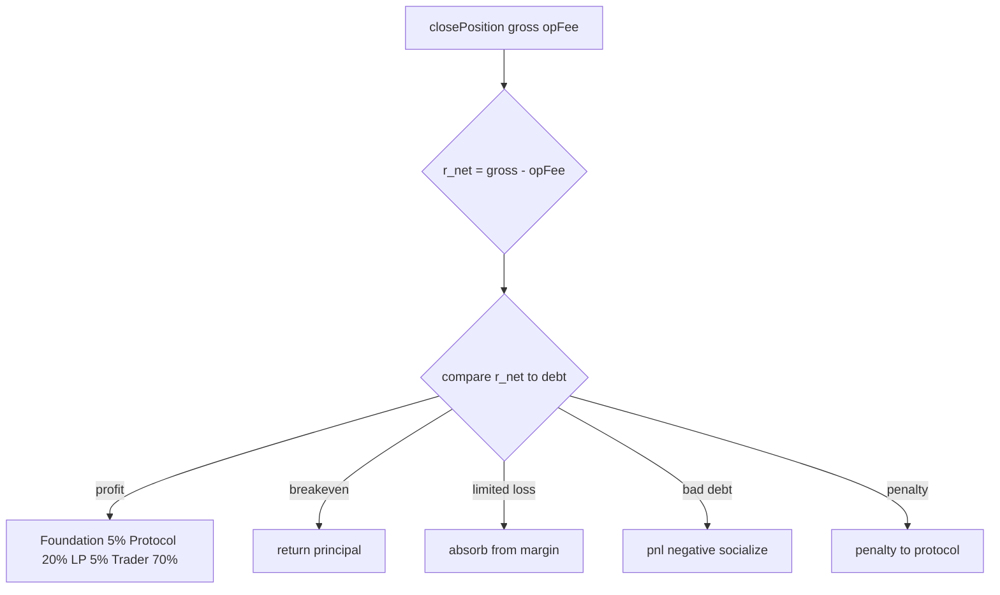
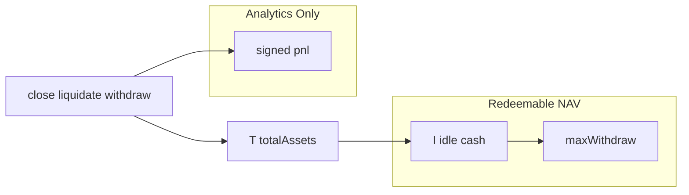

# Cross-Venue Margin Execution & Position Lifecycles

Position lifecycle management in Iris Protocol is executed exclusively by **authorized adapters** against the `IXToken` position registry. The vault does not perform DEX swaps; it books margin $m$ and allocation $a$, updates $S$, and applies settlement branches on adapter-reported $\texttt{totalReturnAssets}$. This chapter specifies origination constraints, resolution branching, profit waterfalls, and the signed $\texttt{pnl}$ accumulator — decoupled from redeemable NAV.

---

## Structural Mechanics of Position Origination

### Position Record

Each open position is keyed by $\texttt{positionId} \in \{0,1\}^{256}$ and stores:

$$
\mathcal{P} = (\texttt{trader}, \, \texttt{adapter}, \, m, \, a, \, t_{\text{open}}, \, t_{\text{close}})
$$

### Origination Sequence

Only $\texttt{onlyAuthorizedAdapter}$ addresses may invoke $\texttt{openPosition(id, trader, } m, a)$. The adapter-local sequence (see Chapter 8) precedes the vault call; vault-side validation:

$$
\begin{aligned}
&\text{(i) Unique id: } \mathcal{P}(\texttt{id}) = \emptyset \\
&\text{(ii) Volume: } m + a \geq V_{\min} \\
&\text{(iii) Leverage: } a \leq m \cdot \dfrac{\texttt{maxLeverageBps}}{10\,000} \\
&\text{(iv) Cap: } S + m + a \leq \dfrac{\texttt{maxOpenPositionsVolumeBps}}{10\,000} \cdot (T - D) \\
&\text{(v) Cash: } I \geq m + a
\end{aligned}
$$

Default $V_{\min} = 10^6$ USDT wei (1 USDT); $\texttt{maxLeverageBps} = 50\,000$ (5×); $\texttt{maxOpenPositionsVolumeBps} = 5000$.

State transition on success:

$$
S' = S + m + a, \quad I' = I - (m + a), \quad F_{\text{adapter}}' = F_{\text{adapter}} + m
$$

Margin $m$ credits adapter **fixed** ledger; underlying USDT transfers to adapter for swap execution.

---

## Settlement Branching and Profit Waterfalls

### Close Settlement Variables

On $\texttt{closePosition(id, totalReturnAssets, opFee)}$:

$$
\texttt{debt} = a + m, \quad r_{\text{net}} = \texttt{totalReturnAssets} - \texttt{opFee}
$$

Require $\texttt{opFee} \leq \texttt{totalReturnAssets}$ or revert $\texttt{InvalidOperatorFee}$. Settlement applies ledger effects **before** underlying pull — atomic under $\texttt{nonReentrant}$.

### Branch Classification

| Branch | Condition | Protocol action |
|--------|-----------|-----------------|
| **Profit** | $r_{\text{net}} > \texttt{debt}$ | Profit waterfall; trader net credit |
| **Breakeven** | $r_{\text{net}} = \texttt{debt}$ | Principal restoration |
| **Limited loss** | $\texttt{loss} \leq m \cdot \texttt{liquidationThresholdBps}/10\,000$ | Loss from margin escrow |
| **Hard bad debt** | $\texttt{totalReturnAssets} < a$ | Socialized shortfall; $\texttt{pnl} < 0$ |
| **Penalty** | Loss exceeds threshold | Penalty fee to protocol; $\texttt{pnl} > 0$ |

where $\texttt{loss} = \max(0, \texttt{debt} - r_{\text{net}})$. Default $\texttt{liquidationThresholdBps} = 7500$ (75% of margin).

### Profit Waterfall (Profit Branch)

Let gross trade profit:

$$
\Pi = r_{\text{net}} - \texttt{debt}
$$

Partition:

$$
\begin{aligned}
\Pi_F &= \Pi \cdot \dfrac{500}{10\,000} && \text{(Foundation 5\%)} \\
\Pi_P &= \Pi \cdot \dfrac{2000}{10\,000} && \text{(Protocol 20\%)} \\
\Pi_L &= \Pi \cdot \dfrac{500}{10\,000} && \text{(LP farming 5\%)} \\
\Pi_T &= \Pi - \Pi_F - \Pi_P - \Pi_L && \text{(Trader 70\%)}
\end{aligned}
$$

$\Pi_F$ minted to Foundation $\texttt{0x00008c80D4cBD653B1D384566d9b23B37d100000}$; $\Pi_L$ minted to $\texttt{lpFarming}$ or redirected to Foundation if unset; $\Pi_P$ accrues to $T$ via rebasing pool; $\Pi_T$ credited to trader fixed/rebasing ledger per settlement path.

### Force-Close and Liquidation Rails

**Force-close** $\texttt{forceClosePosition(id, gross, opFee, keeper)}$:

$$
K_{\text{force}} = \min\left( m \cdot \dfrac{\texttt{bps}}{10\,000}, \, K_{\max}, \, \texttt{gross} \right)
$$

Settlement on $\texttt{gross} - K_{\text{force}}$; keeper paid rebasing $\texttt{\_mint}$.

**Liquidation** $\texttt{liquidatePosition(id, gross, keeper, opFee)}$:

$$
K_{\text{liq}} = \min\left( r_{\text{net}} \cdot \dfrac{\texttt{bps}}{10\,000}, \, K_{\max} \right)
$$

$\texttt{opFee}$ waived if $\texttt{opFee} > \texttt{totalReturnAssets}$. Default $\texttt{bps} = 1000$, $K_{\max} = 500 \times 10^6$.

---

## The PnL Signed Accumulator

### Definition

$\texttt{pnl} \in \mathbb{Z}$ is a **signed analytics ledger** — not a substitute for $T$, $I$, or $\texttt{totalSupply()}$. It records protocol-favorable and adverse settlement events for reporting and governance review.

### Update Rules

| Event | $\Delta \texttt{pnl}$ |
|-------|----------------------|
| Profitable close — protocol share $\Pi_P$ | $+\Pi_P$ (protocol share only; Foundation/LP minted as shares) |
| Hard bad debt close | $-(\texttt{debt} - r_{\text{net}})$ when $r_{\text{net}} < a$ |
| Penalty path | $+\texttt{penalty}$ |
| Liquidation bad debt | $-(\texttt{loss} + K - m)$ (branch-dependent) |
| Withdrawal fee after $D$ amortization | $+(f - \min(f, D))$ |
| Force-close | No direct keeper line in $\texttt{pnl}$ (keeper mint separate) |

**Excluded by design:** rebasing yield accrual, $\Delta D$ amortization on withdraw, rounding dust, Foundation mint economics.

### Redeemability Decoupling

Depositor redemption capacity:

$$
\texttt{maxWithdraw}(u) \leq I
$$

remains independent of $\texttt{pnl}$. A positive $\texttt{pnl}$ does not imply full book NAV is physically redeemable when $S > 0$.

---

Position lifecycle branches, profit waterfalls, and $\texttt{pnl}$ accounting complete the execution-to-settlement path begun at vault origination. Chapter 5 addresses systemic risk rails (Keeper incentives, solvency guards, flash reentrancy) that bound tail-risk outcomes across these branches.
