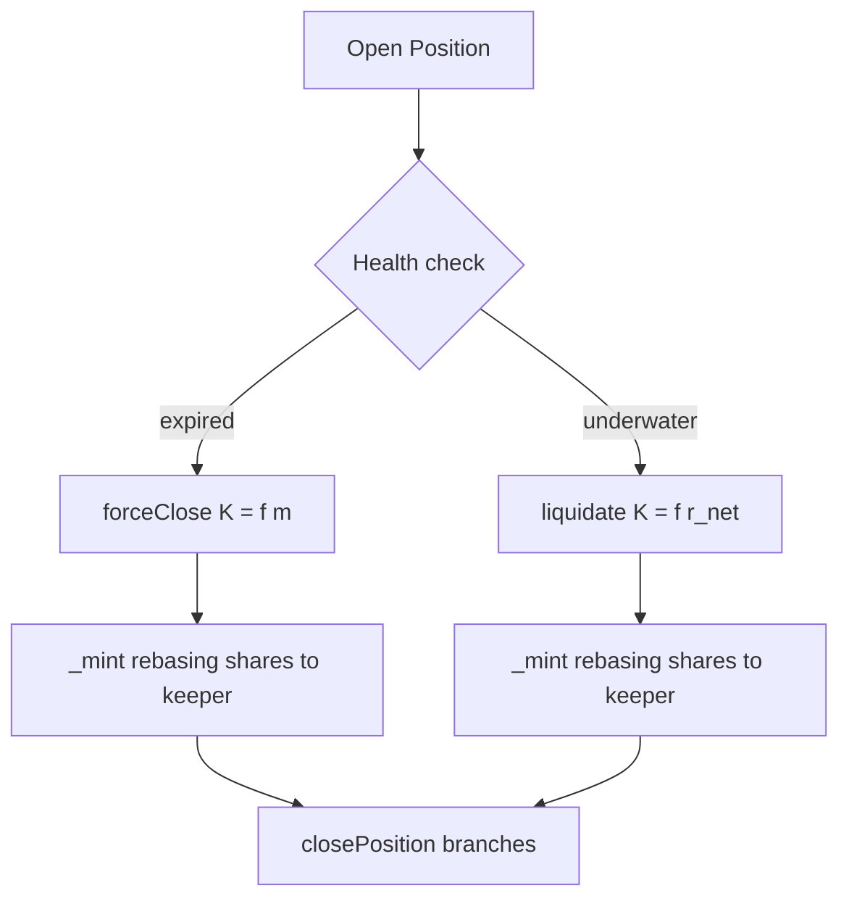
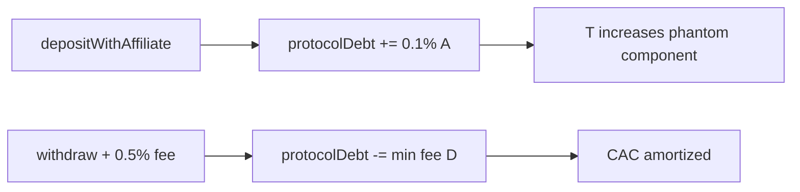
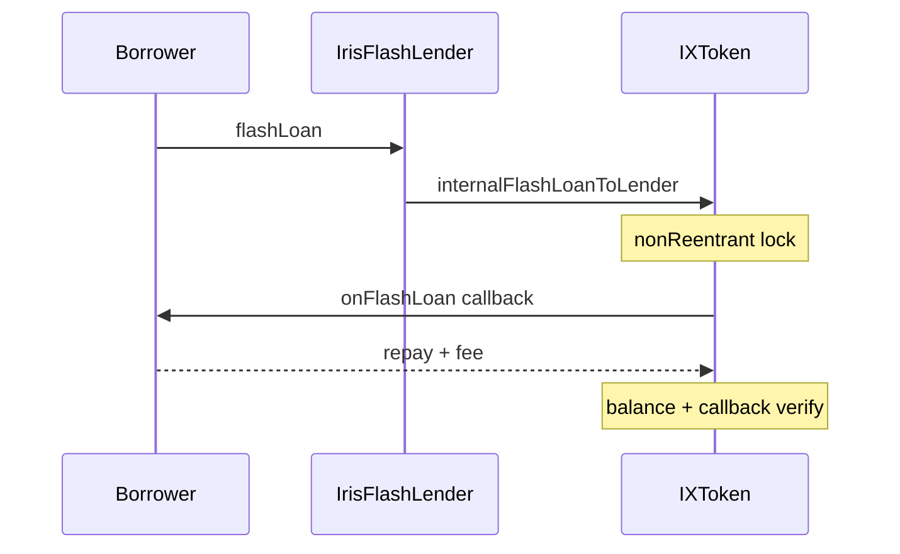

# Systemic Risk Management & Defensive Clearing Rails

Systemic risk in Iris Protocol concentrates at three boundaries: **undercollateralized position tail loss** (bad debt), **affiliate-driven phantom liability growth** ($D$), and **flash/reentrancy attack surfaces** on vault entrypoints. This chapter formalizes Keeper clearing rails, cross-parameter solvency proofs, and Cancun-era reentrancy isolation.

---

## Automated Forced-Settlement & Liquidations

### Orthogonal Incentive Rails

Foundation fee capture ($5\%$ of $\Pi$) and Keeper execution mints are **economically orthogonal**. Conflating them would incentivize premature liquidation of profitable positions. Keepers receive rebasing vault shares via $\texttt{\_mint}$ only on:

- $\texttt{forceClosePosition}$ — administrative/expiry path
- $\texttt{liquidatePosition}$ — underwater rescue path

### Force-Close: Squall Keeper Rail

Triggered via adapter $\texttt{closeExpiredPosition}$ when:

$$
\texttt{block.timestamp} \geq t_{\text{open}} + \texttt{maxPositionDurationSeconds} + \mathbb{1}_{\neg\text{premium}} \cdot \Delta_{\text{ext}}
$$

Vault settlement:

$$
K_{\text{force}} = \min\left( m \cdot \frac{\texttt{keeperIncentiveRewardBps}}{10\,000}, \, K_{\max}, \, G \right)
$$

where $G = \texttt{totalReturnAssets}$. Settlement proceeds on $G - K_{\text{force}}$ through shared $\texttt{\_closePosition}$ branches. Keeper sizing scales on **margin** $m$ — modest incentive for expiry-style administrative closes.

### Liquidation: Iron Liquidator Rail

Eligibility (adapter + vault aligned):

$$
\texttt{loss} \geq m \cdot \frac{\texttt{liquidationThresholdBps}}{10\,000}
$$

Vault settlement:

$$
K_{\text{liq}} = \min\left( r_{\text{net}} \cdot \frac{\texttt{keeperIncentiveRewardBps}}{10\,000}, \, K_{\max} \right)
$$

where $r_{\text{net}} = \texttt{totalReturnAssets} - \texttt{opFee}$ (with $\texttt{opFee}$ waived if excessive). Keeper sizing scales on **net recovery** — intentionally larger effective premium when rescued cash is high relative to margin (disposition C-02: expired + underwater may use either path).

### Comparative Mechanics

| Path | Vault function | Keeper base | Cap |
|------|----------------|-------------|-----|
| Force-close | `forceClosePosition` | $m$ | $K_{\max}, G$ |
| Liquidation | `liquidatePosition` | $r_{\text{net}}$ | $K_{\max}$ |

Five Keeper NFTs compete on latency; premium holders receive stricter adapter thresholds and shorter non-premium expiry extensions.

### Sanctions Gate

$\texttt{ISanctionsList}$ blocks sanctioned addresses on deposit, transfer, and keeper reward paths — Gatekeeper rail enforces compliance before settlement mints.

---

## Solvency Guard Formulations

### Affiliate CAC and Protocol Debt

On $\texttt{depositWithAffiliate}$ with gross deposit $A$:

$$
\Delta D_{\text{aff}} = A \cdot \frac{\texttt{affiliateFeeBps}}{10\,000}, \quad \texttt{affiliateFeeBps} = 10 \text{ (0.1\%)}
$$

Full $A$ enters $I$; affiliate receives rebasing shares on $\Delta D_{\text{aff}}$ immediately. Virtual liability inflates $T$ and rebasing NAV before economic repayment — disposition **C-1: acknowledged by design**.

### Withdrawal Amortization

On withdraw of $W$ with fee:

$$
f = W \cdot \frac{\texttt{withdrawalFeeBps}}{10\,000}, \quad \texttt{withdrawalFeeBps} = 50
$$

$$
D' = D - \min(f, D), \quad \texttt{pnl} \mathrel{+}= f - \min(f, D)
$$

### Cross-Parameter Solvency Proof

Governance $\texttt{setProtocolParameters}$ enforces:

$$
\texttt{withdrawalFeeBps} \cdot (10\,000 - \texttt{maxOpenPositionsVolumeBps}) \geq \texttt{affiliateFeeBps} \cdot 10\,000
$$

**Proof sketch (defaults):** Maximum affiliate issuance rate per unit $T_{\text{phys}}$ deposited is $\alpha = \texttt{affiliateFeeBps}/10\,000$. Maximum withdrawal-fee recovery rate on non-strategy portion of book is $\omega = \texttt{withdrawalFeeBps} \cdot (1 - \texttt{maxOpenPositionsVolumeBps}/10\,000)$. Solvency requires $\omega \geq \alpha$ so cumulative withdrawal fees can amortize worst-case $D$ under maximal $S$ deployment:

$$
50 \times (10\,000 - 5000) = 250{,}000 \geq 10 \times 10\,000 = 100{,}000 \quad \checkmark
$$

### Physical Deploy Isolation

Strategy caps use $T_{\text{phys}} = T - D$, ensuring phantom $D$ cannot fund $\Delta S$:

$$
\Delta S \leq \frac{\texttt{maxOpenPositionsVolumeBps}}{10\,000} \cdot (I + S) \quad \text{with } D \text{ excluded from cap base}
$$

---

## Mitigation of Flash Loan Reentrancy Vectors

### Threat Model

Flash liquidity entrypoints on vaults present classic reentrancy: external call during $\texttt{onFlashLoan}$ callback re-enters $\texttt{deposit}$ / $\texttt{withdraw}$ / $\texttt{transfer}$ before state finalization. Without guards, attacker could inflate $\sigma$, drain $I$, or desynchronize $S$.

### Iris Gateway Isolation

End borrowers **never** call `IXToken` flash directly. Governance sets $\texttt{lender}$ to `IrisFlashLender` gateway — sole caller of:

$$
\texttt{internalFlashLoanToLender(token, amount, data)}
$$

guarded by $\texttt{onlyLender}$.

### Cancun Transient Reentrancy Guard

Heavy paths employ $\texttt{ReentrancyGuardTransient}$ (EIP-1153):

$$
\texttt{transient\_slot} \in \{0,1\} \quad \text{set on entry, cleared on exit}
$$

Applied to: $\texttt{deposit}$, $\texttt{withdraw}$, position lifecycle, $\texttt{internalFlashLoanToLender}$. Finding H-1 (missing flash reentrancy guard): **closed**.

**Explicit non-guarded path:** $\texttt{transfer}$ / $\texttt{transferFrom}$ — documented threat surface; integrators must not assume reentrancy safety on ERC20 transfer hooks.

### ERC-3156 Callback Verification

Post-callback:

$$
\texttt{keccak256("ERC3156FlashBorrower.onFlashLoan")} = \texttt{callbackResult}
$$

or revert $\texttt{ERC3156CallbackFailed}$ (M-1 closed). Balance post-checks on vault-token mint path and underlying transfer path (M-2 closed).

### Flash Path Economics

| Token | Mechanism | $\Delta T$ during callback |
|-------|-----------|---------------------------|
| Vault token | Fixed-ledger flash mint/burn | Unchanged at $T = I + D + S$ |
| Underlying | Transfer idle $I$ | $I$ temporarily reduced; restored $+fee$ |

Vault-token flash temporarily inflates $\texttt{totalSupply}$ during callback — oracles must not sample mid-tx $\texttt{totalSupply}$ as NAV input.

---

Systemic risk rails — Keeper clearing, solvency guards, flash isolation — bound tail outcomes of the position branches in Chapter 4. Chapter 6 addresses governance chronology and Foundation veto game theory governing parameter changes to the constants used herein.
