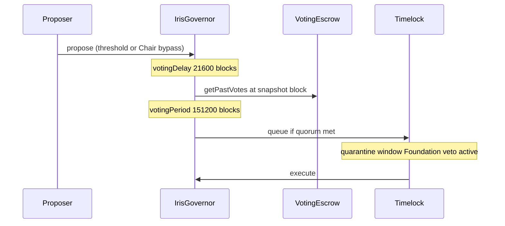
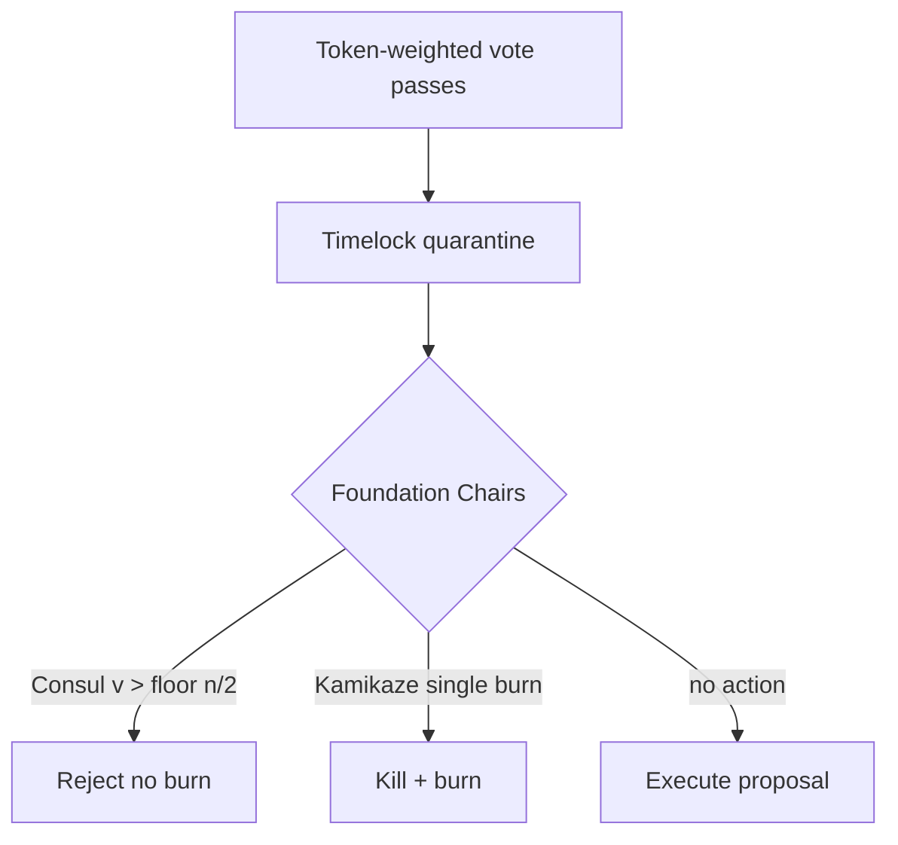
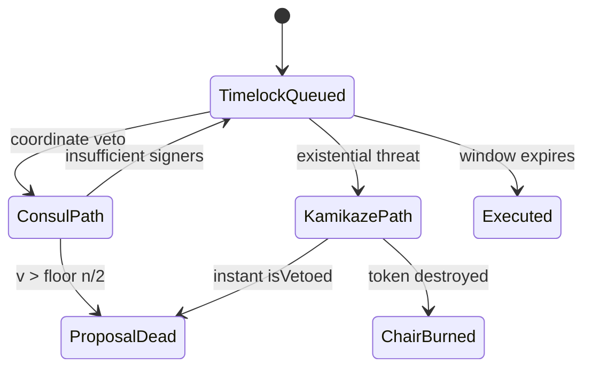

# Game-Theoretic Governance & The Tactical Overlay

Iris Protocol governance combines **block-number-weighted token voting** (`VotingEscrow` → `IrisGovernor` → `TimelockController`) with an **institutional Foundation overlay** (15 ERC721 Chairs) exercising timelock quarantine veto authority. This chapter specifies escrow chronology, profit accrual during lock, Foundation coalition dynamics, and the Consul/Kamikaze bifurcation as a formal game.

---

## Chronological Escrow Mechanics

### IERC6372 Block-Number Clock

`VotingEscrow` implements:

$$
\texttt{clock}() = \texttt{block.number}, \quad \texttt{CLOCK\_MODE}() = \texttt{"mode=blocknumber"}
$$

All checkpoint lookups $\texttt{getPastVotes}(u, b)$ and $\texttt{getPastTotalSupply}(b)$ use block height $b$, not $\texttt{block.timestamp}$. This decouples governance snapshots from miner/validator timestamp skew and L2 sequencer clock artifacts — a documented vulnerability class in timestamp-mode Governor stacks.

### Lock Structure

User locks DAI-denominated IrisX for duration $D_b$ blocks:

$$
D_b \in [\texttt{MIN\_LOCK}, \, \texttt{MAX\_LOCK}] = [50\,400, \, 10\,512\,000]
$$

At $\sim$12s/block: one week to four years. **One lock per address**; adjustments via $\texttt{increaseLockAmount}$ / $\texttt{extendLockDuration}$.

### Voting Weight

Weight equals locked rebasing share count — **no time decay**:

$$
w(u) = \sigma_{\text{locked}}(u)
$$

Unlike Curve-style $ve$-models, duration affects **unlock time** only, not marginal vote weight per share. Anti vote-renting: delegation disabled:

$$
\texttt{delegates}(u) = u, \quad \texttt{delegate}(\cdot) \Rightarrow \texttt{ManualDelegationNotAllowed}
$$

### Profit Accrual During Lock

Locked tokens remain rebasing. While $T$ increases from trading profit, withdrawal fees, and protocol fee retention:

$$
\sigma_{\text{locked}} \text{ fixed in count}, \quad \texttt{convertToAssets}(\sigma_{\text{locked}}) \uparrow
$$

Voters earn **economic exposure to protocol performance** during lock without transferable vote delegation — skin-in-the-game without rentable governance weight.

### Governor Chronology

`IrisGovernor` parameters (block units):

| Parameter | Blocks | $\approx$ Duration |
|-----------|--------|-------------------|
| `votingDelay` | 21,600 | 3 days |
| `votingPeriod` | 151,200 | 21 days |
| `proposalThreshold` | — | 1,000 voting units ($10^9$ wei scale) |
| `quorumFraction` | — | 10% at snapshot block |

**Integration invariant:**

$$
\texttt{proposalSnapshot}(p) = b_s \implies \texttt{getPastVotes}(u, b_s) \text{ uses same clock mode}
$$

### Veto State Override

$$
\texttt{state}(p) = \begin{cases}
\texttt{Canceled} & \texttt{isVetoed}[p] = \texttt{true} \\
\texttt{super.state}(p) & \text{otherwise}
\end{cases}
$$

---

## The Foundation Overlay & Coalition Dynamics

### Contract Specification

**The Iris Foundation:** $\texttt{ERC721("The Iris Foundation", "IRIS-FOUNDATION")}$ at:

$$
\texttt{0x00008c80D4cBD653B1D384566d9b23B37d100000}
$$

**Supply:** 15 tokens, IDs $0, 1, \ldots, 14$. **All Chairs are functionally identical on-chain** — no names, traits, or privilege tiers in contract logic.

### Economic Stake

On profitable close, $\texttt{foundationFeeBps} = 500$ mints $5\%$ of $\Pi$ to Foundation contract. Holders claim:

$$
\texttt{ClaimRewards(token)}: \quad \text{payout}_i = \frac{B_{\text{token}}}{\texttt{liveCards}} \quad \forall i \in \texttt{activeCardsRegistry}
$$

where $B_{\text{token}} = \texttt{IERC20(token).balanceOf(Foundation)}$.

### Overlay Powers (Not Substitute Sovereignty)

| Power | Mechanism |
|-------|-----------|
| Threshold bypass | Any Chair proposes without 1,000-unit threshold |
| Consul veto | $\lfloor \texttt{liveCards}/2 \rfloor + 1$ during timelock |
| Kamikaze veto | Single Chair burns token → instant veto |

Community $\texttt{IrisGovernor}$ retains proposal passage and quorum. Foundation acts **only** during timelock quarantine as circuit breaker — tactical overlay, not replacement legislature.

### Coalition Stability

With $n = \texttt{liveCards}$, Consul requires:

$$
v > \left\lfloor \frac{n}{2} \right\rfloor
$$

After Kamikaze burn ($n \to n-1$), threshold adjusts dynamically. Surviving Chairs' per-seat fee share increases from $1/n$ to $1/(n-1)$ — compensating absorption of fallen Chair's revenue stream.

---

## Consul Veto vs. Kamikaze Veto

### Consul Veto: Coordination Equilibrium

**Players:** $n$ Chair holders, symmetric payoffs from fee stream.

**Action:** Sign $\texttt{consulVeto(proposalId)}$ during timelock.

**Success condition:**

$$
|\{i : \texttt{vetoed}_i\}| > \left\lfloor \frac{n}{2} \right\rfloor
$$

**Payoff:** Proposal halted; each surviving Chair retains token; fee stream intact. Cost: coordination latency, public revelation of opposition coalition.

**Nash intuition:** For non-existential proposals, mutual benefit from preserving $1/n$ fee share dominates unilateral burn — Consul is the **cheap-talk plus commitment** equilibrium for recoverable disputes.

### Kamikaze Veto: Sacrificial Dominance

**Action:** Single Chair $j$ invokes $\texttt{kamikazeVeto(proposalId, tokenId)}$.

**Immediate effect:**

$$
\texttt{isVetoed}[p] = \texttt{true}, \quad \texttt{liveCards}' = n - 1, \quad \texttt{Chair}_j \text{ permanently burned}
$$

**Payoff to $j$:** $-\infty$ fee stream (token destroyed). **Payoff to survivors:** $1/(n-1)$ vs $1/n$ fee share uplift. **Payoff to protocol:** avoided loss $\mathcal{D}$ from malicious proposal.

**Rationality condition:**

$$
\text{Burn rational} \iff \text{NPV}\left(\frac{1}{n} \cdot 0.05 \cdot \mathbb{E}[\Pi_{\text{future}}]\right) < \mathcal{D}_{\text{existential}}
$$

Kamikaze is **dominant** only under existential threat — governance capture, vault drain proposal, catastrophic parameter corruption — not parameter disagreements resolvable via Consul.

### Comparative Game Matrix

| Dimension | Consul | Kamikaze |
|-----------|--------|----------|
| Players required | $> \lfloor n/2 \rfloor$ | 1 |
| Token cost | 0 | 1 burned |
| Timelock bypass | No — acts within window | Yes — instant |
| Fee stream | Preserved | Forfeited for burner |
| Reuse frequency | Repeatedly viable | Credible once per Chair |

---

Governance chronology (block-clock escrow), Foundation coalition economics, and veto game structure complete the institutional control plane. Chapter 7 deepens $D$ amortization mechanics; Chapter 8 specifies adapter execution trust assumptions governed by these parameters.
