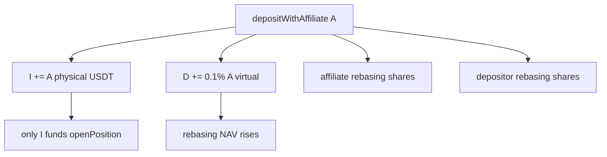
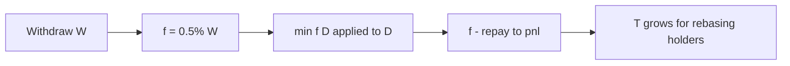

# Protocol Debt Mechanics & Capital Amortization

`protocolDebt` ($D$) is the virtual affiliate obligation component of $T = I + D + S$. It implements **optimistic customer acquisition cost (CAC)** accounting: affiliates receive immediate rebasing exposure while the protocol books an IOU amortized through withdrawal fees. Audit disposition **C-1** classifies this as acknowledged by design — not an open critical finding — subject to the solvency guards in Chapter 5.

---

## Virtual Liquidity Generation

### depositWithAffiliate Mechanism

On $\texttt{depositWithAffiliate}(A, \texttt{receiver}, \texttt{affiliate})$ with gross deposit $A$ (USDT wei):

$$
\Delta D_{\text{aff}} = A \cdot \frac{\texttt{affiliateFeeBps}}{10\,000}, \quad \texttt{affiliateFeeBps} = 10
$$

Sequence:

1. Pull $A$ from depositor → $I \mathrel{+}= A$ (full physical cash enters vault);
2. Mint affiliate rebasing shares on $\Delta D_{\text{aff}}$ to address $\texttt{affiliate}$;
3. $D \mathrel{+}= \Delta D_{\text{aff}}$;
4. Mint depositor rebasing shares via $\lfloor \texttt{convertToShares}(A) \rfloor$ on **full gross** $A$.

**Depositor UX:** No upfront haircut. Affiliate earns immediate rebasing yield exposure on commission.

**Book effect:** $T \mathrel{+}= \Delta D_{\text{aff}}$ while only $A$ physical USDT arrived — phantom component inflates rebasing NAV:

$$
R = \max(T - F, 0) \uparrow
$$

### Economic Interpretation as CAC

Define affiliate CAC per referred deposit:

$$
\texttt{CAC}_{\text{on-chain}} = \Delta D_{\text{aff}} = 0.001 \cdot A
$$

This is **not** immediately paid from $I$; it is a virtual liability expected to be repaid from future withdrawal fee flows. Off-chain marketing CAC (ads, events) is tracked separately.

### Self-Referral Block

$\texttt{affiliate} = \texttt{depositor}$ or $\texttt{affiliate} = \texttt{address(0)}$ skips affiliate branch — prevents trivial CAC loop.

### Physical Isolation of $D$

Strategy deployment and volume caps reference:

$$
T_{\text{phys}} = T - D = I + S
$$

Phantom $D$ **cannot** fund $\texttt{openPosition}$:

$$
m + a \leq I, \quad S + m + a \leq \frac{\texttt{maxOpenPositionsVolumeBps}}{10\,000} \cdot T_{\text{phys}}
$$

$D$ inflates rebasing NAV but never leaves as adapter margin.

---

## Amortization Schemes

### Withdrawal Fee Stream

On $\texttt{withdraw}(W, \texttt{receiver}, \texttt{owner})$, protocol charges:

$$
f = W \cdot \frac{\texttt{withdrawalFeeBps}}{10\,000}, \quad \texttt{withdrawalFeeBps} = 50
$$

Total debit from user: $W + f$ (fee on top).

### Debt Amortization Priority

Withdrawal fee **first** repays $D$:

$$
\Delta D_{\text{repay}} = \min(f, D), \quad D' = D - \Delta D_{\text{repay}}
$$

Residual fee accrues to protocol analytics:

$$
\Delta \texttt{pnl} = f - \Delta D_{\text{repay}}
$$

Rebasing depositors benefit from $\Delta \texttt{pnl} > 0$ retention via $T$ growth after $D$ exhaustion.

### Cumulative Amortization Dynamics

For cohort of affiliate-referred deposits with aggregate phantom liability $D_0$, cumulative withdrawal volume $W_{\text{cum}}$ produces cumulative fees:

$$
F_{\text{cum}} = \texttt{withdrawalFeeBps} \cdot W_{\text{cum}} / 10\,000
$$

Debt exhaustion time (ignoring concurrent new affiliate deposits):

$$
D_0 \leq F_{\text{cum}} \implies W_{\text{cum}} \geq \frac{10\,000 \cdot D_0}{\texttt{withdrawalFeeBps}}
$$

**Example:** $D_0 = \$100$ (from \$100,000 referred at 0.1%) requires $W_{\text{cum}} \geq \$100 / 0.005 = \$20{,}000$ cumulative withdrawals to fully amortize.

### Solvency Guard (Governance Enforced)

At $\texttt{setProtocolParameters}$, require:

$$
\texttt{withdrawalFeeBps} \cdot (10\,000 - \texttt{maxOpenPositionsVolumeBps}) \geq \texttt{affiliateFeeBps} \cdot 10\,000
$$

**Worst-case model:** If fraction $\phi = \texttt{maxOpenPositionsVolumeBps}/10\,000$ of $T_{\text{phys}}$ is locked in $S$, at most fraction $(1-\phi)$ of book can withdraw at steady state. Fee recovery capacity must dominate affiliate issuance rate:

$$
\underbrace{(1-\phi) \cdot \texttt{withdrawalFeeBps}}_{\text{effective recovery bps}} \geq \texttt{affiliateFeeBps}
$$

With defaults $\phi = 0.5$, $\texttt{withdrawalFeeBps} = 50$, $\texttt{affiliateFeeBps} = 10$:

$$
(1 - 0.5) \times 50 = 25 \geq 10 \quad \checkmark
$$

### What C-1 Does Not Claim

1. **Simultaneous full redemption:** All holders cannot redeem $\texttt{balanceOf}$ from $I$ when $S > 0$ or $D > 0$. Use $\texttt{maxWithdraw}$.
2. **Fair mint independence:** Gross $\texttt{previewDeposit}(A)$ plus affiliate mint may overshoot single-pool fair mint — separate audit item from C-1 core disposition.

---

## Parameter Sensitivity

| Parameter | Increase effect on $D$ risk |
|-----------|----------------------------|
| $\uparrow \texttt{affiliateFeeBps}$ | Faster $D$ accumulation per deposit |
| $\downarrow \texttt{withdrawalFeeBps}$ | Slower amortization |
| $\uparrow \texttt{maxOpenPositionsVolumeBps}$ | Smaller $(1-\phi)$ → weaker solvency guard margin |

Governance adjustments must satisfy the cross-parameter inequality or $\texttt{setProtocolParameters}$ reverts.

---

Protocol debt mechanics close the loop between growth (affiliate CAC) and solvency (withdrawal amortization). Chapter 8 addresses how authorized adapters execute trades that generate the profit flows $\Pi$ whose waterfall repays systemic risk and governance stakeholders.
