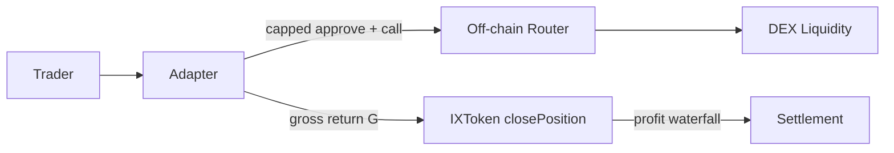
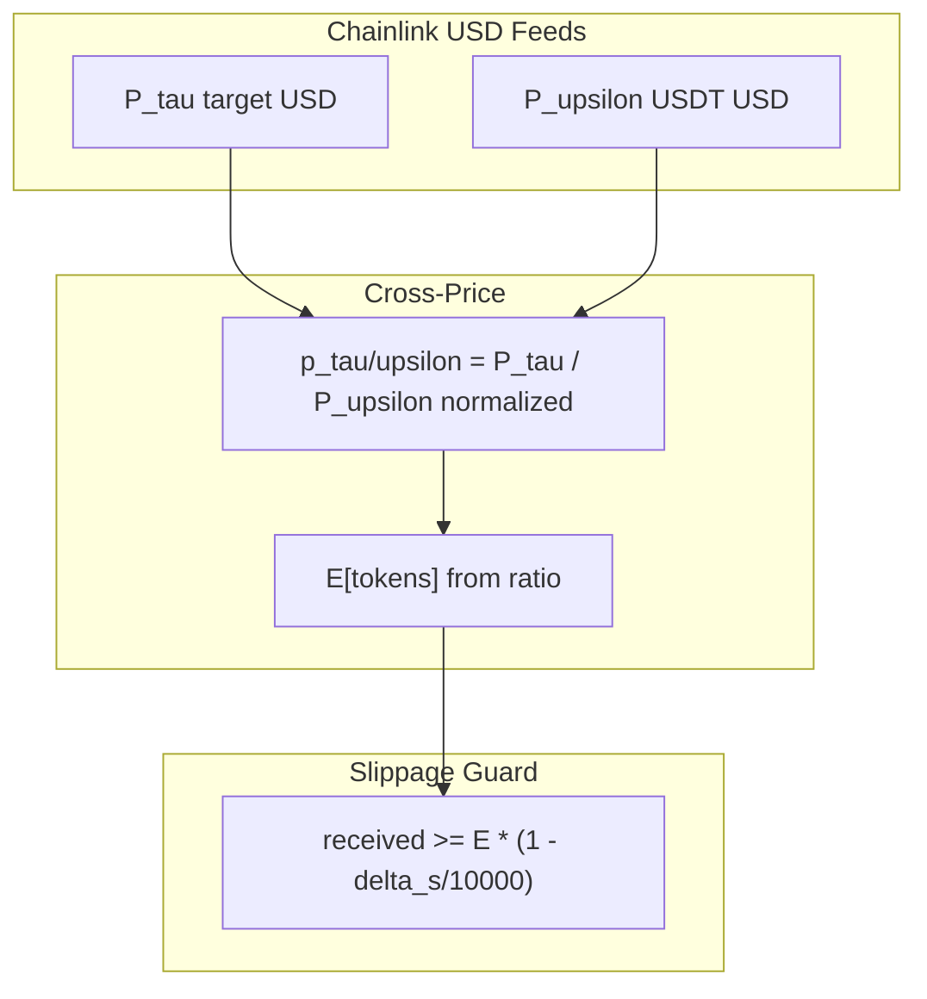

# Pluggable Execution Layers: Adapter V1 Specifications

`IrisLeveragedSpotV1Adapter` is the v1 **generic swap-engine** execution layer for Iris Protocol. It implements $\texttt{IIrisAdapter}$ against `IXToken`, executes leveraged **long spot** via off-chain-routed swap executors, and enforces Chainlink cross-price slippage floors. The vault trusts adapter-reported $\texttt{totalReturnAssets}$; the adapter does not re-validate vault PnL branches. This chapter specifies permissionless routing rationale, oracle normalization, and trust dispositions.

---

## Permissionless Execution Routing

### Architectural Separation

| Layer | Responsibility |
|-------|----------------|
| `IXToken` | Book $S$; settle close/liquidate; apply profit waterfall |
| `IrisLeveragedSpotV1Adapter` | Swap execution; slippage validation; local position state |
| Executor (off-chain) | Route construction (1inch, 0x, etc.) |

The adapter calls $\texttt{executor.call(data)}$ with **capped ERC20 approvals** — no on-chain router registry.

### On-Chain Safety Without Allowlist (Disposition C-03)

Safety invariants enforced at execution time:

1. **Approval cap:** $\texttt{approve(executor, } \Delta_{\max})$ limited to swap leg size;
2. **Balance delta:** $\Delta \texttt{bal}(\text{target})$ and $\Delta \texttt{bal}(\text{USDT})$ verified post-call;
3. **Slippage floor:** Received amount $\geq$ Chainlink cross-price expectation minus $\delta_s$;
4. **Reentrancy guard:** $\texttt{ReentrancyGuard}$ on adapter entrypoints.

**Disposition C-03:** Permissionless $\texttt{executor}$ is **by design**. Re-flagging absent router allowlist is non-compliant with audit disposition.

### Direction Constraint

Only $\texttt{Direction.LONG}$ supported:

$$
\texttt{SHORT} \Rightarrow \texttt{DirectionNotSupported}
$$

Target token $\tau \neq$ underlying $\upsilon$ (USDT).

### Trust Boundary

Vault books PnL from adapter-reported gross $G = \texttt{totalReturnAssets}$. Adapter owner must equal vault owner ($\texttt{setAdapterStatus}$). Rogue adapter cannot close foreign $\texttt{positionId}$ — vault enforces adapter address match on $\mathcal{P}$.

### Authorized Close Operators

Trader may authorize $\texttt{closeOperator}$ account-wide:

$$
\texttt{closePosition}: \texttt{msg.sender} \in \{\texttt{trader}\} \cup \texttt{authorizedCloseOperators}[\texttt{trader}]
$$

Per-position approval not required — account-level delegation.

---

## Cross-Price Oracle Normalization

### Feed Architecture

Per-token $\texttt{PositionConfig.chainlinkPriceFeed}$ for target $\tau$; immutable $\texttt{underlyingChainlinkFeed}$ for USDT/USDC underlying $\upsilon$.

Price extraction via $\texttt{\_getSafePrice}$: staleness and round-id checks on target feed; underlying stablecoin oracle risk accepted at deployment.

### Open Leg (USDT → Target)

Given base amount $b$ (USDT wei to swap), target decimals $d_\tau$, underlying feed decimals $d_\upsilon$, target feed decimals $d_f$:

$$
\mathbb{E}[\text{tokens}] = \frac{b \cdot P_\upsilon \cdot 10^{d_\tau} \cdot 10^{d_f}}{P_\tau \cdot 10^{d_\upsilon} \cdot 10^{d_{\text{base}}}}
$$

Received tokens must satisfy:

$$
\text{tokens} \geq \mathbb{E}[\text{tokens}] \cdot \left(1 - \frac{\delta_s}{10\,000}\right)
$$

or revert $\texttt{OpenSlippageExceeded}$.

### Close / Liquidation Leg (Target → USDT)

Symmetric with $\texttt{tokensSold}$ / $\texttt{currentTokenAmount}$. Liquidation slippage checked against **pre-swap MTM** (disposition C-05: accepted game); vault loss band re-validated on post-swap $G$.

### Slippage Parameter Bounds

| Parameter | Value |
|-----------|-------|
| `defaultSlippageBps` | 100 (1%) if caller passes 0 |
| `maxSlippageBps` | 300 (3%) hard cap |
| Caller exceeds cap | $\texttt{MaxSlippageExceeded}$ |

### Multi-Feed Skew

Separate USD feeds for $\tau$ and $\upsilon$ normalize cross-rate without assuming $\tau/\upsilon$ direct pool exists:

$$
\hat{p}_{\tau/\upsilon} = \frac{P_\tau / 10^{d_\tau}}{P_\upsilon / 10^{d_\upsilon}}
$$

Auditors must verify decimal normalization in $\texttt{\_getSafePrice}$ for each listed target token — feed misconfiguration is deployment risk, not adapter logic gap.

### Position Config Bounds

| Field | Role |
|-------|------|
| `maxLeverageBps` | Cap $a/m$ at adapter (0 = skip) |
| `minPositionVolume` / `maxPositionVolume` | Notional on $m+a$ |
| `maxPositionDurationSeconds` | Expiry for force-close |
| `fundingFeeBps` | Reserved $\texttt{opFee}$ (currently 0 at close) |

### Keeper Integration

| Adapter fn | Vault fn | Keeper incentive base |
|------------|----------|----------------------|
| `closePosition` | `closePosition` | None |
| `closeExpiredPosition` | `forceClosePosition` | $m$ |
| `liquidatePosition` | `liquidatePosition` | $r_{\text{net}}$ |

Premium Keeper NFT: stricter $\texttt{liquidationThresholdBps}$ offset; shorter expiry extension for non-premium closers.

### State Tracking Drift (Operator Awareness)

| State | Adapter | Vault |
|-------|---------|-------|
| Position registry | Local until settled | `positions[id]` deleted on settle |
| Token inventory | Commingled ERC20 balances | Books $S$, not per-token |
| `protocolDebt` | Not referenced | Reduces deploy cap |

---

Pluggable execution via Adapter V1 completes the stack from governance-authorized swap routing to vault settlement. Chapter 9 catalogs formal verification artifacts, test coverage boundaries, and mathematical notation for cross-reference.
