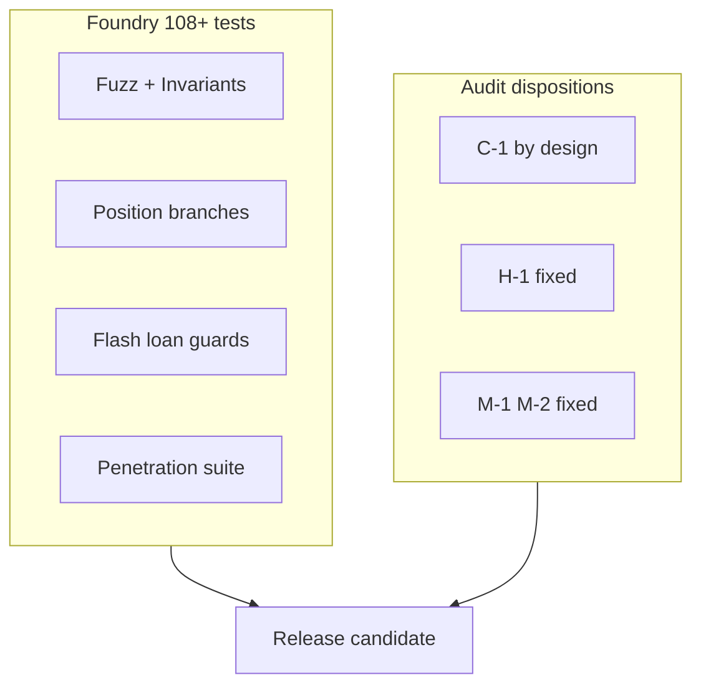

# System Verification, Coverage, & Appendices

This chapter documents the verification posture of Iris Protocol as of release candidate **2026-05-22** (iris-core), audit disposition closure status, and a consolidated mathematical notation reference for cross-chapter use.

---

## Formal Verification & Test Suites

### iris-core Test Matrix

Foundry suite against `IXToken.sol` (Solidity $0.8.26$, `via_ir`, optimizer 10,000 runs):

| Suite | Focus | Cases |
|-------|-------|-------|
| `IXTokenAdvancedFuzzTest` | Accounting closure, share math, affiliate NAV, invariants | Fuzz + 6 invariants |
| `IXTokenPositionLifecycleTest` | All close/liquidate/force-close branches | 25+ |
| `IXTokenPermitAndWithdrawTest` | EIP-2612, fixed withdraw, $D$ amortization | 11 |
| `IXTokenGovernanceTest` | Owner setters, adapter auth, UUPS | — |
| `IXTokenSecurityTest` | Access control, sanctions, reentrancy probe | 24 |
| `IXTokenFlashLoanTest` | `internalFlashLoanToLender`, callback guards | 17 |

**Aggregate:** 108+ tests passing; **0 failures** on release commit.

### Coverage Metrics (`IXToken.sol`)

| Metric | Value |
|--------|-------|
| Lines | $\approx 93.7\%$ |
| Statements | $\approx 90.5\%$ |
| Branches | $\approx 56.9\%$ |
| Functions | $100\%$ |

Moderate branch coverage reflects unreachable defensive branches (`InsufficientPhysicalLiquidity`), dust frontiers, permit catch-alls on non-permit tokens, and trusted-adapter fast paths — documented in `docs/audit_reports/test-coverage.md`.

### Invariant Properties (Fuzz)

`IXTokenAdvancedInvariantTest` enforces over 12,800 calls:

1. $\texttt{totalSupply()} \leq \texttt{totalAssets()}$ (liability ≤ book)
2. $\texttt{totalAssets()} = I + D + S$ decomposition coherence
3. Physical debt isolation under random deposit/withdraw/parameter toggles
4. Strategy booked once per position id

### Audit Disposition Summary

| ID | Topic | Status |
|----|-------|--------|
| **C-1** | `protocolDebt` phantom NAV | Acknowledged / by design |
| **H-1** | Flash loan missing `nonReentrant` | **Fixed** |
| **M-1** | ERC-3156 callback not checked | **Fixed** — `ERC3156CallbackFailed` |
| **M-2** | Wrong account in insufficient balance | **Fixed** |
| **VE-01** | Clock mismatch governance | **Fixed** — `IERC6372` block mode |
| **C-02** (adapter) | Expired + underwater dual keeper paths | By design |
| **C-03** (adapter) | Permissionless executor | By design |
| **C-05** (adapter) | Liquidation slippage pre-swap MTM | Accepted game |

**Open items:** `lpFarming` distribution not wired in core; `IrisFlashLender` gateway WIP.

### Auditor Workflow (Recommended)

1. Read invariant header in `IXToken.sol` and `_rebasingAssets` / `totalAssets`
2. Read `docs/audit_reports/test-coverage.md` scenario matrix
3. Trace: `deposit` → `openPosition` → `closePosition` (profit branch)
4. Trace loss paths: bad debt, liquidate, force-close with keeper + `opFee`
5. Execute:

```bash
forge build
forge test
forge coverage --ir-minimum --report summary
```

6. Cross-check C-1 disposition before re-flagging `protocolDebt`

### Four Ultimate Verification Targets

Production sign-off checklist:

| # | Target | Verification |
|---|--------|--------------|
| 1 | Flash mint reentrancy | `nonReentrant` on `internalFlashLoanToLender`; callback token; post-balance |
| 2 | Ledger sync deltas | $\Delta S \leftrightarrow \Delta I$ on lifecycle; no double-count $S$ in `totalSupply` |
| 3 | Asymmetric rounding | Floor deposit mint; Ceil withdraw burn; dust sweep on full exit |
| 4 | Oracle cross-feed skew | Decimal normalization; $\delta_s \in [100, 300]$ bps; staleness guards |



---

## Mathematical Notation Reference

### Global Accounting

| Symbol | Definition |
|--------|------------|
| $T$ | $\texttt{totalAssets()} = I + D + S$ |
| $I$ | Idle USDT in vault |
| $D$ | $\texttt{protocolDebt}$ (virtual affiliate IOU) |
| $S$ | $\texttt{assetsInStrategy}$ |
| $F$ | $\texttt{\_totalFixedBalances}$ |
| $\sigma$ | $\texttt{\_totalShares}$ (rebasing) |
| $R$ | $\texttt{\_rebasingAssets()} = \max(T - F, 0)$ |
| $T_{\text{phys}}$ | $T - D = I + S$ |

### Liabilities & Conversion

| Expression | Meaning |
|------------|---------|
| $\texttt{totalSupply()} = \texttt{convertToAssets}(\sigma) + F$ | Gross liabilities |
| $\lfloor \texttt{convertToAssets}(\sigma_a) \rfloor$ | Rebasing `balanceOf` (Floor) |
| $\texttt{maxWithdraw}(u) \leq I$ | Physical redemption cap |

### Position Lifecycle

| Symbol | Definition |
|--------|------------|
| $m$ | Margin amount |
| $a$ | Allocated amount |
| $\texttt{debt}$ | $a + m$ |
| $r_{\text{net}}$ | $\texttt{totalReturnAssets} - \texttt{opFee}$ |
| $\Pi$ | $r_{\text{net}} - \texttt{debt}$ (profit) |
| $G$ | Gross $\texttt{totalReturnAssets}$ |

### Fee Parameters (Defaults, bps)

| Parameter | Value |
|-----------|-------|
| `foundationFeeBps` | 500 |
| `protocolShareOfProfitBps` | 2000 |
| `lpFarmingFeeBps` | 500 |
| `withdrawalFeeBps` | 50 |
| `affiliateFeeBps` | 10 |
| `keeperIncentiveRewardBps` | 1000 |
| `maxLeverageBps` | 50,000 |
| `maxOpenPositionsVolumeBps` | 5000 |
| `liquidationThresholdBps` | 7500 |

### Keeper Incentives

$$
K_{\text{force}} = \min\left(m \cdot \frac{\texttt{bps}}{10\,000}, K_{\max}, G\right)
$$

$$
K_{\text{liq}} = \min\left(r_{\text{net}} \cdot \frac{\texttt{bps}}{10\,000}, K_{\max}\right)
$$

### Solvency Guard

$$
\texttt{withdrawalFeeBps} \cdot (10\,000 - \texttt{maxOpenPositionsVolumeBps}) \geq \texttt{affiliateFeeBps} \cdot 10\,000
$$

### Governance (Block Units)

| Parameter | Blocks |
|-----------|--------|
| `MIN_LOCK_DURATION` | 50,400 |
| `MAX_LOCK_DURATION` | 10,512,000 |
| `votingDelay` | 21,600 |
| `votingPeriod` | 151,200 |
| `proposalThreshold` | 1,000 units |
| `quorumFraction` | 10% |

$$
\texttt{clock}() = \texttt{block.number}
$$

### Foundation

| Item | Value |
|------|-------|
| Contract | `0x00008c80D4cBD653B1D384566d9b23B37d100000` |
| Supply | 15 Chairs, IDs $0$–$14$ |
| Consul threshold | $v > \lfloor n/2 \rfloor$ |
| Profit fee | $5\%$ of $\Pi$ |

### Contract Functions (Canonical)

| Function | Role |
|----------|------|
| `deposit` / `depositWithAffiliate` | USDT intake |
| `withdraw` | USDT output + fee + $D$ amortization |
| `openPosition` | Book $S$; adapter only |
| `closePosition` | Settlement branches |
| `forceClosePosition` | Expiry keeper path |
| `liquidatePosition` | Underwater keeper path |
| `ClaimRewards` | Foundation fee distribution |
| `internalFlashLoanToLender` | Gateway-only flash |

### Glossary

| Term | Meaning |
|------|---------|
| **IrisX / IXToken** | Rebasing vault token over USDT |
| **Adapter** | `IrisLeveragedSpotV1Adapter` |
| **Executor** | Off-chain swap router (permissionless) |
| **Keeper** | 5-NFT execution corps |
| **Foundation** | 15-Chair ERC721 overlay |
| **pnl** | Signed analytics ledger ≠ NAV |
| **opFee** | Operator fee inside gross return |

---

**Repositories:** `iris-core`, `iris-governance`, `iris-uv4-adapter`  
**Agent master spec:** `docs/aic/ai_context.md`  
**Security contact:** $\texttt{security@irislab.net}$

*End of Iris Protocol GitBook Whitepaper.*
